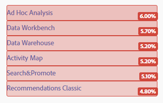
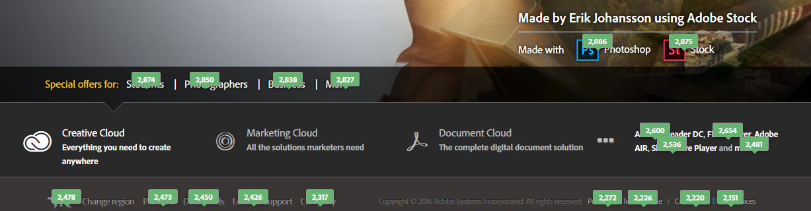
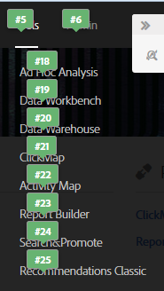
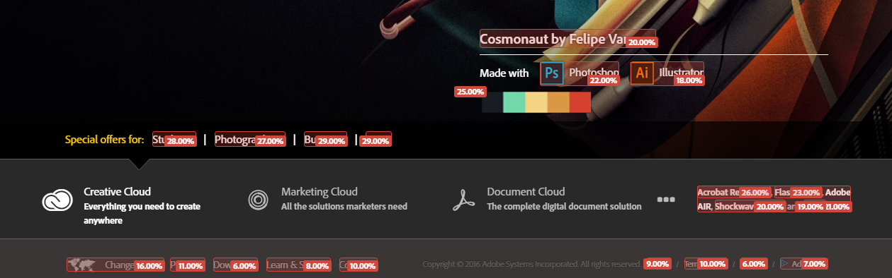

# 可自訂覆蓋圖

覆蓋圖提供多種設定資料視覺效果的方式，讓您輕鬆查看並了解頁面上連結的人氣高低。

覆蓋圖可讓您在頁面上直接視覺化點按資料。這正是 Activity Map 視覺化分析工具與大部分表格與圖形工具 (例如「Reports &amp; Analytics」) 之間的最大差異。

Activity Map 提供下列三種覆蓋圖：

* 漸層覆蓋圖 (熱度圖)
* 氣泡覆蓋圖
* 獲益者和損失者覆蓋圖

您也可以[為動態內容設定覆蓋圖演算](/help/analyze/activity-map/activitymap-link-tracking/activitymap-stl-track-custom-elements.md)。

若要對覆蓋圖進行變更，請開啟[「覆蓋圖設定面板」](/help/analyze/activity-map/activitymap-overlay-settings.md)並編輯可用選項。

將滑鼠暫留在某個覆蓋圖上，會顯示其[詳細資料](/help/analyze/activity-map/activitymap-overlay-details.md)。

## 漸層覆蓋圖 (熱度圖) {#section_06AF13DE05A1454D960176CD0DA921A6}

漸層覆蓋圖中的色彩強度是根據該連結的人氣高低。此強度可以針對前 30 名排行進行標準化，也可以做為絕對量度值的函數。

這些度量覆蓋在頁面的連結上，成為一種「熱圖」，提供重要問題的解答，其中包括：

* 個別頁面有何價值？
* 頁面上的個別元素有何價值？
* 頁面上最有價值的數位不動產為何？

## 氣泡覆蓋圖 {#section_A657AB3F64CB47F881BBFFD72B37D9D4}

氣泡覆蓋圖會在一個小型註標泡泡中顯示覆蓋圖內容 (量度、百分比或排名)。

在工具列的「覆蓋圖類型」中選取此覆蓋圖時，就會顯示氣泡覆蓋圖。符合「[Activity Map 設定](/help/analyze/activity-map/activitymap-overlay-settings.md)」中選取項目 (前 30 名、前 50 名、全部...) 的所有連結都會顯示氣泡覆蓋圖。如果未選取此選項，則顯示漸層覆蓋圖。

> [!NOTE] 您必須顯示子功能表，才會顯示子功能表的氣泡覆蓋圖：
>
>>

## 獲益者和損失者覆蓋圖 {#section_EE80278E20C14824869BF5A27A4634C8}

**[!UICONTROL 獲益者和損失者覆蓋圖]**&#x200B;僅適用於即時模式：它們會比較目前時段的量度和上一個時段的量度，用以報告連結活動的即時變更。藉以提供充滿視覺吸引力的檢視即時趨勢方式。

此即時覆蓋圖會根據前一個和目前時段之間的量度值變更，來排名點按。

