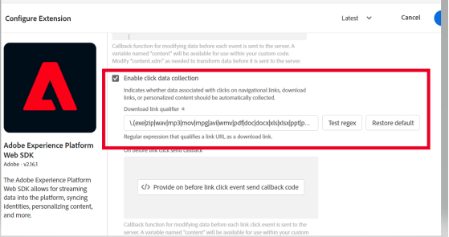

# 啟動並啟用 Activity Map

說明若想啟用 Activity Map 連結收集和用戶下載，Analytics 管理員需要完成的步驟。

## 步驟 1.啟動 Activity Map {#update_code}

Activity Map 模組是 AppMeasurement.js、Adobe Experience Platform 標記和 Web SDK (alloy.js) 的一部分。您無法收集 Activity Map 資料，除非您更新至 **Web SDK 版本 2.15.0** 或更高版本，或 **Adobe Analytics 標記擴充功能 v1.90** 或更高版本，或 **AppMeasurement 版本 1.6** 或更高版本。

+++Web SDK (Adobe Experience Platform 標記擴充功能)

1. 在 Adob&#x200B;&#x200B;e Experience Platform 標記中，導覽至您要實施 Analytics 的屬性。在「[!UICONTROL 擴充功能] -> [!UICONTROL Adobe Experience Platform Web SDK]」下，依下面醒目提示選取「**[!UICONTROL 啟用按一下資料收集]**」。
1. 進行變更來建立資料庫。
1. 將資料庫發佈至生產環境。

**驗證**

使用 Developer Console 網路標記進行互動呼叫：

1. 在網站上載入開發啟動指令碼。
1. 在點選元素後，在「網路」標記中搜尋 &#39;/ee&#39;

   

Adobe Experience Platform Debugger：

1. 下載並安裝 [Adobe Experience Platform Debugger](https://chromewebstore.google.com/detail/adobe-experience-platform/bfnnokhpnncpkdmbokanobigaccjkpob)。
1. 前往「[!UICONTROL 記錄檔] > [!UICONTROL Edge] > [!UICONTROL 連接到 Edge]」。

   

**常見問題**

* **互動呼叫未在「網絡」標籤中觸發。**
在收集呼叫中的點選資料收集，我們需要使用 &quot;/ee&quot; 或「收集」來篩選嗎？

* **收集呼叫沒有「承載顯示」。**
收集呼叫專門設計為追蹤不會影響到其他網站的導覽，因此文件卸載功能適用於收集呼叫。這不會影響您的資料收集，但如果您需要在頁面上驗證，請將 target = &quot;_blank&quot; 新增至個別的元素。然後連結會在新標籤中開啟。

* **如何忽略 PII 的收集？**
在 &lt;&lt; on before link click send callback>> 中新增個別的條件並返回 false 以忽略這些值。[了解更多](https://experienceleague.adobe.com/docs/experience-platform/edge/fundamentals/configuring-the-sdk.html?lang=zh-Hant)

  程式碼範例：

  

+++

+++手動 Web SDK 實施

有關如何實施連結追蹤以及如何透過擷取 `region` 的已點選 HTML 元素來啟用 Activity Map 的資訊，請參閱「[ 追蹤連結](https://experienceleague.adobe.com/docs/experience-platform/edge/data-collection/track-links.html?lang=zh-Hant)」。

>[!NOTE]
>
>目前，如果 Web SDK 啟用連結追蹤，在客戶從一個頁面導覽到下一個頁面時會傳送連結事件。這與 AppMeasurement 的運作方式不同，可能會導致傳送額外的計費點擊給 Adobe。

+++

+++Analytics 擴充功能 (Adobe Experience Platform 標記)

在 Adob&#x200B;&#x200B;e Experience Platform 標記中，導覽至您要實施 Analytics 的屬性。在「[!UICONTROL 安裝擴充功能]」對話框中，選取「**[!UICONTROL 使用 Activity Map]**」。

+++

+++AppMeasurement

1. 下載最新 AppMeasurement 的 JavaScript 程式庫。
前往「**[!UICONTROL Analytics]** > **[!UICONTROL 管理員]** > **[!UICONTROL 所有管理員]** > **[!UICONTROL 程式碼管理員]**」。
1. 請依照[這些說明](https://experienceleague.adobe.com/docs/analytics/implementation/js/overview.html?lang=zh-Hant)來實施。

+++

## 步驟 2. 啟用 Activity Map 報告 {#enable}

您必須在報告套裝層級啟用 Activity Map 報告。

1. 登入 Adobe Analytics，並依序導覽至&#x200B;**[!UICONTROL 「Analytics]** > ****&#x200B;管理員 > **[!UICONTROL 報告套裝]** > 選取報告套裝 > **[!UICONTROL 編輯設定]** > **[!UICONTROL Activity Map]** > **[!UICONTROL Activity Map 報告」]**。

1. Activity Map 會將連結資料收集至 Activity Map 報告中。您必須先按一下&#x200B;**[!UICONTROL 「啟用 Activity Map 報告」]**&#x200B;啟動變數，才能真正啟動。

   此步驟會新增收集資料所需的所有 Analytics 維度。

   

1. 大約一小時後，查看[「Activity Map 頁面報告」](/help/analyze/activity-map/activitymap-reporting-analytics.md)，當中就會顯示用戶有點按連結的所有頁面。

## 步驟 3.新增使用者至「[!UICONTROL Activity Map 存取權]」產品設定檔 {#add_users}

1. 按一下&#x200B;**[!UICONTROL 「新增用戶至群組」]**。

   這會將您帶往 [Adobe Admin Console](https://adminconsole.adobe.com/E2F05B3B52F54D2E0A490D44@AdobeOrg/overview) 中的產品設定檔頁面。

1. 如果您尚未建立「[!UICONTROL Activity Map 存取權]」產品設定檔，請立即建立。此設定檔所需的權限項目為「[!UICONTROL Analytics 工具] > [!UICONTROL Activity Map] 和 [!UICONTROL Analytics 工具] > [!UICONTROL 區段發布]」。

1. 新增使用者至該產品設定檔。如此可讓您的使用者從「**[!UICONTROL Adobe Analytics]** > **[!UICONTROL 工具]** > **[!UICONTROL Activity Map]**」下載 Activity Map。

