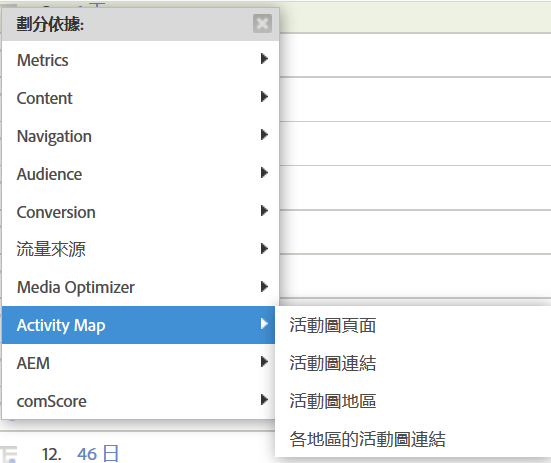

# 啟用 Activity Map{#enable-activity-map}

說明若想啟用 Activity Map 連結收集和使用者下載，Analytics 管理員需要完成的步驟。

## 步驟 1.將 AppMeasurement (Javascript) 代碼更新至 v1.6 (或更高版本) {#section_5D1586289DF2489289B1B6C1C80C300D}

Activity Map模組是AppMeasurement.js檔案（位於檔案頂端）的一部分。 AppMeasurement程式庫會在執行個體化時載入Activity Map模組。

除非您更新為此版本（或更新版本）的AppMeasurement，否則無法收集Activity Map資料。

1. Download the latest AppMeasurement code (AppMeasurement_Javascript-1.6.zip) by going to  **[!UICONTROL Analytics]** > **[!UICONTROL Admin]** > **[!UICONTROL Code Manager]** and [implement it](https://marketing.adobe.com/resources/help/zh_TW/sc/implement/js_implementation.html).

   我們已加入一 [些範例實作程式碼](/help/analyze/activity-map/activitymap-getting-started/activitymap-getting-started-admins/activitymap-sample-implementation-code.md) ，協助您透過加入Activity Map模組，以視覺化方式對程式碼所做的變更。

1. 驗證實作：

   1. 點按可點按的元素時，資料會儲存在名為s_sq的Cookie中。
   1. Activity Map資料可在追蹤呼叫的查詢字串中看到。 例如：

      ```
      …&c.&a.&Activity Map.&link=My%20Link&region=My%20Region&page=My%20Page&.Activity Map&.a&.c&...
      ```

1. Break this report down by **[!UICONTROL Activity Map Link by Region]** to see the link/region for that page:  {width=&quot;400px&quot;}

## 步驟 2.啟用 Activity Map 報表 {#section_D14F15D2FC0346FCAD8B3B87E6DD33D4}

首先，您必須在報表套裝層級啟用 Activity Map 報表。

1. Log in to Adobe Analytics and navigate to  **[!UICONTROL Analytics]** > **[!UICONTROL Admin > Report Suites >[select report suite]> Edit Settings > Activity Map]** > **[!UICONTROL Activity Map Reporting]** .
1. Activity Map 會將連結資料收集至 Activity Map 報表中。For the activation to happen, you must first activate the variables by clicking **[!UICONTROL Enable Activity Map Reports]**.

   此步驟會新增您收集資料所需的所有Analytics維度。

1. 大約一小時後，查看[「Activity Map 頁面報表」](/help/analyze/activity-map/activitymap-reporting-analytics.md)，當中就會顯示使用者有點按連結的所有頁面。

## 步驟 3.新增使用者至 Activity Map 存取群組 {#section_4C7A47BB7DEF4AFFBC276392467F9675}

1. 按一下 **[!UICONTROL Add Users to Group]**.

   這會將您帶往管理控制台中的群組管理頁面。

1. [新增使用者至此群組](https://marketing.adobe.com/resources/help/zh_TW/reference/groups.html) ，以及 **[!UICONTROL Save Group]**。

1. This allow your Admin users to download Activity Map from  **[!UICONTROL Adobe Analytics]** > **[!UICONTROL Tools]** > **[!UICONTROL ActivityMap]** .

>[!NOTE] 如果您希望非管理員使用者下載 Activity Map，請建立新的使用者群組，以提供「工具」和「舊版 ClickMap 安裝程式」的權限。此權限層級與「Activity Map存取」結合，提供下載和使用工具的權限。
