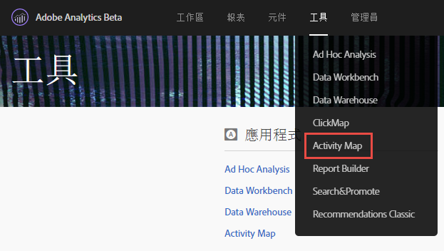
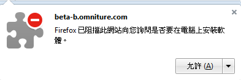
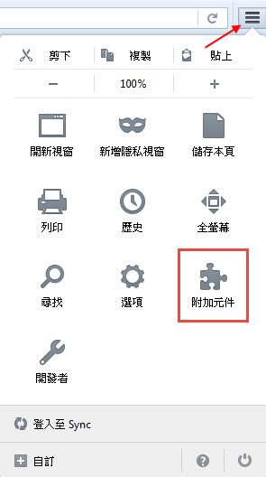

# 安裝 Activity Map 瀏覽器外掛程式{#install-activity-map-browser-plug-ins}

安裝程序視您使用的瀏覽器種類而異。

Activity Map 瀏覽器外掛程式：

* 可手動插入以做為 Analytics 頁面標記。
* 可由瀏覽器工具列中的按鈕或功能表項目啟動。
* 僅與下列桌面瀏覽器的最新版本相容：Internet Explorer、Firefox、Safari 和 Chrome。
* 支援 **[!UICONTROL Remember my login]** 功能。
* 可以在不包含 Analytics 頁面代碼的網頁上&#x200B;**插入** Activity Map 工具列。如果頁面不含 Analytics 頁面代碼，會顯示錯誤訊息。
* 需要您進行瀏覽器外掛程式安裝程序。

## 在 Chrome 上安裝 Activity Map 外掛程式 {#section_6907253D5D5E4422967E6439207A013F}

1. Go to **[!UICONTROL Adobe Analytics]** > **[!UICONTROL Tools]** > **[!UICONTROL Activity Map]**.  
1. 按一下 **[!UICONTROL Download Activity Map]**.
1. 按一下 **[!UICONTROL Install the Activity Map Plug-in]**.
1. Answer **[!UICONTROL Yes]** when the security warning asks you whether you want to download the Activity Map Browser Plug-in.
1. 下載完成後，找到 .zip 檔的位置並解壓縮其內容。
1. 回到 Chrome 位址列並輸入 `chrome://extensions`。
1. 勾選「開發人員模式」方塊。
1. 按一下「載入未封裝擴充功能」並從彈出式功能表中選取解壓縮的資料夾。
1. 如果看到工具列中新增加一個 Adobe Analytics 圖示  {width=&quot;70px&quot;}，表示下載成功。您現在可以從網頁[啟動 Activity Map](/help/analyze/activity-map/activitymap-getting-started/activitymap-getting-started-users/activitymap-launch.md) 了。

## 在 Firefox 上安裝 Activity Map 外掛程式 {#section_1F69D3D22DB34D6992747B1A62C1D2DA}

1. Go to **[!UICONTROL Analytics]** > **[!UICONTROL Activity Map]**.

1. 按一下 **[!UICONTROL Download Activity Map]**.
1. 按一下 **[!UICONTROL Install the Activity Map Plug-in]**.
1. Click **[!UICONTROL Allow]** when this message appears: 
1. 按一下 **[!UICONTROL Install Now]**.
1. 按一下 **[!UICONTROL Open Menu]** 右上方的圖示，然後選取 **[!UICONTROL Add-Ons]**。 {width=&quot;250px&quot;}
1. Activity Map 應該會列在 Firefox 附加元件清單中。
1. 如果看到工具列中新增加一個 Adobe Analytics 圖示 ，表示下載成功。您現在可以從網頁[啟動 Activity Map](/help/analyze/activity-map/activitymap-getting-started/activitymap-getting-started-users/activitymap-launch.md) 了。

## 在 Internet Explorer 上安裝 Activity Map 外掛程式 {#section_1A33705D7F784C4A88C9026ADC860FB8}

1. Go to **[!UICONTROL Analytics]** > **[!UICONTROL Activity Map]**.
1. 按一下 **[!UICONTROL Download Activity Map]**.
1. 按一下 **[!UICONTROL Install the Activity Map Plug-in]**.
1. Click **[!UICONTROL Run]** to initiate the Activity Map installation.
1. Click **[!UICONTROL Yes]** on the popup to allow the program to make changes to the computer.
1. 依照安裝精靈中的指示進行。
1. 如果 Activity Map 安裝成功，您會在 Internet Explorer 中看到一則通知，指出 Activity Map 已可供使用。將其啟用，開始使用應用程式。您現在可以從網頁[啟動 Activity Map](/help/analyze/activity-map/activitymap-getting-started/activitymap-getting-started-users/activitymap-launch.md) 了。
