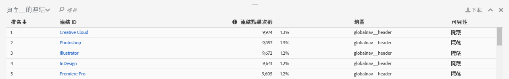
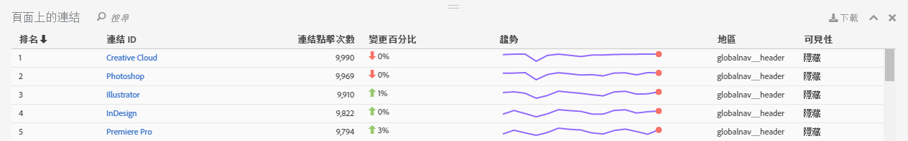

# 連結報表

連結報表會報告在目前頁面上找到的連結。並不會報告為該頁面收集的所有連結。

「頁面上的連結」報表提供連結的表格檢視。有時候您會想查看在單一檢視中排名的連結點擊次數 (或其他量度)。如此可在連結之間提供更好的比較結果。建立「頁面上的連結」報表，包含頁面上所有連結的排名清單 (依據連結 ID)、點按資訊 (# 和 %) 以及頁面中的地區。按一下 Activity Map 工具列中的「頁面上的連結報表」按鈕。

「**[!UICONTROL 頁面上的連結]**」報表隨即在 Activity Map 控制面板的瀏覽器框架下方開啟。

## 標準模式 {#section_C8D2A1C07A2A4E3A8F84AC9240603FA7}

在標準模式中，「頁面上的連結」報表會顯示從一天到多天，彙總整個日期範圍的連結資料。並顯示每個連結的下列資訊：

<table id="table_3DE41B2CFA644B70AF802A3123CE51D9"> 
 <thead> 
  <tr> 
   <th colname="col1" class="entry"> 欄目 </th> 
   <th colname="col2" class="entry"> 說明 </th> 
  </tr> 
 </thead>
 <tbody> 
  <tr> 
   <td colname="col1"> 排名 </td> 
   <td colname="col2"> 頁面中的排名。在標準模式中，無論您點按哪個欄，排名值都保持不變。 </td> 
  </tr> 
  <tr> 
   <td colname="col1"> 連結 ID </td> 
   <td colname="col2">連結的主要 ID。 (關於如何定義主要 ID 的詳細資訊，請參閱 [全新的連結追蹤方法] (/home/analyze/activity-map/activitymap-link-tracking/activitymap-link-tracking-methodology.md) </td> 
  </tr> 
  <tr> 
   <td colname="col1"> 點按 </td> 
   <td colname="col2"> 指定之連結的原始點按次數，以及其佔頁面點按總次數的百分比。如果使用者在工具列中選擇不同的量度，連結報表會改為報告該量度。 </td> 
  </tr> 
  <tr> 
   <td colname="col1"> 地區 </td> 
   <td colname="col2"> 代表連結所在的頁面中地區。 </td> 
  </tr> 
  <tr> 
   <td colname="col1"> 可見性 </td> 
   <td colname="col2">表示連結的可見性狀態。可能有兩個值： 
    <ul id="ul_BABCC0F64145407C9D439150A6898E6D">
     <li id="li_9AF0479BDCEB4A44A37292FAABFA83A5"><b>隱藏</b>：連結目前位在頁面中，但未顯示給一般使用者 (類似導覽功能表中的子功能表，只有在使用者將滑鼠暫留到父功能表頂端時才會顯示出來) </li>
     <li id="li_C6FA4EC27EDD4341AB9821E2B4BC9E60"><b>顯示</b>：連結目前顯示在頁面上。但有可能顯示在下半部，使用者必須捲動頁面才看得到。 </li>
    </ul>
附註：如果連結設定為「隱藏」，則不會顯示它的覆蓋圖。 
</td> 
  </tr> 
 </tbody> 
</table>

**篩選資料**

如果想聚焦於特定連結，則可在「**[!UICONTROL 篩選資料]**」欄位中搜尋相關詞語。只有符合搜尋的連結會顯示覆蓋圖。若不使用篩選，則會顯示「[Activity Map 設定](/help/analyze/activity-map/activitymap-overlay-settings.md)」中指定的覆蓋圖。

## 即時模式 {#section_AC1967217B5A4532ACB01D33636F6770}

在即時模式中，「頁面上的連結」報表會顯示跨越數分鐘的趨勢資料。

<table id="table_61D1FB0F02894055A1AB394DE4FE4742"> 
 <thead> 
  <tr> 
   <th colname="col1" class="entry"> 欄目 </th> 
   <th colname="col2" class="entry"> 說明 </th> 
  </tr> 
 </thead>
 <tbody> 
  <tr> 
   <td colname="col1"> 排名 </td> 
   <td colname="col2"> 頁面中的排名。如果是漸層或氣泡覆蓋圖，無論您點按哪個欄，排名值都保持不變。如果是獲益者/損失者覆蓋圖，則排名值會依據哪個連結獲益/損失最多而改變。 </td> 
  </tr> 
  <tr> 
   <td colname="col1"> 連結 ID </td> 
   <td colname="col2">連結的主要 ID。關於如何定義主要 ID 的詳細資訊，請參閱全新的 [連結追蹤方法。] (/help/analyze/activity-map/activitymap-link-tracking/activitymap-)ink-tracking-methodology.md) </td> 
  </tr> 
  <tr> 
   <td colname="col1"> 連結點擊次數 </td> 
   <td colname="col2"> 所選時段內的點按總次數。 </td> 
  </tr> 
  <tr> 
   <td colname="col1"> % 變更 </td> 
   <td colname="col2"> 目前時段連結量度和前一個時段連結量度之間的變更百分比。負 % 變更顯示為紅色，正 % 變更顯示為綠色。 </td> 
  </tr> 
  <tr> 
   <td colname="col1"> 趨勢 </td> 
   <td colname="col2"> 所有已收集時段的折線圖。目前選取的時段會以綠色標記顯示。目前滑鼠暫留的時段會以紅色標記顯示。 </td> 
  </tr> 
  <tr> 
   <td colname="col1"> 地區 </td> 
   <td colname="col2"> 代表連結所在的頁面中地區。 </td> 
  </tr> 
  <tr> 
   <td colname="col1"> 可見性 </td> 
   <td colname="col2">表示連結的可見性狀態。可能有兩個值： 
    <ul id="ul_B10C55ED4D3C4CF99506DC467E2E7CFB">
     <li id="li_EA646722A51041CC9E62C56DEF92C81F">隱藏：連結目前位在頁面中，但未顯示給您看到 (例如在頁面載入後才會顯示的連結)。 </li>
     <li id="li_F9543614C2894003AC9984A7404E2785">顯示：連結目前顯示在頁面上。但有可能顯示在下半部，您必須捲動頁面才看得到。 </li>
    </ul></td> 
  </tr> 
 </tbody> 
</table>

## 排序和篩選 {#section_4B8E8233C21247CAA70DAEC2156548AD}

有時候您只需要分析特定頁面區域的結果 (例如左側面板)，以判斷如何組織該特定網頁區域的內容。

為了這個目的，我們為「頁面上的連結」報表中的連結建立了排序和篩選功能。您可透過篩選欄位使用篩選功能，搜尋詞會套用至「連結 ID」欄和「連結地區」欄。排序功能則可透過按一下欄位 (排名、連結 ID、點按、隨時間變更、地區、可見性)，並可依遞增或遞減排序。從「頁面上的連結」報表過濾掉連結時，其覆蓋圖就不會出現在網站上。
