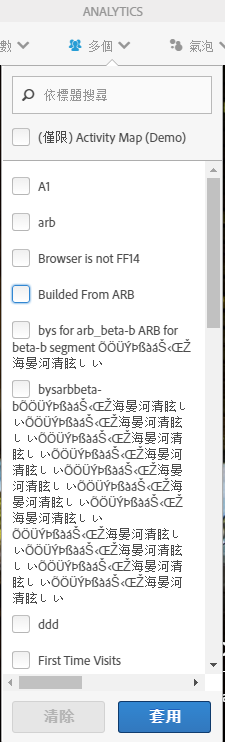
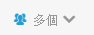

# 客戶分段

可讓您在 Activity Map 中套用多區段篩選。

>[!NOTE] 由於 Adobe Analytics 平台不支援分段即時資料，因此「區段」控制項僅適用於標準模式。

You can select one or several of the segments from the **[!UICONTROL Segments]** drop-down menu shown below. 列出的區段與您所擁有或透過「報告與分析」與您共用的區段，與所選報表套裝的區段相同。

當區段選擇變更，且關閉區段選擇器後，將針對應用程式中顯示的所有度量啟動新的Analytics資料擷取程式。 在頁面間導覽時，會記住選取的區段。

選取多個區段時，「區段選擇標籤」（處於收合狀態）會顯示「多個」。 當您按一下控制項時，會顯示選取區段的完整清單。

The selected segments will be applied to all Analytics reports presented in Activity Map, i.e. overlays and the **[!UICONTROL Links on Page]** and **[!UICONTROL Page Details]** reports.
