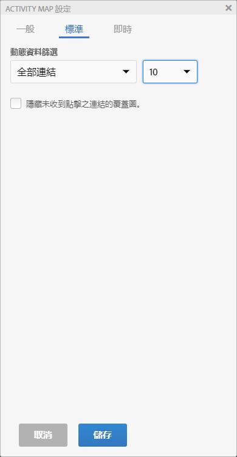
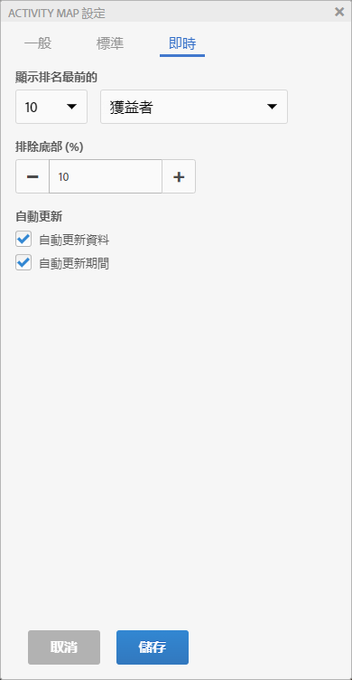
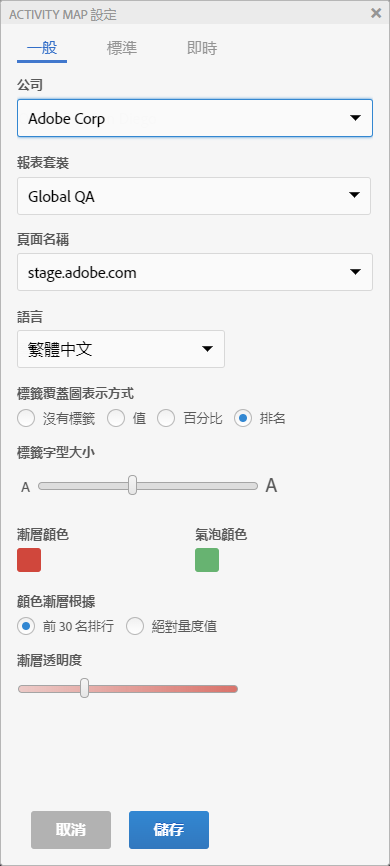

# 設定 Activity Map

「Activity Map 設定面板」可讓您修改所有覆蓋圖視覺效果類型的設定和屬性。

按一下 Activity Map 工具列上的齒輪圖示，即可存取「Activity Map 設定」面板。

「設定」面板會根據所選取的應用程式模式，而顯示不同的內容。「其他」索引標籤包含一般設定。

| 標準 | **[!UICONTROL 漸層]**&#x200B;或&#x200B;**[!UICONTROL 氣泡]**&#x200B;覆蓋圖 |
|---|---|
| Live | **[!UICONTROL 獲益者和損失者]**、**[!UICONTROL 漸層]**、**[!UICONTROL 氣泡]**&#x200B;覆蓋圖 |
| 其他 | 報表套裝選擇和語言選擇 |

## 標準模式覆蓋圖的設定 {#section_24DB95376E1A448494ECF3F57743FC19}

<table id="table_0244107DE6D142F2A1DA4882E0ED9826"> 
 <thead> 
  <tr> 
   <th colname="col2" class="entry"> 設定 </th> 
   <th colname="col3" class="entry"> 說明 </th> 
  </tr> 
 </thead>
 <tbody> 
  <tr> 
   <td colname="col2">  標籤覆蓋圖表示方式 </td> 
   <td colname="col3"> 
    <ul id="ul_13AD02789F2D4904A35215A8FA230F3E"> 
     <li id="li_8DB71636D2074C69B0D94D3FB0CAFE28"> <b>沒有標籤</b>：僅適用於漸層覆蓋圖。在這種情況下，覆蓋圖的色彩會表達連結的排名 </li> 
     <li id="li_39C98D7EA9514C1D8731B9D21C0E73A6"> <b>值</b>：該連結的原始量度總計 </li> 
     <li id="li_A5F583E45BCD4F2399398F9DCC7FE382"> <b>百分比</b>：此連結量度相對於頁面總量度的百分比。 </li> 
     <li id="li_E4BF7D3B863E4B6C8E737CF29ADA9D67"> <b>排名</b>：此連結在已轉譯頁面中呈現之所有連結間的排名 </li> 
    </ul> </td> 
  </tr> 
  <tr> 
   <td colname="col2">  標籤字型大小 </td> 
   <td colname="col3"> 可讓您使用滑桿來增加/減少覆蓋圖的標籤字型大小，以提高可讀性。 </td> 
  </tr> 
  <tr> 
   <td colname="col2">  顯示 </td> 
   <td colname="col3">選取「排名前」、「底層」或「全部連結」以在覆蓋圖中顯示。如果選取「排名前」或「底層」，您還必須選取要顯示的連結數。 </td> 
  </tr> 
  <tr> 
   <td colname="col2"> 隱藏未收到點擊之連結的覆蓋圖。 </td> 
   <td colname="col3"> 此核取方塊可讓您隱藏未收到點擊之連結的覆蓋圖，以降低介面中的雜訊。 </td> 
  </tr> 
  <tr> 
   <td colname="col2">  漸層顏色 / 氣泡顏色 </td> 
   <td colname="col3">在一系列顏色中選取，用來顯示「漸層」或「氣泡」覆蓋圖視覺效果的覆蓋圖連結排行。 </td> 
  </tr> 
  <tr> 
   <td colname="col2">  顏色漸層根據 </td> 
   <td colname="col3"> 
    <ul id="ul_1B5C2A44A9EB465D8B8E9AD91AF79D69"> 
     <li id="li_C983CB68B90B492BB0774254292B5961"> 前 30 名排行：針對前 30 個值標準化色彩強度。 </li> 
     <li id="li_1E83431C8C734AB0BC82B5A66AED1189"> 絕對量度值：色彩強度是絕對量度值的函數。 </li> 
    </ul> </td> 
  </tr> 
  <tr> 
   <td colname="col2">  漸層透明度 </td> 
   <td colname="col3">選取漸層覆蓋圖的透明度。 
此設定不影響氣泡覆蓋圖。 
 </td> 
  </tr> 
 </tbody> 
</table>

## 即時模式覆蓋圖的設定 {#section_D30F6E62FB5D404090B588F396A460AF}

| 設定 | 說明 |
|---|---|
| **[!UICONTROL 顯示排名最前的]** | 選取要顯示的連結數 (或全部)，並選取要將「**[!UICONTROL 獲益者]**」或「**[!UICONTROL 損失者]**」(或兩者) 顯示為覆蓋圖。 |
| **[!UICONTROL 排除最後 (%)]** | 選取以消除資料稀少的獲益者-損失者連結。過濾掉連結變更的最後百分比，僅檢視具有足夠資料可顯示相關獲益或損失的連結。百分比是根據該頁面的連結數來計算。例如，過濾掉具 200 個連結之清單上的最後 10%，會過濾掉最後 20 個連結。 |
| **[!UICONTROL 自動更新資料]** | 可讓您決定在計算新時段時，是否應自動更新介面上顯示的 Analytics 資料。 |
| **[!UICONTROL 自動更新時段]** | 勾選此選項時，每次擷取新資料都會重新整理網頁，以讓頁面上的連結與所收集的資料更緊密同步。 |

## 其他設定 {#section_697A12F099494D699A4BF498598178C5}

<table id="table_0F560236F8844FA0928CBB9C50D5ABEF"> 
 <tbody> 
  <tr> 
   <td colname="col1"> 報表套裝 </td> 
   <td colname="col2"> 
您能存取的報表套裝清單不再僅限於網頁標籤所定義的報表套裝。您現在可以使用其他報表套裝替代所選取的報表套裝 (對應至該頁面任一標籤)。此新的報表套裝不需要連結至該頁面上的標籤。如果變更您在「Activity Map 設定」中選定的報表套裝，儲存程序會重新整理所有受影響的分析報表。 
 
 
重要：虛擬報表套裝與即時模式不相容，只與標準模式相容。如果您處於標準報表套裝的即時模式，但在此對話方塊中選取了虛擬報表套裝，則一旦按下此處的「確定」，就會顯示標準模式。 
 
 
此外，日曆控制項也會重新初始化以符合報表套裝的日曆類型 (西曆、零售、自訂...)。 
 </td> 
  </tr> 
  <tr> 
   <td colname="col1"> 語言 </td> 
   <td colname="col2"> 此選項對應至「Adobe Analytics」所提供的語言。 </td> 
  </tr> 
  <tr> 
   <td colname="col1"> 關於 </td> 
   <td colname="col2"> 指出應用程式名稱和版本號碼。 </td> 
  </tr> 
 </tbody> 
</table>

