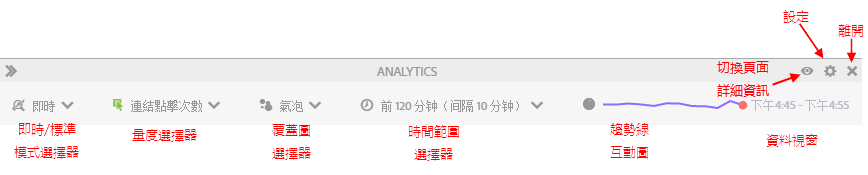

# 標準模式和即時模式的比較

Activity Map 提供兩個基本模式，用以為頁面活動提供補充報告功能。

* 在標準模式中，「[頁面上的連結](/help/analyze/activity-map/activitymap-links-report.md)」報表會顯示從一天到多天，彙總整個日期範圍的連結資料。
* 即時模式則可即時顯示活動趨勢。

按一下工具列中的「模式」按鈕，即可切換這兩種模式。

## 標準模式 {#section_0C755F30B7EC4A13A62AB9A391AF51E6}

在「**標準模式**」中，您可以在工具列中選取日期範圍，如下所示。

在此模式中，系統會線性分配未啟用「參與率」的商務量度。舉例來說，假設某位使用者在點按首頁的「iPod mini」連結後，又再繼續瀏覽了 3 個頁面。在第 4 個頁面時，他購買了一台 200 美元的 iPod mini。「iPod mini」連結會收到 200 美元的參與率收入和 50 美元 (200/4) 的收入 (線性分配收入)。

問：假如不同地區的頁面中有相同連結名稱的連結呢？又既然這兩個連結分屬不同地區，但頁面中的連結名稱卻相同，那它們會分別收到評價嗎？

答：這取決於您彙總連結資料的方式。在 Activity Map 中，我們看的是特定頁面的「連結 ID|地區」，因此分配的資料會是「連結 ID|地區」組合。在此案例中，由於地區不同，使得連結|地區各是截然不同的，因此，第一個連結|地區獲得的所有分配收入，會與第二個連結的所有分配收入有所不同。但在 Adobe Analytics 使用者介面中，您可以只查看特定頁面 (按「連結」劃分的頁面) 的連結 ID 報表，而不是「連結|地區」報表。在此情況下，系統會彙總這兩個地區的收入。

## 即時模式 {#section_D619B77D89A840F0B1C2DEA2715A516A}

在&#x200B;**即時模式**&#x200B;中，會以 1 分鐘到 15 分鐘的增量，並以趨勢方式來顯示 Analytics 資料。這個模式是用於分析和監控網頁上的短期趨勢。

即時模式是為了響應出版機構的需求。這些機構需要監控幾個關鍵頁面中連結人氣的微型趨勢。能夠迅速辨別哪些連結表現不佳、哪些連結越來越熱門，是出版業務的重要能力。

>[!IMPORTANT]
>
>虛擬報表套裝與即時模式不相容，只與標準模式相容。

