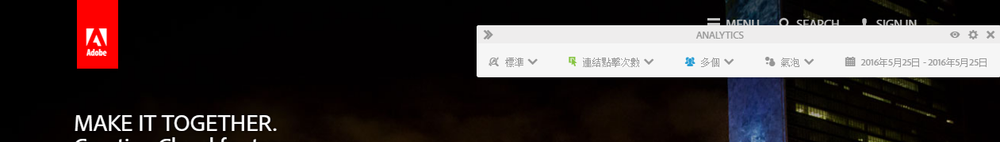
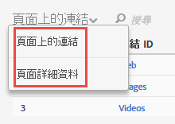

# Activity Map 使用者介面

Activity Map UI 由兩部分組成：

* 上方視窗包含網頁、插入的覆蓋圖以及工具列。
* 下方面板提供報表。

## 上方面板 {#section_2DA8ACD35D4C4ACBA32C13EFB5317E7C}

您可在上方查看網頁以及[插入的工具列](/help/analyze/activity-map/activitymap-standard-live.md)和[連結覆蓋圖](/help/analyze/activity-map/activitymap-gainerslosers.md)。連結上方顯示的氣泡排名則可讓您識別點按總次數。

將滑鼠暫留在每個連結覆蓋圖上，可以存取其他連結詳細資料：

## 下方報表面板 {#section_21B129D69B7A4F918E975E8E66DB02EE}

在頁面下方，您可以看到「[頁面上的連結](/help/analyze/activity-map/activitymap-links-report.md)」報表和「[頁面細節](/help/analyze/activity-map/activitymap-page-flow.md)」報表，供您檢視目前網頁統計資料的摘要以及頁面流量資訊。

「頁面上的連結」報表提供目前頁面上連結的試算表檢視，包括其他點按資訊。「頁面細節」報表呈現在瀏覽至目前顯示頁面之前和之後所造訪頁面的相關分析資料。

