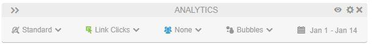
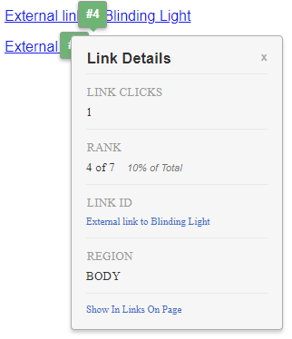

# Activity Map擴充功能介面

Activity Map擴充功能介面由兩部分組成：

* 可讓您設定擴充功能和報表的頂端面板
* 顯示最受歡迎連結的覆蓋圖
* 顯示最受歡迎連結量度的底部面板

## 上方面板

頂端面板包含Activity Map覆蓋的基本控制項。

它提供下列設定：

* **標準/即時檢視**：在標準檢視和即時檢視之間切換。
   * 標準檢視：根據歷史資料顯示覆蓋圖。
   * 即時檢視：根據即時資料顯示覆蓋。 日期選擇器會變更為下拉式清單，讓您變更即時資料的粒度。
* **量度選擇器**：可讓您變更覆蓋報告的量度。 如果您已選取即時檢視，則只有[!UICONTROL 連結點按]可用。
* **區段選取器**：可讓您選取[區段](/help/components/segmentation/seg-overview.md)，檢視您覆蓋圖中的資料子集。 「即時」檢視中無法使用區段。
* **覆蓋圖視覺效果型別**：可讓您變更覆蓋圖視覺化連結排名的方式。
   * **[!UICONTROL 泡泡圖]**：在報告期間，熱門連結收到顯示其數值排名的綠色泡泡圖。 您可以在[設定](settings.md)中變更泡泡顏色。
   * **[!UICONTROL 漸層]**：排名最前的連結以透明紅色顯示。 最受歡迎的連結是最深的紅色。 您可以在[設定](settings.md)中變更漸層顏色。
   * **[!UICONTROL 關閉]**：停用連結覆蓋。
* **日期選擇器**：可讓您變更報告期間。

此面板的標題包含下列設定：

* **展開/摺疊頂端面板**：切換頂端面板，以水平或垂直顯示設定（雙箭頭圖示）。
* **[!UICONTROL 切換頁面詳細資料]**：顯示或隱藏底部面板（眼睛圖示）。
* **[!UICONTROL 顯示設定]**：開啟可變更設定的功能表（齒輪圖示）：
   * **[!UICONTROL 設定]**：開啟擴充功能的[設定](settings.md)。
   * **[!UICONTROL 說明]**：開啟檔案以Experience League（此頁面）。
   * **[!UICONTROL Adobe社群]**：開啟[Experience League社群](https://experienceleaguecommunities.adobe.com/)。
   * **[!UICONTROL 關於]**：顯示擴充功能版本。
   * **[!UICONTROL 登出]**：將您登出擴充功能，要求您再次登入。
* **[!UICONTROL 結束Activity Map]**：關閉擴充功能的所有覆蓋圖（X圖示）。

## 頁面覆蓋

頁面覆蓋圖包含您的網站內容，覆蓋圖會顯示報告期間最常點按的連結位置。 您可以設定這些連結覆蓋圖，使其在頂端面板的&#x200B;**[!UICONTROL 覆蓋圖視覺效果型別]**&#x200B;中顯示為泡泡或漸層。

如果按一下泡泡圖或漸層，即可檢視該特定連結的詳細資訊。

## 底部面板

底部面板會顯示覆蓋圖上所顯示連結的彙總檢視。

* **報告型別**：切換底部面板以顯示頁面&#x200B;**報告上的**&#x200B;連結或&#x200B;**[!UICONTROL 頁面詳細資料]**&#x200B;報告。
* **[!UICONTROL 頁面名稱]**：目前的[頁面](/help/components/dimensions/page.md)維度名稱。
* **[!UICONTROL 搜尋]**：篩選報告以便只顯示符合輸入文字的連結名稱。
* **[!UICONTROL 下載]**：將報表匯出為CSV。 您可以在相同的下載檔案中加入[!UICONTROL 頁面]上的連結報告、[!UICONTROL 頁面]報告和[!UICONTROL 頁面流量]報告。
* **[!UICONTROL 變更報表停駐位置]**：切換此面板的位置，使其顯示在瀏覽器視窗的底部或頂端。
* **[!UICONTROL 關閉報告]**：關閉此面板。 您可以使用頂端面板中的&#x200B;**[!UICONTROL 切換頁面詳細資料]**&#x200B;按鈕（眼睛圖示）再次開啟面板。

**[!UICONTROL 頁面]**&#x200B;上的連結報告會顯示具有下列設定的基本工作區報告：

* [Activity Map連結](/help/components/dimensions/activity-map-link.md)維度
* [發生次數](/help/components/metrics/occurrences.md)量度（標示為&#x200B;**[!UICONTROL 連結點按次數]**）
* 目前的[頁面](/help/components/dimensions/page.md)值已套用為區段

**[!UICONTROL 頁面詳細資料]**&#x200B;報告顯示使用[頁面](/help/components/dimensions/page.md)維度的[流量](/help/analyze/analysis-workspace/visualizations/c-flow/flow.md)視覺效果，著重於目前頁面。 目前頁面的下列量度會顯示在左側：

* 總共[個頁面檢視](/help/components/metrics/page-views.md)
* 所有頁面檢視的[!UICONTROL %]
* [個專案](/help/components/metrics/entries.md)計數
* [退出](/help/components/metrics/exits.md)計數
* [單頁造訪次數](/help/components/metrics/single-page-visits.md)
* [!UICONTROL 頁面平均點按次數]
* 平均第[頁逗留時間](/help/components/metrics/time-spent.md)
* [重新載入次數](/help/components/metrics/reloads.md)
* [跳出率](/help/components/metrics/bounce-rate.md)
* [!UICONTROL 連結點選次數]

