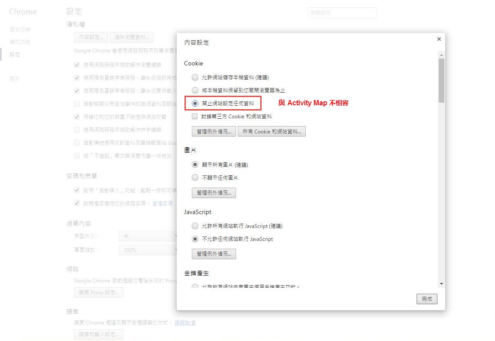
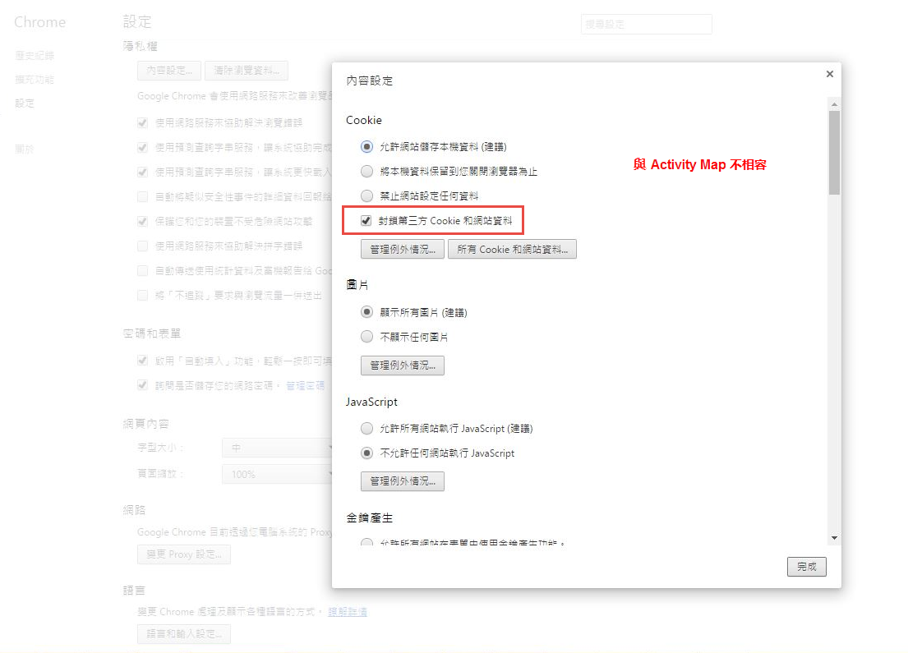
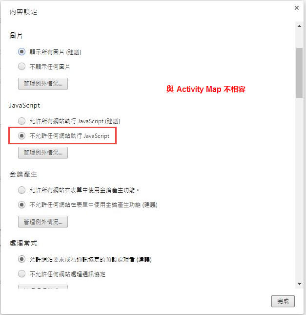
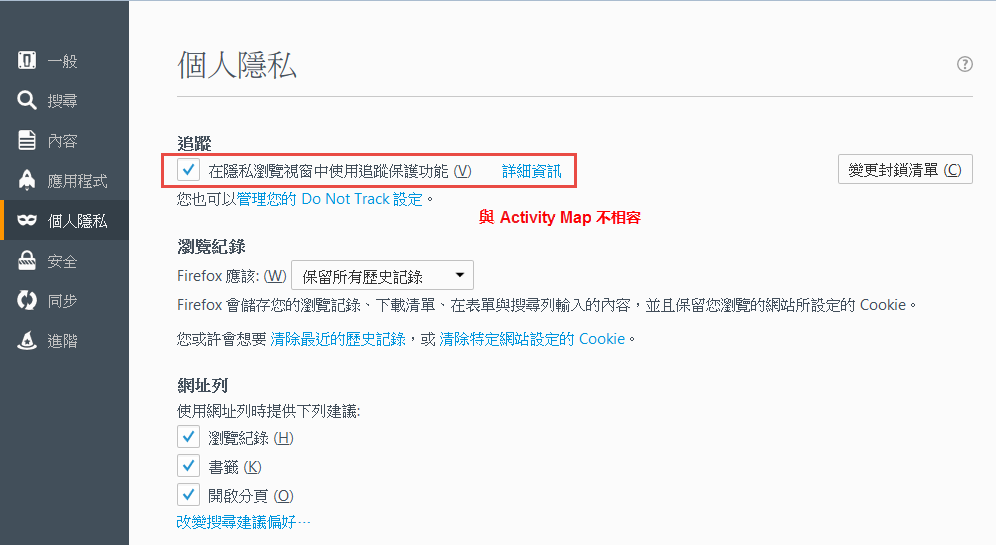
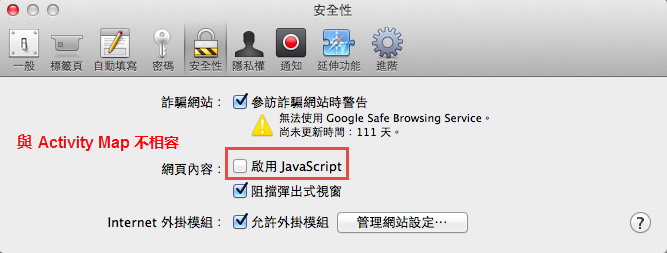
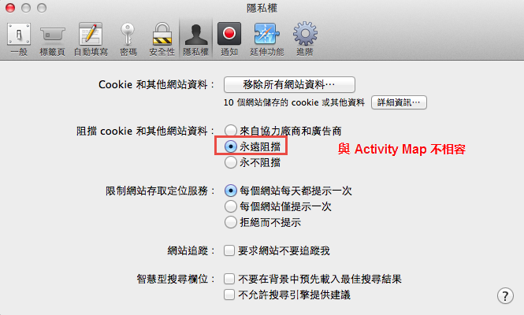
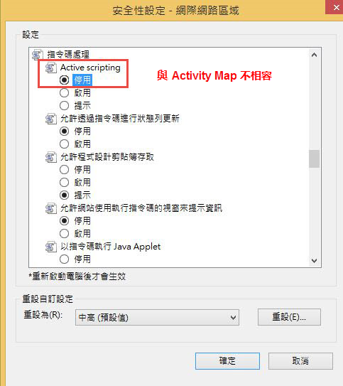

# 疑難排解Activity Map資料收集

如果您沒有看到Activity Map維度的資料，請使用此頁面來協助判斷原因。

## 使用除錯工具確認資料收集

首先，請確定AppMeasurement正確收集Activity Map資料。

1. 下載並安裝[Adobe Experience Cloud Debugger Chrome擴充功能](https://experienceleague.adobe.com/en/docs/experience-platform/debugger/home)。
2. 導覽至您的網頁，然後按一下連結。
3. 後續頁面載入時，請開啟偵錯工具。 驗證您看到介於`activitymap.`和`.activitymap`之間的Activity Map內容資料變數：

## Activity Map資料不存在的可能原因

檢查下列各項，確認Activity Map元件是否存在：

* **AppMeasurement版本**： v1.6及更高版本支援Activity Map。 升級到最新穩定AppMeasurement版本後，許多邊緣案例問題得以解決。
* **Activity Map模組**：檢查`AppMeasurement.js`檔案中是否有`AppMeasurement_Module_Activity_Map`模組。 如果您的實作使用Adobe Experience Platform來收集資料，請確定在&#x200B;**[!UICONTROL 連結追蹤]**&#x200B;下設定Analytics擴充功能時，已勾選&#x200B;**[!UICONTROL 啟用ClickMap]**。
* **`s_sq` Cookie**：Activity Map取決於資料收集的`s_sq` Cookie。
   * 請確定`cookieDomainPeriods`變數已正確設定，尤其是區域網域，例如`*.co.uk`或`*.co.jp`。
   * 請確定`linkInternalFilters`變數已設定為所要的值。 如果點按的連結不符合內部篩選器，Activity Map會將其視為退出連結，不會收集資料。
* **正在執行Activity Map覆蓋**：啟用AppMeasurement覆蓋時，Activity Map不會追蹤您網頁的點選資料。

顯示與使用 Activity Map 不相容的瀏覽器參數。Adobe建議停用這些設定。

## Chrome

## Firefox

## Safari

## Internet Explorer

**驗證**

使用 Developer Console 網路標記進行互動呼叫：

1. 在網站上載入開發啟動指令碼。
1. 在點選元素後，在「網路」標記中搜尋 &#39;/ee&#39;

Adobe Experience Platform Debugger：

1. 下載並安裝 [Adobe Experience Platform Debugger](https://chromewebstore.google.com/detail/adobe-experience-platform/bfnnokhpnncpkdmbokanobigaccjkpob)。
1. 前往「[!UICONTROL 記錄檔] > [!UICONTROL Edge] > [!UICONTROL 連接到 Edge]」。

* **網路索引標籤中的互動呼叫未觸發**：集合呼叫中的點選資料集合，使用`"/ee"`或`"collect?"`篩選。
* **收集呼叫沒有裝載顯示**：收集呼叫的設計方式不會影響到其他網站的導覽，因此檔案解除安裝功能適用於收集呼叫。 此功能不會影響您的資料收集，但如果您需要在頁面上驗證，請將`target="_blank"`新增至個別元素。 連結會在新標籤中開啟。
