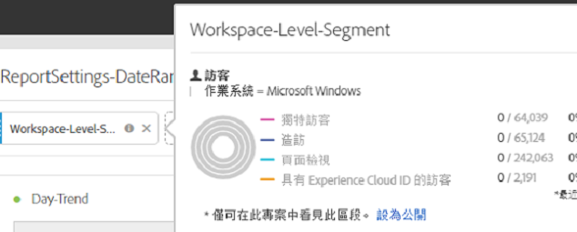
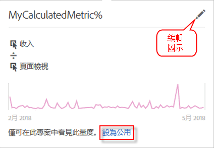

# 專案轉換工具常見問題集

## 專案轉換工具常見問題集 {#topic_8231595303AD403E9322645A63632D57}

* [已知的轉換問題](/help/analyze/ad-hoc-analysis/c-aha-project-converter/aha2aw-converter-faq.md#section_39C922A58B2E49C9877B363042801361)
* [轉換常見問答集](/help/analyze/ad-hoc-analysis/c-aha-project-converter/aha2aw-converter-faq.md#section_1E53FE373AF045978F939916124E194E)

## 已知的轉換問題 {#section_39C922A58B2E49C9877B363042801361}

| 問題 | 說明 |
|--- |--- |
| 提供劃分或以欄顯示的分鐘詳細程度 | 當分鐘詳細程度已套用劃分，或如果分鐘詳細程度以欄顯示，則專案無法轉換為 Analysis Workspace。因應措施是移除分鐘詳細程度的劃分，並從欄中移除劃分，然後轉換專案。然後，您可以在 Analysis Workspace 中將劃分套用在分鐘詳細程度。 |
| 與欄區段一起使用的內部計算量度 | 如果您使用內部計算量度與欄區段，則專案無法轉換至 Analysis Workspace。若要解決此問題，請在轉換前先從專案移除內部計算量度，然後在 Analysis Workspace 中重新新增這些量度。 |

## 轉換常見問答集 {#section_1E53FE373AF045978F939916124E194E}

<table id="table_48CC119236C94835A6A512E989BE4200"> 
 <thead> 
  <tr> 
   <th colname="col1" class="entry"> 問題 </th> 
   <th colname="col2" class="entry"> 回答 </th> 
  </tr>
 </thead>
 <tbody> 
  <tr> 
   <td colname="col1"> 
<b>問：Analysis Workspace 中是否有任何不支援的 Ad Hoc Analysis 功能？</b> 
 </td> 
   <td colname="col2"> 
答：Analysis Workspace 不支援「站點分析」報表。Ad Hoc Analysis 和 Workspace 中的其他視覺效果之間也有一些細微差異。請參閱下列問題以了解詳細資訊。 
 </td> 
  </tr> 
  <tr> 
   <td colname="col1"> 
<b>問：如何轉換表格設定？</b> 
 </td> 
   <td colname="col2"> 
    <ul id="ul_A645A004FB094A1593439A6607FE9A6B"> 
     <li id="li_033CA771F08A4BC3B0BC52CDCCA03FF4"><b>顯示的列數</b>：Workspace 採用僅顯示 10 列的編頁方式 (可自訂為一次最多顯示 400 列)，而 Ad Hoc 在一頁中最多可顯示 50,000 列。請注意，資料仍在 Workspace 中，只是編頁為 10 列的預設值。 </li> 
     <li id="li_A8B8890149334032A56D8D1C0F8691EA"><b>進階搜尋</b>：不支援多個同步搜尋選項，但單一搜尋選項 (例如「所有這些單字」、「精確對應片語」、「任何這些單字」或「不含這些單字」) 會轉換到 Analysis Workspace。 </li> 
    </ul> </td> 
  </tr> 
  <tr> 
   <td colname="col1"> 
<b>問：如何轉換圖表/圖形？</b> 
 </td> 
   <td colname="col2"> 
答：請注意，圖表和圖形在 Workspace 中統稱為「視覺效果」。 
 
    <ul id="ul_597F5AB826EF434295D0CABD0313CAD5"> 
     <li id="li_AFB2805418034721A9519D999128C0A8"><b>設定</b>：Workspace 不支援「項目數」或「長條數目」之類的視覺效果設定。 </li> 
     <li id="li_D5C7EA8815344EDB8585CBB8E1AF583E"><b>圓餅圖</b>：匯出為<a href="https://marketing.adobe.com/resources/help/zh_TW/analytics/analysis-workspace/donut.html"  >環形圖</a>視覺效果。Workspace 中的這個視覺效果限制為 19 個區段。 </li> 
     <li id="li_91659FBFD77C4B3393D78447D658B7B4"><b>泡泡圖</b>：匯出為<a href="https://marketing.adobe.com/resources/help/zh_TW/analytics/analysis-workspace/scatterplot.html"  >散點圖</a>視覺效果。根據預設，散點圖會在 X 軸上繪製第一個量度，並在 Y 軸上繪製第二個量度。如果只有一個量度，泡泡圖會轉換為「折線圖」視覺效果。 </li> 
     <li id="li_FA05085FFB1747EBAF63616AC2B8D59C"><b>色階分佈圖</b>：在 Workspace 與 Ad Hoc Analysis 中支援不同的分段邏輯。因此，這會轉換為<a href="https://marketing.adobe.com/resources/help/zh_TW/analytics/analysis-workspace/bar.html"  >長條圖</a>視覺效果。 </li> 
     <li id="li_959499D20796459CA0F6BBC8F0A8D808"><b>散點圖</b>：在 Analysis Workspace 的匯出專案中，Y 軸會設為第一欄，X 軸會設為第二欄，而直徑則是第三欄。 </li> 
     <li id="li_14E06D7A5106405A89A07B44FFD9A92D"><b>流失表格</b>：若要顯示流過或流失表格，請以滑鼠右鍵按一下查核點，然後選取劃分選項。 </li> 
     <li id="li_240F43C386F04111A7632A8FCA37832C"><b>流失報表層級資料範圍</b>：尚未將自訂的報表日期範圍套用到「流失」視覺效果。 </li> 
     <li id="li_1FF5B3FD9E424E7190AF03FD4DD9D654"><b>流量報表</b>：會將「流量」移至另一個面板，以保留日期範圍與區段。 </li> 
     <li id="li_BE8F8F6EC2EA49E18EF52539BC1700E0"><b>轉換漏斗</b>：將轉換為自由表格，因為 Analysis Workspace 不支援此功能。「流失」視覺效果是「轉換漏斗」的建議替代項目，不過其行為會稍有不同。 </li> 
    </ul> </td> 
  </tr> 
  <tr> 
   <td colname="col1"> 
<b>問：如何轉換區段？</b> 
 </td> 
   <td colname="col2"> 
    <ul id="ul_15D5B17461E2402DB07DF8B0A10AAC37"> 
     <li id="li_CF9C3D235A664B15B21D9F89DC5EF7D3">區段是供轉換的專案內部使用 (非公用)。您可以選擇將其設為公用，如下所示： 
 
 </li> 
     <li id="li_AE61DAEC5C0047349DD192EFEEDB0BF9">Ad Hoc Analysis 工作區層級的區段會套用在 Workspace 中的專案/工作區層級。 </li> 
     <li id="li_B1559E2C18724FE189AF87D0BEF16811">Ad Hoc Analysis 報表層級的區段會套用在 Workspace 中的表格欄層級。 </li> 
     <li id="li_0E6DF6D44EA448A4A212BA2BB8E342CF">Ad Hoc Analysis 表格區段會套用在 Workspace 中的欄層級。 </li> 
    </ul> 
您可以在<a href="https://marketing.adobe.com/resources/help/zh_TW/analytics/segment/"  >區段產生器</a>中編輯區段。 
 </td> 
  </tr> 
  <tr> 
   <td colname="col1"> 
<b>問：如何轉換日期範圍？</b> 
 </td> 
   <td colname="col2"> 
    <ul id="ul_A24AB597F3CE4847AF00D49A9A72A395"> 
     <li id="li_24FD18AF64114445939C4FBC03F2D406">Ad Hoc Analysis 中的「最近 X 天」日期範圍會<i>排除</i>今天， 而 Analysis Workspace 會<i>包含</i>今天。因此，各項工具之間的「最近 90 天」等日期範圍可能不會完全相符。使用自訂日期範圍，在 Analysis Workspace 中擷取相同的時段。 </li> 
     <li id="li_AA4390470C494748B4B12030B1226720">Ad Hoc Analysis 工作區層級的日期範圍會套用在 Workspace 中的專案/工作區層級。 </li> 
     <li id="li_B8F0CDD413154856A315D087FEC4D418">Ad Hoc Analysis 報表層級的日期範圍會套用在 Workspace 中的表格欄層級。 </li> 
    </ul> 
您可以在「Analytics &gt; 元件 &gt; 日期範圍」下編輯自訂日期範圍。 
 </td> 
  </tr> 
  <tr> 
   <td colname="col1"> 
<b>問：如何轉換計算量度？</b> 
 </td> 
   <td colname="col2"> 
    <ul id="ul_ADA380D5D09B4223AAE4853D4C64F679"> 
     <li id="li_010572F793F54680ABE64117DAB7E800">計算量度是供匯出的專案內部使用 (非公用)。以滑鼠右鍵按一下量度，然後按一下「設為公用」，即可選擇將其設為公用。 
 
 </li> 
     <li id="li_930546EC8FEB432C8810FAF93556FC9A">所有類型的計算量度均支援匯出功能。 </li> 
     <li id="li_DFF7C6F8BB2344928D49194DA0F6EC38"><b>配置類型</b>：即使 Analysis Workspace 未明確顯示計算量度的配置類型，匯出仍會產生並符合 Ad Hoc Analysis 中既有的配置類型。 </li> 
    </ul> 
您可以按一下編輯圖示 (鉛筆)，在<a href="https://marketing.adobe.com/resources/help/zh_TW/analytics/calcmetrics/"  >計算量度產生器</a>中編輯配置類型。 
 </td> 
  </tr> 
  <tr> 
   <td colname="col1"> 
<b>問：Ad Hoc 中的「全域資料設定」 如何套用到轉換的專案？</b> 
 </td> 
   <td colname="col2"> 
「全域資料設定」可能會導致相同的專案匯出兩次，並且表現出不同的行為： 
 
    <ul id="ul_E3827883DD8045FAAB359D7E85E3EEFA"> 
     <li id="li_1056CA4813C44638BEB070228AE6914C"><b>計算重複例項。</b>無論在匯出時套用何種設定，都會套用至 Analysis Workspace 中的匯出專案。 </li> 
     <li id="li_D5405E2862CF434CA82AA9DE000F4BBC"><b>資料來源。</b>在 Analysis Workspace 中，會顯示所有 Analytics 資料，包括資料來源。 </li> 
    </ul> </td> 
  </tr> 
  <tr> 
   <td colname="col1"> 
<b>問：如果我的 Ad Hoc Analysis 專案已排定，該排程是否會轉換到 Analysis Workspace？</b> 
 </td> 
   <td colname="col2"> 
否，不會轉換排程。在 Analysis Workspace 中，開啟您要排定的專案，然後前往「共用 &gt; 依排程傳送檔案」以設定新排程。請務必取消 Ad Hoc Analysis 中已排定的專案。 
 </td> 
  </tr> 
  <tr> 
   <td colname="col1"> 
<b>問：這兩種工具之間是否有任何命名差異？</b> 
 </td> 
   <td colname="col2"> 
答：是。請參閱 Analysis Workspace 文件中的<a href="https://marketing.adobe.com/resources/help/zh_TW/analytics/analysis-workspace/adhocanalysis_vs_analysisworkspace.html"  >重要術語的比較</a>。 
 </td> 
  </tr> 
 </tbody> 
</table>

