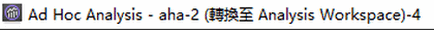
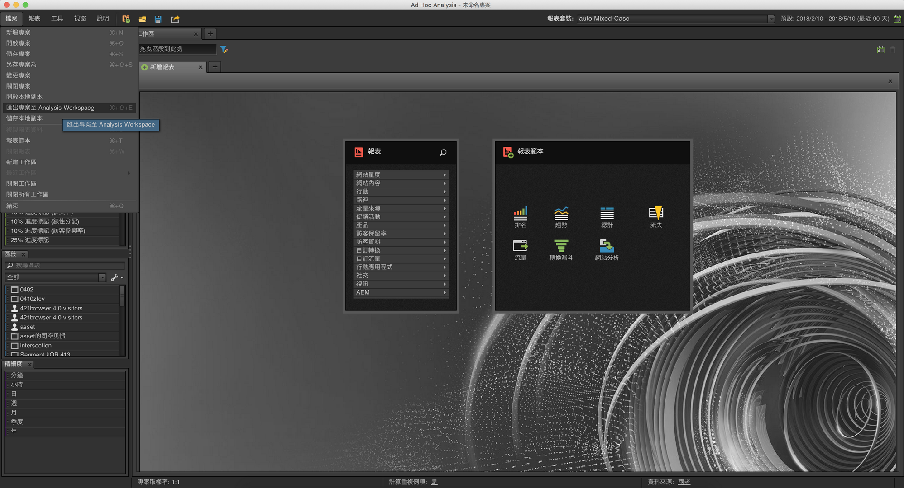
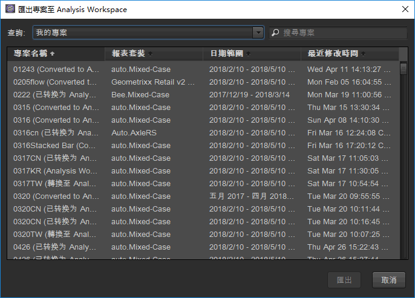
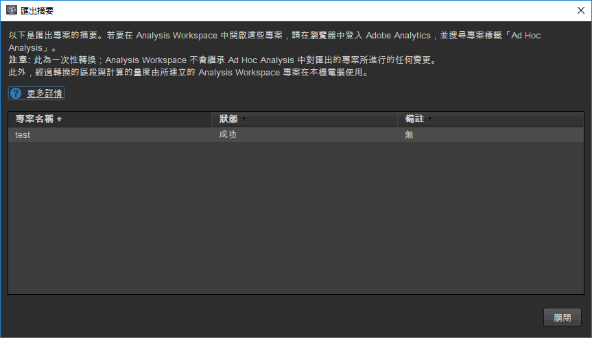
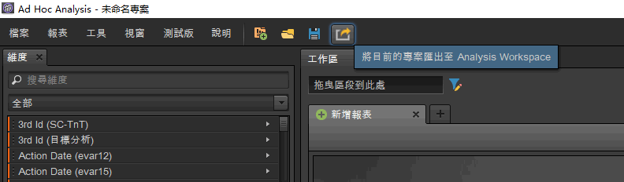

# 在 Ad Hoc Analysis 中轉換專案

## 在 Ad Hoc Analysis 中轉換專案 {#topic_5A55F73488704C5D8E42CDD04B5984DE}

轉換專案之前，請注意下列事項：

* 若要轉換專案，您必須以管理員身分或以具備可使用 Analysis Workspace 之權限的非管理員身分登入 Ad Hoc Analysis。
* 由於這是一次性轉換，Analysis Workspace 中不會反映您對轉換的 Ad Hoc 專案所做的任何其他變更。不過，您可以選擇重新轉換專案。
* 任何轉換的 Ad Hoc Analysis 專案都會繼續存在於 Ad Hoc 中，並在標題加上括號，表示已轉換該專案及其轉換次數。範例：

   

有關轉換 Ad Hoc Analysis 專案，提供以下 2 個選項：

* 從清單中選取您要轉換的專案。
* 僅轉換目前開啟的專案。

**從清單中選取專案**

1. 在 Ad Hoc Analysis 中，按一下&#x200B;**[!UICONTROL 「檔案]** > **[!UICONTROL 將專案轉換至 Analysis Workspace」]**。

   

1. 在&#x200B;**[!UICONTROL 「將專案轉換至 Analysis Workspace」]**&#x200B;對話方塊中，選取要轉換的專案，或按住 + 選取整個清單。

   

1. 按一下&#x200B;**[!UICONTROL 「轉換」]**。
1. 現在[!UICONTROL 「轉換摘要」]會列出所有已轉換的專案，與表示轉換「成功」或「失敗」的狀態欄，以及顯示錯誤代碼。聯絡 Adobe Client Care，進一步診斷「`Error-Id: <Error-Code>`」。

   

**轉換目前的專案**

1. 在 Ad Hoc Analysis 中，開啟您要轉換的專案。
1. 按一下&#x200B;**[!UICONTROL 「將目前的專案轉換至 Analysis Workspace」]**。

1. 現在[!UICONTROL 「轉換摘要」]會列出所有已轉換的專案，與表示轉換「成功」或「失敗」的狀態欄，以及顯示錯誤代碼。聯絡 Adobe Client Care，進一步診斷「`Error-Id: <Error-Code>`」。
