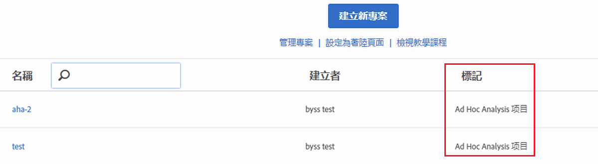

# 在 Analysis Workspace 中檢視轉換的專案

在 Workspace 中檢視專案之前，請參閱[常見問題集](/help/analyze/ad-hoc-analysis/c-aha-project-converter/aha2aw-converter-faq.md#topic_8231595303AD403E9322645A63632D57)，並檢閱 Ad Hoc Analysis 與 Workspace 之間的[術語差異](/help/analyze/ad-hoc-analysis/c-aha-project-converter/aha2aw-converter-faq.md#topic_8231595303AD403E9322645A63632D57)。

1. 導覽至&#x200B;**[!UICONTROL 「Analytics]** > **[!UICONTROL Workspace]**」。請注意，從 Ad Hoc Analysis 轉換的專案會加上「Ad Hoc Analysis 專案」的標記。

   

1. 按一下專案名稱以檢視專案。
1. 視需要進一步變更專案。請注意，Ad Hoc Analysis 中不會反映這些變更。

