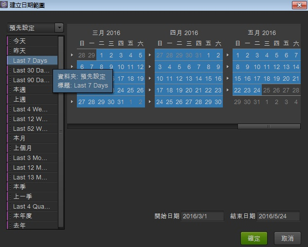

# 日期和日期範圍

在日曆中，您可以指定日期和日期範圍，也可以選取預設集。您可以在專案、工作區和報表層級進行日曆選擇。 專案的日期範圍是預設日期。 不過，工作區日期範圍會覆寫專案的日期範圍。 同樣地，報表的日期範圍會覆寫工作區和專案的日期設定。 您無法選取資料可用範圍以外的日期範圍。

## 日期和日期範圍 {#concept_AB32765013F449908B5964AB622C75FF}

在日曆中，您可以指定日期和日期範圍，也可以選取預設集。您可以在專案、工作區和報表層級進行日曆選擇。 專案的日期範圍是預設日期。 不過，工作區日期範圍會覆寫專案的日期範圍。 同樣地，報表的日期範圍會覆寫工作區和專案的日期設定。 您無法選取資料可用範圍以外的日期範圍。

 啟用的 **[!UICONTROL Clear Date]** 選項表示在報表層級指定日期範圍。

您也可以將日期（和時間維度）拖曳至報表或 [!UICONTROL Table Builder]。 您可以選擇特定的日、周、月、年或滾動日期。 如果您在行銷報告與分析中使用自訂日曆，報表套裝會繼承這些設定並據以更新報表。

在建立專案時選取日期範圍時，使用左側的「預先設定」會設定遞延日期，而使用右側的日曆則不會。 An easy way to tell whether your date range is rolling is the statement &quot;This date range will roll&quot; next to the **[!UICONTROL OK]** button.

>[!NOTE] 如果您需要執行舊版報表的相關協助，請聯絡您的客戶經理。

## 舊日期片段 {#concept_53AA34DB3CE647608CAF4B41D6EAF45E}

在2010年下半年，Adobe開始將報表套裝移轉至統一資料平台，以改善處理和儲存。 在移轉前存在的資料，會被視為受日曆季度或年限限制的舊有（或歷史）資料。

<!-- 

c_legacy_data.xml

 -->

**若要存取歷史日期片段**

1. [建立或開啟專案。](/help/analyze/ad-hoc-analysis/c-getting-started.md)
1. Open the [calendar](/help/analyze/ad-hoc-analysis/c-dates.md), then select **[!UICONTROL Quarter]** or **[!UICONTROL Year]**.

>[!NOTE] 歷史日期片段是以季度和年度為單位來區隔。您無法檢視跨越舊式切割與新處理平台之間界限的資料。 兩個範圍的日期範圍都會導致錯誤。 此外，日期範圍僅適用於西曆，而不適用於自訂日曆。

