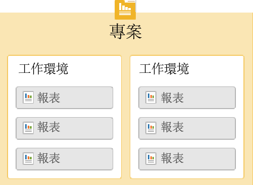
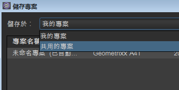

# 開始使用 Ad Hoc Analysis{#concept_48936BA28FAE42DB81F1B2CD4726EB17}

>[!I重要]
>Adobe 於 2018 年 8 月 6 日宣佈有意終止 Ad Hoc Analysis 服務，我們將會在確定後公佈服務終止日期。如需詳細資訊，包括在此期間相容的 Java 版本，請造訪 [https://adobe.ly/discoverworkspace](https://adobe.ly/discoverworkspace)。

您可以對網站活動執行即時的進階分析。 您可以同時檢視多個報表，並跨多個維度套用區段。 您可以從微觀和宏觀角度分析資料，以檢視其對重要業務量度的影響。

透過這些功能，您可以了解網站流量、訪客人口統計、收入和產品流動等資訊。然後，您可以篩選、排序和分段資料，以尋找精確問題的答案。 結果會即時傳回，讓您快速分析多種因素的影響。

<table id="table_C9C0444687FC418580F996E1D2ADB61A"> 
 <thead> 
  <tr> 
   <th colname="col1" class="entry"> 入門任務 </th> 
   <th colname="col2" class="entry"> 說明 </th> 
  </tr> 
 </thead>
 <tbody> 
  <tr> 
   <td colname="col1"> 
1. 登入 Adobe Analytics。 
 </td> 
   <td colname="col2"> 
前往 <a href="https://marketing.adobe.com"  >marketing.adobe.com</a>，並使用您的 Adobe Analytics 憑證登入。 
 </td> 
  </tr> 
  <tr> 
   <td colname="col1"> 
2. 啟動 Ad Hoc Analysis。 
 </td> 
   <td colname="col2">按一下「Adobe Analytics &gt; 工具 &gt; Ad Hoc Analysis」，然後按一下「啟動 Ad Hoc Analysis」按鈕。 
 
附註：如果您在此頁面上找不到「<b>啟動 Ad Hoc Analysis</b>」按鈕，請向管理員確認是否已將您加入「管理工具」的「<i>Ad Hoc Analysis 授權使用者</i>」群組。 
 
 </td> 
  </tr> 
  <tr> 
   <td colname="col1"> 
3. 建立專案。 
 </td> 
   <td colname="col2"> 
在 啟動頁面中，選取報表套裝，然後按一下建立專案。 
 
請參閱<a href="/help/analyze/ad-hoc-analysis/c-getting-started.md"   >專案和工作環境</a>。 
 </td> 
  </tr> 
  <tr> 
   <td colname="col1"> 
4.開啟報表。 
 </td> 
   <td colname="col2"> 
使用標準的Cloud報表功能表搜尋報表。 您也可以選擇範本。 
 
請參閱 <a href="/help/analyze/ad-hoc-analysis/c-getting-started.md"   > 報表範本</a>。 
 </td> 
  </tr> 
  <tr> 
   <td colname="col1"> 
5.設定報表。 
 </td> 
   <td colname="col2"> 
透過執行任務來設定報表： 
 
    <ul id="ul_0D2E8C614F2A4899A376BCEECEA374C6"> 
     <li id="li_FA925D52A8FD4DFAB0C88B797B24E72B"> 建立區段，以深入了解資料 </li> 
     <li id="li_5E91632551D2473BA8BD0637CDC1A9F6"> 新增量度、維度和區段至表格產 <a href="/help/analyze/ad-hoc-analysis/c-tablebuilder.md"   > 生器</a> </li> 
     <li id="li_019316C9A94B4A8C8A77D07C04E50278">設定<a href="/help/analyze/ad-hoc-analysis/c-dates.md"   >日期範圍</a> </li> 
     <li id="li_2B33B325D5EE420AB412B73AD1D231C5"> <a href="/help/analyze/ad-hoc-analysis/c-schedule.md"   > 計劃</a>報表傳送 </li> 
    </ul> 
搜尋此說明系統，可找到您需要的說明。 
 </td> 
  </tr> 
 </tbody> 
</table>

## 系統推薦 {#concept_6691331B45174290BD9B839806A9B52D}

儘管報表可在一些最常用的網站瀏覽器上正常執行，但在符合特定推薦的系統上，效果最佳。

<!-- 

c_sys_reqs.xml

 -->

>[!NOTE]自 2018 年 7 月起，Ad Hoc Analysis 將僅支援 Java 8 或更高版本。如果您在 2018 年 7 月的維護版發行後，選擇在 Java 7 上執行 Ad Hoc Analysis，Adobe 將不再支援您的 Ad Hoc Analysis 實作。

* 支援OpenGL 2.0的視訊卡
* Cookie：必要
* 作業系統：Windows 和 Mac OS。
* Macromedia Flash Player：6 或更高版本
* 監視器解析度：800x600 (建議使用 1024x768)
* 色彩深度：16 位元或更高
* JavaScript：啟用
* Java 版本：Java 1.7 或更高版本    （請參閱上文附註）

   如果您未安裝正確版本的Java，則會為您安裝它。 如果您已安裝不相容的Java版本，臨機分析會下載並提示您安裝更新。

## Java升級指示 {#section_E4C0C6492FF24636A0FF71A59331111D}

自 2018 年 7 月起，Ad Hoc Analysis 將僅支援 Java 8 或更高版本。如果您選擇在 2018 年 7 月的維護發行後於 Java 7 上執行 Ad Hoc Analysis，Adobe 將不再支援您的 Ad Hoc Analysis 實作。

我們的。jar檔案會使用安全的256位元加密進行簽署，低於1.7.0_76的Java版本不支援此加密。 此256位元憑證可讓我們以增強的安全性為您服務。

如果您仍安裝 Java 7，則需在 2018 年 7 月維護版本發行前升級。方法如下：

* 如果您有權在機器上安裝程式：

   1. 請前往 https://www.java.com。
   1. 按一下 **[!UICONTROL Free Java Download]**.
   1. 按一下 **[!UICONTROL Agree and Start Free Download]**.
   1. 安裝您作業系統專用的最新Java版本。

* 如果您&#x200B;**無權**&#x200B;在機器上安裝程式：

   1. 與您的IT部門合作，以安裝最新版Java。

## 啟動 Ad Hoc Analysis {#concept_B1CE3C1E6D1A4311B9835BEB69812E55}

<!-- 

c_login.xml

 -->

您可以從 [!DNL Experience Cloud] 或使用 URL 登入。如果您從「報告與分析」登入，系統會自動登入。 只有當您從其他位置（例如連結或我的最愛功能表）存取臨機分析URL時，才需要使用URL登入。

## 從 Experience Cloud 登入 {#task_128ED319F3AE49ED886EA3DFA8D0987F}

說明如何從 [!DNL Experience Cloud] 登入的步驟。

<!-- 

t_login_suite.xml

 -->

1. 在瀏覽器中瀏覽至 [!DNL marketing.adobe.com]。
1. Type your company name, your username, and your password. Then click **[!UICONTROL Sign In]**.
1. 按一下 **[!UICONTROL Adobe Analytics]** > **[!UICONTROL Tools]** > **[!UICONTROL Ad Hoc Analysis]**.

   如果您在此頁面上看不到「**啟動 Ad Hoc Analysis**」按鈕，請向管理員確認是否已將您加入「管理工具」的「*Ad Hoc Analysis 授權使用者*」群組中。
1. 按一下 **[!UICONTROL Launch Ad Hoc Analysis]**.
1. 將 [!DNL discover.jnlp] 檔案儲存在本機。

   任何時候想啟動 Ad Hoc Analysis，請執行此儲存的檔案。

## 專案和工作環境 {#concept_FAE346335B0347A192C6C806C775D72B}

專案會定義匯入的資料集，包括報表套裝和日期範圍。 專案由任意數目的報表組成，其中包含所有量度、設定、維度和區段。 您可以開始新專案、載入儲存的專案，或載入自動儲存的專案。

<!-- 

c_projects.xml

 -->

您可將報表分組至工 *作區*。 專案可以包含多個工作區，而工作區可以包含多個報表。 這些   項目之間的關係可以理解為巢狀項目：

一次只能開啟一個專案。 不過，您可以在專案中開啟多個工作區。 在每個工作區中，您可以開啟數個報表。

新專案的預設日期範圍為 [!UICONTROL Last 90 Days]。

## 開始專案 {#task_918A4539134E4E62B00486DCB8D3D403}

說明如何開始專案的步驟。

<!-- 

t_project_start.xml

 -->

1. 登入。
1. Open a saved project or click **[!UICONTROL Create Project]**.
1. 搜尋報表或選擇範本。

## 開啟最近儲存的工作環境 {#task_DE4A54180BC24E9DAEC98E2171DC6B40}

說明如何開啟最近儲存的工作環境的步驟。

<!-- 

t_recent_workspace.xml

 -->

1. 按一下 **[!UICONTROL File]** > **[!UICONTROL Recent Workspace]**.

   您最多可以開啟5個最近的工作區。 最近的工作區在退出作業後無法使用。

## 共用專案 {#task_5911780D90164F3A8A677C8BC719750D}

公司中的所有 Ad Hoc Analysis 使用者都能使用共用的專案。

<!-- 

t_share_projects.xml

 -->

1. Go to **[!UICONTROL File]** > **[!UICONTROL Save As]**.
1. 從下 **[!UICONTROL Shared Projects]** 拉式清 **[!UICONTROL Save in:]** 單中選擇。

   

1. Click **[!UICONTROL Save]** to save the project.

   共用的專案可以透過 **[!UICONTROL File]** > **[!UICONTROL Open]** >開啟 **[!UICONTROL Shared Projects]**。

   >[!NOTE]
   >
   >您可以在共用專案的同一個對話方塊中，選取一或多個您自己的共用專案，刪除您的共用專案。

## 重新命名工作環境 {#task_0DB177DD6DB54B7F9FE60A0B3FC7CFC3}

說明如何重新命名工作環境的步驟。

<!-- 

t_rename_workspace.xml

 -->

1.  以滑鼠右鍵按一下工作環境名稱。
1. 選擇 **[!UICONTROL Rename Workspace]**.
1. Type a name, then click **[!UICONTROL OK]**.

## 開啟本地專案 {#task_1B3EF63A80C74776B24B99D80EAC74AC}

說明如何開啟專案本地副本的步驟。

<!-- 

t_open_local_project.xml

 -->

1. 按一下 **[!UICONTROL File]** > **[!UICONTROL Open Local Copy]**.
1. Navigate to the local [!DNL .dproj] file, then click **[!UICONTROL Open]**.

## 報表範本 {#concept_370F674C5B4C45368731AA801C5A45F8}

範本是您要執行之分析類型的起點。 範本可以是空白畫布，例如「排名」或「流失」報表。 或者，範本是以預設度量和維度開頭的報表。

<!-- 

c_templates.xml

 -->

You can access templates when creating a project ( **[!UICONTROL File]** > **[!UICONTROL New Project]**), or by adding a workspace or report.

| 範本 | 說明 |
|--- |--- |
| 排名 | 提供空白畫布，您可在其中建構表格。 例如，「頁面」報告會根據流量來排行您網站的頁面，詳情表格則顯示度量 (如「頁面檢視」和「收入」) 的數字和百分比。 |
| 趨勢 | 可讓您檢查轉換和事件在報告時段內，在選定時間詳細程度（小時、日、周、月、季或年）的趨勢。 |
| 總計 | 顯示營利圖的行政層級報表。 它包含「總收入」、「頁面檢視」和「訂購」的資料。 |
| 流失 | 可讓您建構漏斗，以顯示查核點之間的轉換率和流失率。 例如，您可以追蹤訪客在購買過程中的流失點。 |
| 流量 | 顯示使用者在頁面、網站區域和伺服器上最常採用的路徑。 |
| 轉換漏斗 | 顯示特定量度事件之間的轉換百分比。 您可使用此報表來了解產生銷售額的點進次數，以及售出件數。 |
| 網站分析 | 一種三維網站路徑工具，可顯示訪客在指定頁面和事件間的移動方式。 |
| Virtual Focus Group | 隨機從您的瀏覽中進行瀏覽，並顯示該次瀏覽的大量資料。 您可以使用報表根據訪客人口建立焦點群組。 |

## 開啟報表 {#task_0AC455CDA198497AA546622FB05F300D}

您可以在建立專案時或從現有專案中開啟報表或範本。 使用範本從頭開始設定報表。

<!-- 

t_reports_opening.xml

 -->

有數種開啟報表的方法：

* 在頁面 [!UICONTROL New Report] 上，搜尋報表或選擇範本。
* 按一 **[!UICONTROL Reports]** 下功能表，然後選取報表或報表範本。
* Launch a report from a dimension: right-click a dimension name, then select **[!UICONTROL Run Report]** > **`report name`**.
