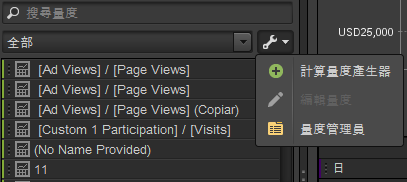
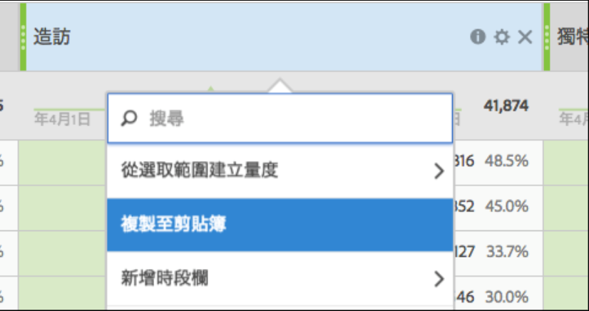

# 量度

度量是有關訪客活動的量化資訊，例如瀏覽、點進、重新載入、平均逗留時間、日期、件數、訂購、收入等。量度和相關資料顯示在報告欄中。

## 量度 {#concept_46A67930CFDB4A078225C5B189688AF3}

度量是有關訪客活動的量化資訊，例如瀏覽、點進、重新載入、平均逗留時間、日期、件數、訂購、收入等。量度和相關資料顯示在報告欄中。

標準度量包括︰

* **流量**：顯示訪客量的相關資料。
* **轉換**：顯示有關網站成功事件的資料。成功事件包括購買、下載，或任何您想要使用者在您網站上執行的操作。
* **計算**：由組合其他度量而建立的可自訂度量。例如，您可以建立一個度量，它透過從收入中減去關鍵字成本和貨品成本來得到純收入。隨後，您可以用此量除以訂購數來得到每訂購的平均純收入。

請參閱 [Analytics 參考](https://marketing.adobe.com/resources/help/zh_TW/reference/metrics.html)中的&#x200B;*度量定義*，了解 [!DNL Experience Cloud] 中如何使用度量的詳細資訊。

您可以使用[!UICONTROL 組織度量]工具，為度量建立新資料夾。您可以接著按照所需的方式將度量分組。組織工具可讓您使用拖曳的方式，將現有度量複製到自訂資料夾。

雖然您可以建立資料匣、將資料夾命名，並且按照所需的方式將度量歸入資料夾，但是您無法變更預設資料夾，只有我的最愛和計算度量資料夾例外。

## 組織量度 {#task_17C844A9387042EAA9983E1E554846B1}

說明如何組織量度和建立量度資料夾的步驟。

<!-- 

t_organize_metrics.xml

 -->

1. 在[!UICONTROL 「度量」]工具窗格中，按一下&#x200B;**[!UICONTROL 「更多動作」]**。(

   )
1. 按一下&#x200B;**[!UICONTROL 組織度量]**。
1. 按一下&#x200B;**[!UICONTROL 新增]**&#x200B;建立資料夾。
1. 選取其他資料夾中的度量，然後將選取的度量拖曳到新的資料夾。
1. 按一下&#x200B;**[!UICONTROL 確定]**。

   >[!NOTE]
   >
   >刪除資料夾時，該資料夾中所有的度量都會從目前選取的專案中刪除。

## 新增量度到報表 {#task_747DD1718B3F4776B83A115D0BE8754C}

說明如何新增度量到   報表的步驟。

<!-- 

t_add_metrics_dsc.xml

 -->

1. 在[!UICONTROL 度量]工具窗格中，找出度量。

   您可以使用搜尋欄位找出度量，也可以進入度量資料夾找出度量。

1. 將度量拖曳到報表或[!UICONTROL 表格產生器]。

   如果您不想要重複新增度量至某個報表，可以事先在[!UICONTROL 設定]中指定預設度量。

   請參閱[排名標籤 - 定義](/help/analyze/ad-hoc-analysis/c-global-settings.md#reference_FB9BADD7E3DA42C1BB2A02A6E9D5C1CF)。

## 計算量度產生器 {#concept_F8E213CE786A43FB93847C5BA883A29C}

Ad Hoc Analysis 中的「計算量度產生器」現在已與「Analytics 統一計算量度」整合。其使用者介面類似於 Analytics 中的「計算量度產生器」。

<!-- 

c_calc_metric_builder.xml

 -->

如需如何建立和管理計算量度的詳細資訊，請參閱[計算量度指南](https://marketing.adobe.com/resources/help/zh_TW/analytics/calcmetrics/)。

以下是在「Ad Hoc Analysis」中存取「計算量度產生器」的方法：

1. 在「[!UICONTROL 度量]」窗格中，按一下「**[!UICONTROL 更多選項]**」，然後按一下「**[!UICONTROL 計算度量產生器]**」。

   

1. 「計算量度產生器」介面可讓您拖放量度、區段和函數以便建立自訂量度：

   

