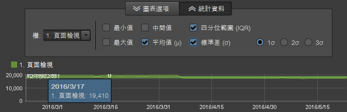

# 報表概觀

標準報表會顯示網站和訪客活動、流量模式、反向連結資料、廣告促銷活動、訪客保留率、產品資料等的相關資料。您可以執行報表，然後存取工具以設定區段、量度和報表比較。

## 報表概觀 {#concept_41459A705F2048EEA4EFA80F6BD9FFAB}

標準報表會顯示網站和訪客活動、流量模式、反向連結資料、廣告促銷活動、訪客保留率、產品資料等的相關資料。您可以執行報表，然後存取工具以設定區段、量度和報表比較。

您可以彙集自訂資料，建立您網站的專用報表。例如，若您的網站上有搜尋功能，則您可追蹤提交的搜尋詞，以及建立顯示這些詞語和搜尋結果的報表。

標準報表集涵蓋每個網站都通用的主題。報表包括 (但不限於)：

* 網站資料
* 訪客資料
* 流量模式
* 反向連結資料
* 廣告促銷活動
* 訪客保留率
* 產品資訊

如果您有使用 Marketing Reports &amp; Analytics，則應熟悉報表類型和功能表。Ad Hoc Analysis 根據下列類型來分類報表：

**摘要報表**

包括如[!UICONTROL 總計報表]，顯示專為快速了解而設計的資料。這些報表適合於想要檢視資料一般說明的主管人員。

**轉換報表**

轉換報表能為您全面、準確、詳細地分析客戶活動。諸如促銷活動管理、銷售週期、客戶流失和客戶轉換等度量，可以讓您度量電子商務交易、銷售來源、廣告效果和客戶忠誠度等等。

**流量報表**

「流量」報表可讓您深入了解訪客與您網站的互動情形。

* 分析訪客行為的重要方面。
* 監視和了解流量模式。
* 確定流行的網站內容。
* 以任何可量度的標準劃分訪客。

## 促銷活動 {#concept_A407CDF1D4AA49BAB396A1666E67FC87}

顯示您廣告行銷的成效。您可以看到帶給您最大流量的廣告行銷類型，以及負責推廣這些行銷的員工。

<!-- 

c_reports_campaigns.xml

 -->

這些報表通常會加以自訂，因此對每個分析人員來說都不一樣。請參閱 [!DNL Admin Console] 說明中的[促銷活動管理員](https://marketing.adobe.com/resources/help/en_US/reference/campaign_manager_admin.html)，了解詳細資訊。

## 統計計算 {#concept_83FF70DB7895435E985699FE9012D585}

您可以自訂預設統計，以在排名報表中顯示。

<!-- 

c_Statistical_Calculation_ad_hoc.xml

 -->

您可將其他預設統計計算新增至排名報表以在執行報表時據以顯示資料，包括平均值、中間值、標準差，以及符合您報告需求的其他數學計算。

**若要開啟排名報表的統計計算：**

1. 從功能表選取「**[!UICONTROL 工具]** > **[!UICONTROL 排名]**」。

1. 選取「**[!UICONTROL 設定]**」。
1. 選取「**[!UICONTROL 預設統計]**」。

**[!UICONTROL 忽略統計計算中的零]**。選取此選項可忽略零，確保新增其他量度並不會變更已計算的平均值。所有統計資料都受此設定影響 (但對「總計」沒有影響)。

| 計算 | 說明 |
|--- |--- |
| 最大值 | 識別指定資料集內所有列中的最大值。 |
| 最小值 | 識別指定資料集內所有列中的最小值。 |
| 總計 | 計算資料集內每一列的所有值。例如，總計會匯總訪客的所有造訪次數，而非只將訪客計算一次 (不管其造訪次數)。這是已收集資料點的全面合計。 |
| 平均值 | 平均值是資料集內列值的算術平均，以總計除以計數來計算 (總計/計數)。平均值會受到極端資料的影響，這點與中間值不同，中間值通常用於偏斜分佈。 |
| 標準差 | 標準差顯示在預計平均值之外存在多少變異。標準差較低表示資料點接近平均值。標準差較高則表示資料點的分布範圍較廣。 |
| 中間值 | 中間值是資料集內的列資料當中，剛好處於前半段和後半段資料交界的數值。與平均值不同，這通常用於避免極端值。 |
| 四分位數 | 四分位數是資料集內以三個點來識別的值組，這三個點將資料集分成四等份，每一等份包含四分之一的資料集。第一個四分位數是第 25 個百分點，第三個四分位數是第 75 個百分點。(第二個四分位數是中間值，第三個四分位數是總計)。 |
| 計數 | 傳回資料集內的列數。 |

## 平均值和量度合計計算的範例{#section_7C49196503964FB0A429FA347BC92D09}

平均值函數的計算類似於 Microsoft Excel 中的資料行。具體來說，這表示一個比值的&#x200B;**平均值** (例如決定平均反彈率) 將是比值的平均，而非平均比。平均比包含反彈率量度的&#x200B;**合計**。

<table id="table_9EC56B15C6A340DA8917CB0DBCAC2355"> 
 <thead> 
  <tr> 
   <th colname="col1" align="center" class="entry"> 日期 </th> 
   <th colname="col2" align="center" class="entry"> 單次造訪 </th> 
   <th colname="col3" align="center" class="entry"> 登入點 </th> 
   <th colname="col4" align="center" class="entry"> 反彈率 </th> 
   <th colname="col5" align="center" class="entry"> </th> 
  </tr>
 </thead>
 <tbody> 
  <tr valign="top"> 
   <td colname="col1"> 
2013 年 6 月 
 
2013 年 7 月 
 
2013 年 8 月 
 </td> 
   <td colname="col2" align="center"> 
344 
 
297 
 
41 
 </td> 
   <td colname="col3" align="center"> 
1000 
 
1000 
 
1000 
 </td> 
   <td colname="col4" align="center"> 
34.4% 
 
29.7% 
 
41.0% 
 </td> 
   <td colname="col5"> </td> 
  </tr> 
  <tr valign="top"> 
   <td colname="col1" align="center" valign="middle"><b>平均值</b> </td> 
   <td colname="col2" valign="middle"> (344+297+41)/3 </td> 
   <td colname="col3" valign="middle"> (1000+1000+100)/3 </td> 
   <td colname="col4" valign="middle" align="right"> (34.4 + 29.7 + 41.0) / 3 = <b>35.0</b>% </td> 
   <td colname="col5" valign="middle"><b>比值平均</b> </td> 
  </tr> 
  <tr valign="top"> 
   <td colname="col1" align="center" valign="middle"><b>量度合計</b> </td> 
   <td colname="col2" valign="middle"> 682 </td> 
   <td colname="col3" valign="middle"> 2100 </td> 
   <td colname="col4" valign="middle" align="right"> 682 / 2100 = <b>32.0</b>% </td> 
   <td colname="col5" valign="middle"><b>平均比</b> </td> 
  </tr> 
 </tbody> 
</table>

## 統計計算覆蓋圖 {#concept_97E1B32DAC734C7B9F8899717283CEEC}

Ad Hoc Analysis 現在也為顯示特定時段 (分鐘、小時、日、週) 之資料的報表，提供統計計算的覆蓋視覺化。

<!-- 

c_overlay_calculations.xml

 -->

在識別一段時間內資料的報表中，「**[!UICONTROL 統計]**」按鈕能讓您選取可顯示為跨越報表時間表之覆蓋圖的計算式。

除了標準[統計計算](/help/analyze/ad-hoc-analysis/c-overview-standard-reports.md#concept_83FF70DB7895435E985699FE9012D585)，您還可以在覆蓋圖中選取第一、第二和第三標準差。

## 群組管理器 {#concept_E1433974A61144858E87334C006982B2}

與其在報表中使用單一頁面，您可以將多個頁面組成群組，再以類別方式作為[!UICONTROL 流失]和[!UICONTROL 站點分析]報表中的開始、中間和目的地位置使用。您可以從主功能表，或從報表內編輯群組。您在 Marketing Reports &amp; Analytics 中已建立的類別，也會出現在[!UICONTROL 「查核點選擇器」]清單中。

<!-- 

c_groups.xml

 -->

按一下&#x200B;**[!UICONTROL 工具]** > **[!UICONTROL 群組管理器]**。
