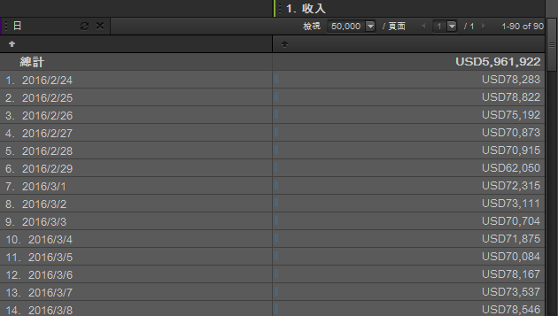

# 時間

時間做為報表維度，可以用於分析經過數小時、數天、數週以及某個日期範圍的趨勢。例如，「產品報表」可顯示在選定的日期範圍內，一項產品產生了多少收入。您可以新增「日」維度，查看報告期間每一天的趨勢。「時間」提供「小時」、「日」、「週」、「月」、「季」和「年」的精細度設定。日期範圍預設集包括「今天」、「昨天」和「最近 7 天」。

## 時間 {#concept_CB64A0A2150C471FB0B0B42516905887}

時間做為報表維度，可以用於分析經過數小時、數天、數週以及某個日期範圍的趨勢。例如，「產品報表」可顯示在選定的日期範圍內，一項產品產生了多少收入。您可以新增「日」維度，查看報告期間每一天的趨勢。「時間」提供「小時」、「日」、「週」、「月」、「季」和「年」的精細度設定。日期範圍預設集包括「今天」、「昨天」和「最近 7 天」。

若要新增「時間」維度，可以從「時間」工具窗格將一個或多個日期範圍拖曳至報表表格或「表格產生器」。

此範例顯示對「日」維度和收入進行趨勢分析。

## 時間 - 定義 {#reference_6E718B78E437438E825DB9262086A987}

在「時間」窗格中，您可以選取日期範圍和趨勢預設集，然後將您的選取項目拖曳至[!UICONTROL 「表格產生器」]或報表格線。

<!-- 

r_time_panel.xml

 -->

| 欄位 | 定義 |
|--- |--- |
| 日期範圍 | 可讓您選取一或多個時段，並拖曳至「表格產生器」或報表格線。您可將時段視為行中的劃分，或是欄標題。您可選取日、週、月或自訂日期範圍等時段。如果您使用 SiteCatalyst 中的自訂日曆，則報表套裝會繼承這些設定。 |
| 趨勢分析 | 可讓您分析經過數小時、數天、數週、數月等的報表趨勢。從趨勢分析拖曳項目至報表時，您檢視的資料，是根據以日曆指定之日期範圍所控管的時間設定為準。 |
