# Analysis Workspace 概述

Analysis Workspace 去除了單一 Analytics 報表的所有典型限制，提供強大、靈活的畫布供您建立自訂分析專案。您可拖放任意數目的資料表格、視覺效果和元件 (維度、量度、區段和時間粒度) 至專案。立即建立劃分和區段；建立同類群組以供分析；建立警報；比較區段；執行流量和流失分析；組織和排程報表，以便與企業中的其他人共用。

**[!UICONTROL 分析]** > **[!UICONTROL 工作區]**

## 概述影片 {#section_B99BF8A326D94ECB91BD69C9888AD10C}

>[!VIDEO](https://www.youtube.com/watch?v=IHOy-QsvVcA)

[這裡](https://www.youtube.com/playlist?list=PL2tCx83mn7GuNnQdYGOtlyCu0V5mEZ8sS)提供完整的 YouTube 播放清單。

>[!NOTE]
>
>參閱 [Analysis Workspace 的新功能](/help/analyze/analysis-workspace/new-features-in-analysis-workspace.md)，了解功能的相關更新。

## 完整控制專案元素和元件 {#section_B7E3EDA3EDEE407D833F4FDB69646EEC}

Analysis Workspace 提供自由與靈活性：

* 拖放元件 (維度、量度、區段和時間粒度)
* 拖放多個視覺效果至專案
* 在專案中的任意位置移動、調整大小以及堆疊視覺效果

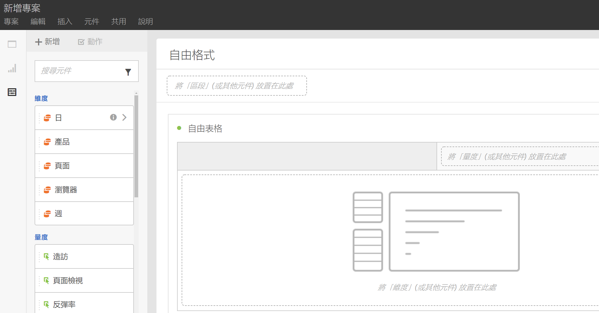

參閱[建立 Analysis Workspace 專案](/help/analyze/analysis-workspace/build-workspace-project/t-freeform-project.md)，以獲得詳細資訊。

## 專案中的多重視覺效果 {#section_B7670740C2D44130B21DAF0873280DA5}

拖放您需要的視覺效果數目至專案。

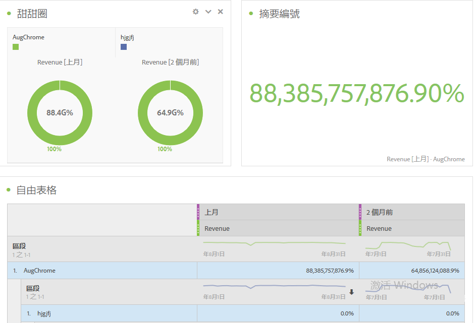

建立可顯示變更百分比的專案，其中具有對應至自由資料表中儲存格的多個視覺效果。

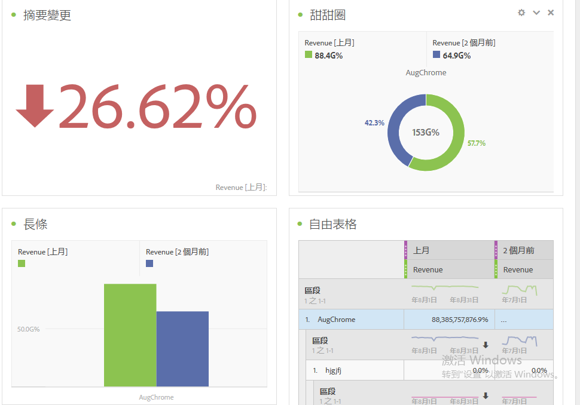

參閱[建立 Analysis Workspace 專案](/help/analyze/analysis-workspace/build-workspace-project/t-freeform-project.md)，以獲得詳細資訊。

## 面板和視覺效果的內部連結 {#section_253EA04E067F4A29A8B54CE2B7631086}

結合 Analysis Workspace [豐富文字編輯](/help/analyze/analysis-workspace/visualizations/text.md)功能後，您可透過文字方塊向下連結至專案內的特定面板及視覺效果，例如建立專案的內容表格。您可以共用專案連結的方式共用這些連結，將使用者導向至專案內的特定視覺效果或面板。已新增「取得面板連結」和「取得視覺效果連結」滑鼠右鍵選項。若要將內部連結新增至您的專案：

1. 將文字視覺效果拖曳至專案，或許位在需要有上下文的視覺效果或表格旁。
1. 將文字方塊填入如內容表格等，然後反白標示要連結至面板或視覺效果的項目，例如「成功量度」。

   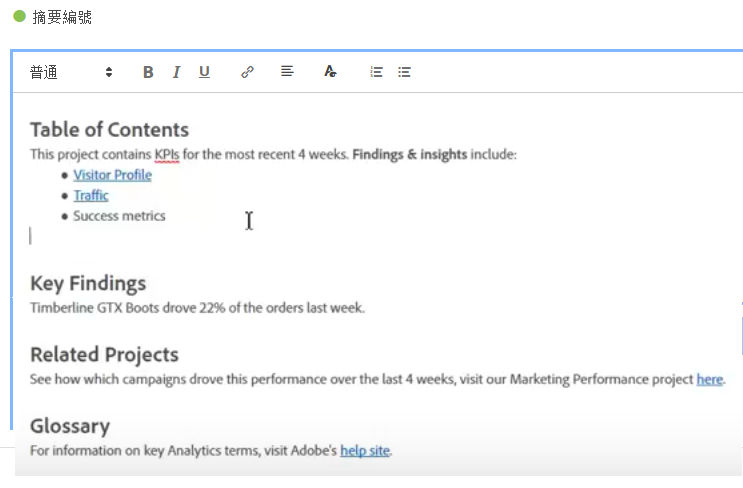

1. 捲動至該面板或視覺效果，然後以滑鼠右鍵按一下面板的標頭。
1. 向下捲動，選取&#x200B;**[!UICONTROL 「取得面板連結」]**&#x200B;或&#x200B;**[!UICONTROL 「取得視覺效果連結」]**:

   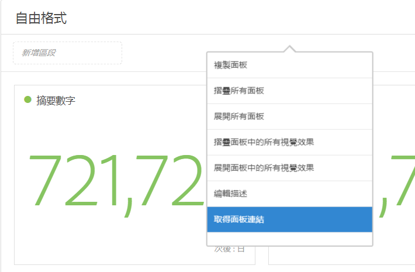

1. 複製該連結，並將連結新增至文字視覺效果的「成功量度」超連結。按一下勾選記號以儲存文字。

如果您在專案內摺疊面板或視覺效果，按一下連結會展開面板/視覺效果，供使用者檢視。

> [!NOTE] 您也可以在&#x200B;**[!UICONTROL 「編輯說明」]**&#x200B;的右鍵選項中使用此功能。

## 連結至其他專案 {#section_AE886C367C3E4F189B65B1BD9BCDBD8C}

您可以將使用者連結至其所可能感興趣的其他專案，例如前往&#x200B;**[!UICONTROL 「共用]** > **[!UICONTROL 取得專案連結]**」，將此連結嵌入專案說明。

## 所選儲存格的動態視覺效果 {#section_182CEC285E4547EBA4608D5F70C9D5D7}

選取個別儲存格，動態查看視覺效果變更。將視覺效果[同步 (鎖定)](/help/analyze/analysis-workspace/analysis-workspace-features.md#section_9D66A001586F49CEB0C565581E44957C) 至所選儲存格。

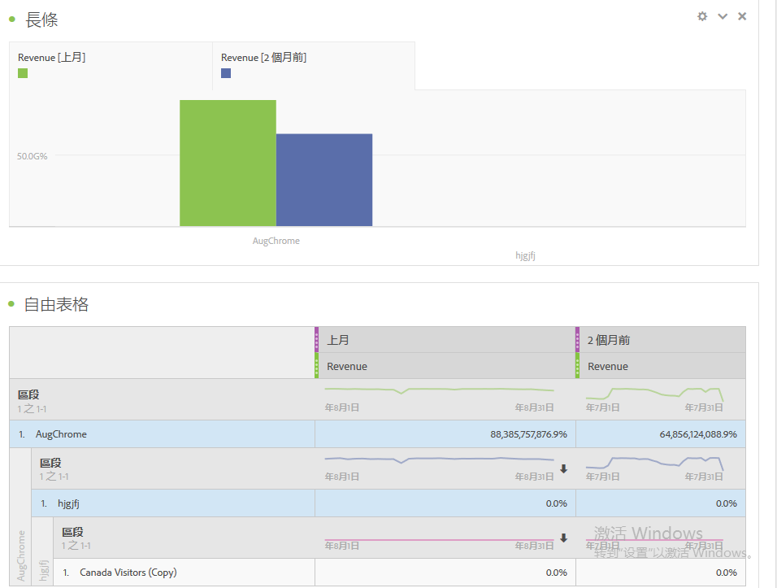

## 鎖定所選項目或位置 {#section_9D66A001586F49CEB0C565581E44957C}

鎖定視覺效果可以控制哪些自由資料表來源對應至視覺效果。

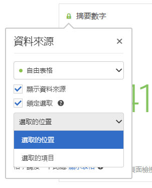

參閱[管理資料來源](/help/analyze/analysis-workspace/visualizations/t-sync-visualization.md)。

## 所選儲存格的趨勢視覺效果 {#section_34930C967C104C2B9092BA8DCF2BF81A}

從所選儲存格建立視覺效果。(按一下滑鼠右鍵 > **[!UICONTROL 趨勢選取項目]**。)

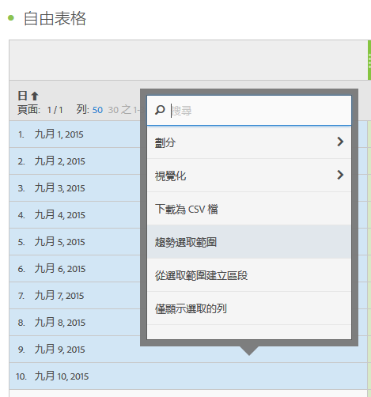

趨勢選取範圍現在&#x200B;**連結**&#x200B;至以下表格，因此如果您在表格中選取不同的列，趨勢圖表會顯示該列。

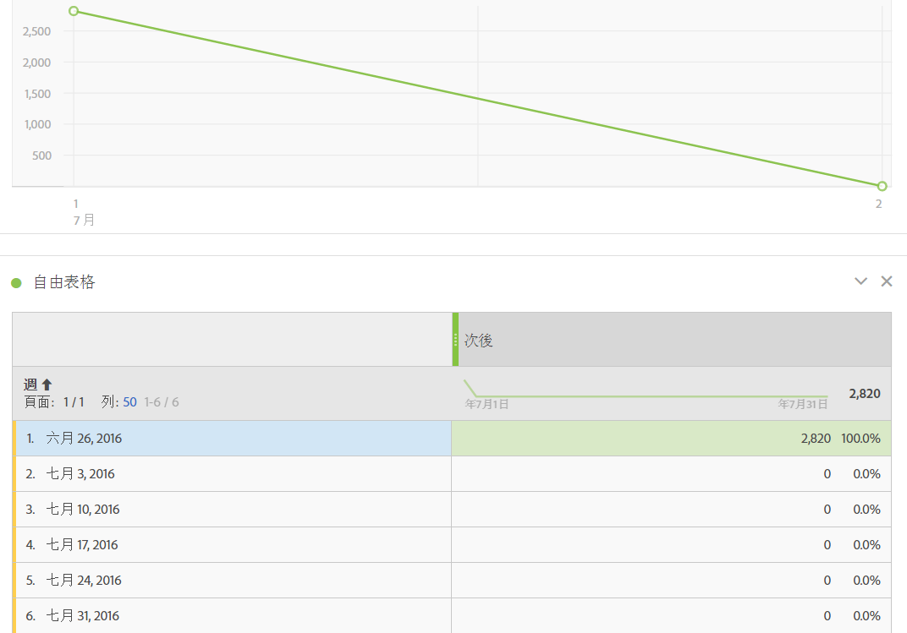

## 維度與維度項目劃分 {#section_1380C1F9E51E4BFB8C5D35E7A53BC70D}

身為零售商，您可以對促銷活動進行比以往更深入的分析，了解如何以更好的方式吸引客戶。您可針對特定需求，以無限方式劃分資料；使用相關量度、維度、區段、時間表及其他分析劃分值來建立查詢。

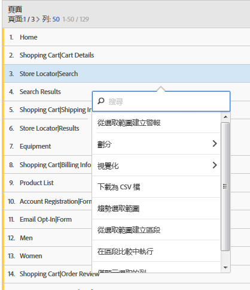

參閱[劃分維度](/help/analyze/analysis-workspace/components/dimensions/t-breakdown-fa.md)。

## 從表格選取項目建立區段 {#section_73BC3688089B426D969B3D5B606DA970}

選取自由表格中的儲存格，並從選取項目建立區段。

比較多個區段，並立即建立和套用區段。您可以套用多個區段，根據行為和互動將重點放在特定客戶，然後進行比較與對照。

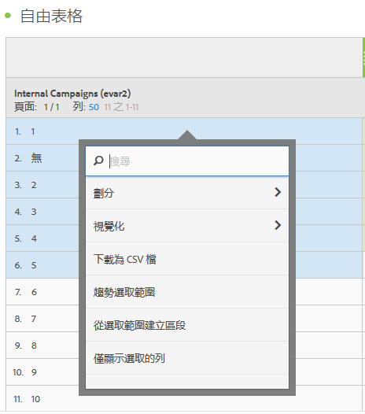

在專案層級拖放區段至自由面板，區段就會套用至整個專案。

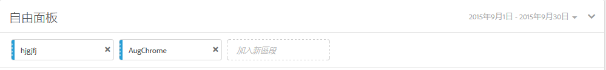

請參閱[區段](/help/analyze/analysis-workspace/components/t-freeform-project-segment.md)。

## 專案和元件標記 {#section_F54D688132A541F2982326D5E022B90D}

您可在 Analysis Workspace 中，套用標記至專案和元件：

* 在資訊面板中套用或建立專案層級標記。()

* 以滑鼠右鍵按一下元件，以從元件面板進行標記 (或建立標記)。
* 在搜尋欄位中使用 # 尋找標記。

## 元件動作 {#section_CBF4D0A5F63E4B0883077B8D852B800B}

從元件左側欄頂端的「動作」功能表，可執行元件層級動作。選取元件並按一下「**[!UICONTROL 動作]**」即可檢視動作。

| 元件動作 | 說明 |
|--- |--- |
| 標記 | 以套用標記的方式組織或管理元件。接著元件會在相關元件管理員中顯示，例如「分析 > 元件 > 區段」或「分析 > 元件 > 專案」 |
| 我的最愛 | 新增元件至我的最愛清單。接著元件會在相關元件管理員中顯示，例如「分析 > 元件 > 區段」或「分析 > 元件 > 專案」。 |
| 核准 | 核准元件使其成為正式項目。接著元件會在相關元件管理員中顯示，例如「分析 > 元件 > 區段」或「分析 > 元件 > 專案」 |
| 共用 | 僅套用至區段。 |
| 刪除 | 僅套用至區段。 |

請參閱[視覺效果](/help/analyze/analysis-workspace/visualizations/freeform-analysis-visualizations.md)以取得詳細資訊。

## 其他功能說明 {#section_5F06AE43C0194CFDBCA7EE0EA3C30B05}

**您可以拖曳和堆疊的項目**

元件

* 維度
* 區段
* 量度
* 日期範圍
* 時間粒度 (小時、日、週等)。

**多個自由表格和多個視覺效果**

關於可以新增至面板的自由表格和視覺效果數目，沒有技術上的限制。此外，您也可以對每個自由表格或表格上的選定列執行新的視覺效果 (或匯出至 CSV)。

**欄排列、排序和複製**

* 排序日期範圍預設集 (不包含自訂日期範圍)。
* CTRL (或 Command) + 按一下 + 拖曳欄可以複製該欄，而拖曳副本則會將其貼至表格中的新位置。

參閱 [Analysis Workspace 中可用的快捷鍵](/help/analyze/analysis-workspace/build-workspace-project/fa-shortcut-keys.md)，以了解詳細資訊。

**選取範圍和動作**

您可用在 Excel 中選取行和欄的方式，來選取行和欄。接著就可以在這些選取範圍上執行動作。例如：

* 從選取範圍建立視覺效果
* 複製至剪貼簿 (CTRL 或 Command + C)
* 劃分多重選取的列。選取行，然後拖曳維度至選取範圍。或者，以滑鼠右鍵按一下選取範圍，然後使用「劃分」功能表。

**自動儲存和未儲存的變更**

如果您嘗試關閉瀏覽器 (或使用「上一頁」按鈕) 時尚未儲存專案，系統會提示您儲存變更。如果系統當機，您會在載入專案時收到還原為上一個專案狀態的警報。

已經存在 (非新的) 專案只會在瀏覽器當機時，或是其他您沒有機會儲存它們的情況下，才會自動儲存

**所有造訪**

Analysis Workspace 獨特的預設區段。*`All Visits`*&#x200B;會顯示您新增至表格的元件總數。

**計算量度**

計算的使用方式與標準量度相同。

請參閱[計算量度](https://marketing.adobe.com/resources/help/zh_TW/analytics/calcmetrics/)。
