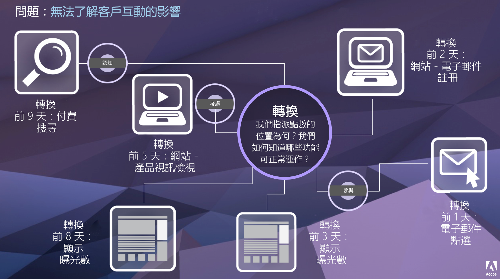

# 歸因 IQ

歸因 IQ 是 Adobe Analytics 中的一組功能，可深入分析行銷活動對轉換所具有的貢獻。

客戶歷程並非線性，且經常無法預測。每位客戶都以自己的步調前進，常常會流連往返、停滯不動、重新開始，或以其他非線性行為進行互動。這些非機械性的行為使得我們很難掌握行銷活動在客戶歷程中的影響，也會阻礙我們將多個資料管道聯繫在一起的努力。

Adobe Analytics 歸因 IQ 讓現代情報團隊能夠瞭解如何在客戶歷程中進行有意義的參與，找出將客戶導向目標結果的轉折點。瞭解客戶歷程的這些層面，您就能有效最佳化行銷行動。

Adobe Analytics 強化了歸因功能，讓您可以:

* 定義付費媒體以外的歸因: 任何維度、量度，管道或事件都可以套用在模型上 (例如內部搜尋)，而不僅限於行銷活動。
* 不限次數利用歸因模型比較功能: 動態比較任意數量的模型。
* 避免實施變更: 透過報表時間處理功能和內容感知工作階段，可以建置客戶歷程內容並套用在執行階段中。
* 建構與您的歸因狀況最相符的工作階段。
* 按區段劃分歸因: 輕鬆比較行銷管道在任何重要區段中的效能 (例如，新客戶與回頭客戶、產品 X 與產品 Y、忠誠度或 CLV)。
* 跨管道檢查和多點接觸分析: 使用 Venn 圖表和色階分佈圖，並計算歸因結果趨勢。
* 以視覺化方式分析關鍵行銷序列活動: 透過多節點流量和流失視覺效果，以視覺化方式探究帶來轉換的路徑。
* 建立計算量度: 使用任何數量的歸因配置方法。

## 功能 {#features}

歸因 IQ 包含下列功能:

* [歸因面板:](c-panels/attribution/attribution.md)
