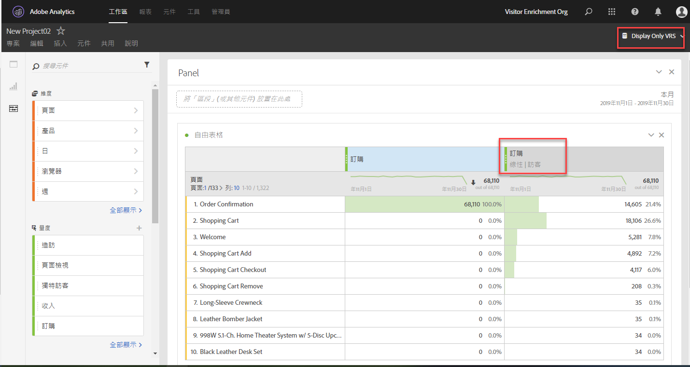

# 常見問題

以下是有關歸因的常見問題解答。

+++##使用歸因時，**[!UICONTROL 無]**&#x200B;條列專案代表什麼？

「無」條列項目是一種全包的項目，代表的是在回顧期間中沒有任何接觸點時發生的所有轉換。若要減少歸因於「無」條列專案的轉換次數，請嘗試使用具有較長回顧期間的「自訂回顧期間」。

+++

+++##我在使用歸因模式時，為何有時會在報告中看到報告期間之外的日期？

有些造訪型量度 (例如 [登入點](/help/components/metrics/entries.md)或[跳出率](/help/components/metrics/bounce-rate.md)) 會將資料歸因予報告期間起始日期以前的期間。這種情況肇因於使用了回顧期間的歸因模式，該模式會決定回顧應達於何種程度時，才會將發生的事件計入量度。最常見的情形是跨越午夜的造訪。例如：

1. 一名造訪者於9月7日晚上11時55分造訪您的首頁。
1. 其造訪了幾頁網頁，而於9月8日凌晨12:05造訪其中的最後一頁。
1. 一週後，您製作9月8日至9月14日期間的每日趨勢報告。

點擊型量度 (例如[頁面檢視](/help/components/metrics/page-views.md)) 產生如預期的結果；自9月8日至9月14日的每日資料趨勢。不過，造訪型量度也能指出上述9月7日的造訪事件。該造訪的歸因登入點發生在9月7日，而回顧期間依預設為9月1日至9月31日。

在這個例子中，顯示的9月7日跳出率一律為 0%。這個量度的定義為 `Bounces divided by Entries`，即點擊型量度除以造訪型量度。跳出事件是由單一影像要求所組成，因此跳出事件不可能持續數日。任何發生在9月7日的跳出事件，都會超過所述的報告期間，因而該日的跳出率當然是 0%。在這報告中，也顯示9月7日的其他點擊型量度亦為 0，因為這些點擊發生在這報告的報告期間外。

再來看另一個類似的例子。下述例子和上述例子之間僅有日期不同：

1. 使用者於 8 月 31 日晚上 11:55 造訪您的首頁。
1. 其造訪了幾頁網頁，而於9月1日凌晨12:05造訪其中的最後一頁。
1. 一週後，您製作9月1日至9月7日期間的每日趨勢報告。

在這個例子中，不會顯示8月31日的「登入點」和「跳出率」資料。由於回顧期間和報告期間都是從9月1日開始，因此無法歸因8月31日的資料。

+++

<!-- not relevant anymore due to introduction of separation of container and lookback window 
+++## When should I use a visit, visitor, or custom attribution lookback?

The choice of attribution lookback depends on your use case. If conversions typically take longer than a single visit, a visitor or custom lookback is recommended. For longer conversion cycles, custom lookback windows are best as they are the only type that can pull in data from prior to the reporting window.

+++
-->

+++##使用歸因時，prop 和 eVar 有何差異？

系統會在報告執行階段重新計算歸因，因此就歸因模式來說，prop 或 eVar (或任何其他維度) 之間並沒有區別。Prop 會持續使用任何回顧期間或歸因模式，而 eVar 配置/期限設定則會受到系統忽略。

+++

+++##歸因模式是否可用於「資料摘要」或「Data Warehouse」等其他 Analytics 功能？

否。歸因模式採用的是報告時間處理，這項功能只能在 Analysis Workspace 中使用。如需詳細資訊，請參閱[報告時間處理](/help/components/vrs/vrs-report-time-processing.md)。

+++

+++##我是否必須在啟用「報告時間處理」的情況下使用虛擬報告套裝，才能使用歸因模式？

歸因模式可在虛擬報告套裝之外使用。雖然歸因模式會在後端使用報告時間處理，但標準報告套裝和虛擬報告套裝都可使用歸因模式。

+++

+++##系統不支援哪些維度和量度？

歸因面板支援所有維度。不支援的量度包括：

* 全部計算量度
* 不重複訪客
* 造訪
* 發生次數
* 頁面檢視次數
* A4T 量度
* 逗留時間量度
* 彈回數
* 跳出率
* 登入點
* 退出點
* 找不到頁面
* 搜尋
* 單頁存取次數
* 單次存取

+++

+++##歸因是否適用於分類？

是的，歸因完全支援分類。

+++

+++##歸因是否適用於資料來源？

是的，歸因支援多數資料來源。摘要層級的資料來源無法進行歸因，因為這些資料來源不會與 Analytics 的訪客識別碼建立關聯。

交易 ID 資料來源會以像任何其他點擊的方式來處理。交易 ID 資料來源不使用傳統報告通常使用的特殊處理。換言之，使用報表時間處理時，交易ID點選會從發生在「交易ID」點選時間戳記附近的點選傳播eVar值。 值不會從接近原始交易時間發生的點選中傳播。

如果可能的話，歸因會仰賴資料來源中事件內傳送的MID欄值（而非持續值）。 歸因模式會即時套用於資料來源中的 MID 欄值。例如，當您使用[上次接觸歸因](models.md)時，模型會從量度的每個執行個體開始。 和會在點選中循序往後走，直到模型達到MID欄中觀察到的最後一個值。

如果不可能，歸因會使用資料來源中&#x200B;*先前記錄*&#x200B;的MID值進行評估。 由於 AA 不支援順序錯誤的資料，這個先前記錄可能不會按時間戳記順序排序。

由於記錄不是按順序排序，應用保存的預期值可能會影響所提供交易 ID 時間戳記與原始交易之間存在的時間量。

+++

+++##歸因可用於 Advertising Analytics 整合嗎？

中繼資料維度 (例如比對類型和關鍵字) 可搭配歸因使用，不過，由於量度 (包括曝光、成本、點擊、平均位置和平均品質分數) 使用摘要層級的資料來源，因此與歸因不相容。

+++

+++##歸因如何與行銷管道搭配運作？

我們初次推出行銷管道時，只提供「首次接觸」和「上次接觸」維度。有了現行版本的歸因，就不再需要明確的首次/最後接觸維度。Adobe 提供通用的「[!UICONTROL 行銷管道]」和「[!UICONTROL 行銷管道詳細資料]」維度，讓您可將其用於所需的歸因模式。這些通用維度的行為與「[!UICONTROL 上次接觸管道]」維度相同，但標籤不同，這是為了避免搭配不同歸因模式使用行銷管道時產生混淆。

由於行銷管道維度以傳統的造訪定義 (由維度本身的處理規則為定義) 為依據，因此無法使用虛擬報告套裝來變更造訪定義。

+++

+++##歸因如何與多值變數 (例如清單變數) 搭配運作？

Analytics 的某些維度可包含單次點擊中的多個值。常見範例包括清單變數和產品變數。

將歸因套用至多值點擊時，同一次點擊中的所有值都會獲得相同的評分。由於有多個值可以接受該次評分，報告總計可能與每個各別條列項目的加總不同。報告總計會去除重複項目，而每個各別維度項目會適當獲得評分。

+++

+++##歸因如何與區段搭配運作？

歸因一律會在採用區段之前執行，而區段會在套用報告篩選器之前執行。此概念同樣適用於使用區段的虛擬報告套裝。

舉例來說，如果您建立了套用「顯示廣告點擊」區段的虛擬報告套裝，您可以使用某些歸因模式在表格中顯示其他管道。

>[!NOTE]
>
> 如果區段隱藏包含量度的點擊，這些量度例項不會歸因於任何維度。不過，類似的報告篩選器只會隱藏某些維度項目，而不會對根據歸因模式處理的量度造成任何影響。因此，相較於具有可比較定義的篩選器，區段可能會傳回較低的值。

+++
