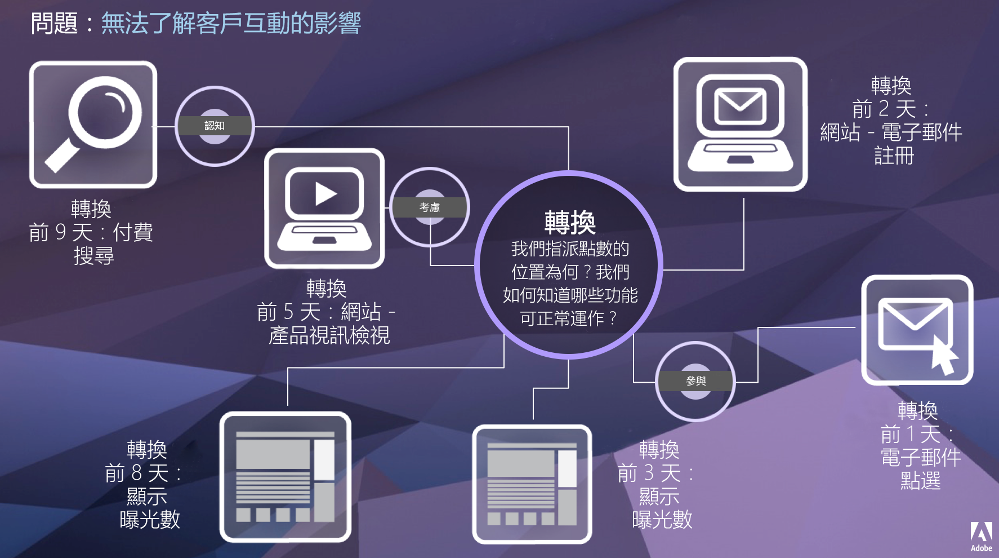

# 歸因概觀

歸因可讓分析人員自訂維度項目獲得成功事件評分的方式。例如：

1. 您的網站訪客按了一下您其中一個產品頁面的付費搜尋連結。他們將產品新增至購物車，但並未購買。
2. 隔天，他們看到了朋友的社交媒體貼文，就按下連結，並完成購買。

在某些報告中，您可能想要將訂單歸因於「付費」搜尋。在其他報告中，則可能會將訂單歸因至「社交」。歸因可讓您控制報告的這個方面。Adobe Analytics Ultimate、Prime、Select 和 Foundation 的所有組織都可使用。如果您不確定您與 Adobe 的合約類型，請聯絡貴組織的 Adobe 帳戶團隊。

## Attribution 價值

客戶歷程並非線性，且經常無法預測。每位客戶都以自己的步調前進，常常會流連往返、停滯不動、重新開始，或以其他非線性行為進行互動。這些非機械性的行為使得我們很難掌握行銷活動在客戶歷程中的影響，也會阻礙我們將多個資料管道聯繫在一起的努力。

Adobe Analytics 強化了歸因功能，讓您可以：

* 定義付費媒體以外的歸因：任何維度、量度，管道或事件都可以套用在模式上 (例如內部搜尋)，而不僅限於行銷活動。
* 不限次數利用歸因模式比較功能：動態比較任意數量的模式。
* 避免實施變更：透過報告時間處理功能和內容感知工作階段，可以建置客戶歷程內容並套用在執行階段中。
* 建構與您的歸因狀況最相符的工作階段。
* 按區段劃分歸因：輕鬆比較行銷管道在任何重要區段中的效能 (例如，新客戶與回頭客戶、產品 X 與產品 Y、忠誠度或 CLV)。
* 跨管道檢查和多點接觸分析：使用文氏圖表和色階分佈圖，並計算歸因結果趨勢。
* 以視覺化方式分析關鍵行銷序列活動：透過多節點流量和流失視覺效果，以視覺效果方式探究帶來轉換的路徑。
* 建立計算量度：使用任何數量的歸因配置方法。

## 功能

Attribution 包含下列功能：

* [歸因面板](../c-panels/attribution.md)：取用任何維度和量度，並將其與不同的歸因模式快速比較。
* [將歸因套用至量度](../visualizations/freeform-table/column-row-settings/column-settings.md)：對專案中的任何量度使用非預設歸因。
* [將歸因套用至劃分](../components/dimensions/t-breakdown-fa.md)：對劃分使用非預設歸因。
* [比較歸因模式](../components/apply-create-metrics.md)：快速瞭解不同歸因模式與任何量度的比較情形。

## 影片

自由格式表格中的 Attribution：

>[!VIDEO](https://video.tv.adobe.com/v/23136/?quality=12)

計算量度中的 Attribution

>[!VIDEO](https://video.tv.adobe.com/v/23140/?quality=12)

使用 Attribution 面板：

>[!VIDEO](https://video.tv.adobe.com/v/23139/?quality=12)

新增 Attribution 模式的並排比較

>[!VIDEO](https://video.tv.adobe.com/v/23651/?quality=12)

## 不支持 Attribution 的 Adobe Analytics 工具

任何不支持 Analytics 2.0 API 的工具 (例如 Report Builder) 都不支持 Attribution。