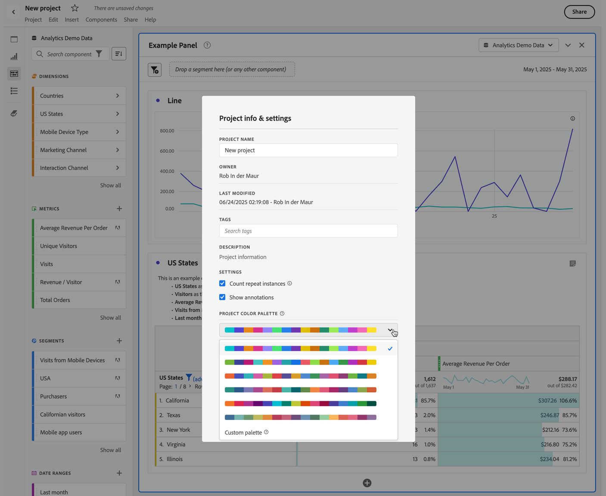
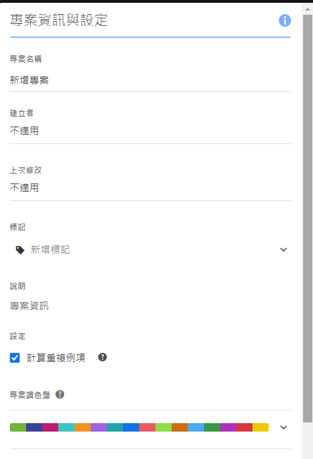
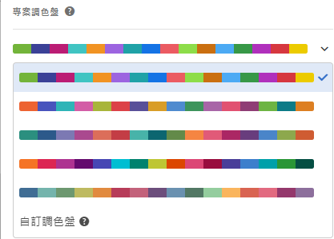

# 視覺效果調色盤 {#visualization-color-palette}

<!-- markdownlint-disable MD034 -->

>[!CONTEXTUALHELP]
>id="workspace_project_colorpalette"
>title="專案調色盤"
>abstract="變更在此專案中使用的調色盤。"

<!-- markdownlint-enable MD034 -->

您可以變更 Workspace 中使用的視覺效果調色盤。您可以選取預先定義的調色板，也可以指定與您公司品牌顏色相符的調色板。此功能會影響工作區中大部分的視覺效果，但&#x200B;**不會**&#x200B;影響摘要變更、自由表格中的條件式格式及地圖視覺效果。

>[!NOTE]
>
>Internet Explorer 11 並不支援調色盤。

請記住：

* 有六種預先設定的調色盤可供選擇。預設調色盤與列為第二的調色盤已針對對比度進行最佳化，兩者皆變得更方便供色盲使用者使用。
* 其他調色板已針對顏色和諧度進行最佳化。

## 若要變更調色盤：

1. 導覽至「**[!UICONTROL 工作區]** > **[!UICONTROL 專案]** > **[!UICONTROL 專案資訊和設定]**」。
1. 從&#x200B;**[!UICONTROL 專案調色盤]**&#x200B;下拉式功能表，您可以挑選其中一個預先設定的色彩配置。
1. 若要指定您自己的調色盤，請選取預先設定選項下方的「**[!UICONTROL 自訂調色盤]**」。
1. 指定最多 16 個以逗號分隔的十六進位值 (例如， `#00a4e4`) 來建立您自己的調色盤。舉例來說，如果您只想使用 4 個值，則顏色會在包含更多顏色的視覺效果中自動重複。

<!--
# Visualization Color Palettes {#visualization-color-palettes}

>[!CONTEXTUALHELP]
>id="workspace_project_colorpalette"
>title="Project color palette"
>abstract="Change the color palette used in this project."

You can change the visualization color palette used in Workspace by choosing a different color palette or by specifying your own palette that could match your company's branding colors. This feature affects most visualizations in Workspace, but it does **not** affect [!UICONTROL Summary Change], conditional formatting in [!UICONTROL Freeform] tables, and the [!UICONTROL Map] visualization.

>[!NOTE]
>
>Color palette support is not enabled for Internet Explorer 11.

Keep in mind:

* There are five pre-set color palettes to choose from. The default palette and the one below have been optimized for optimal contrast and are both more accessible for those who are color blind.
* The third to the fifth color palettes below the top two have been optimized for color harmony.

## Change your [!UICONTROL color palette]:

>[!BEGINSHADEBOX]

See  [Using a custom color palette](https://video.tv.adobe.com/v/23876?quality=12&learn=on){target="_blank"} for a demo video.

>[!ENDSHADEBOX]

1. Navigate to **[!UICONTROL Workspace]** > **[!UICONTROL Project]** > **[!UICONTROL Project Info & Settings]**.
1. From the **[!UICONTROL Project Color Palette]** drop-down list, you can pick one of five pre-set color schemes.

   

1. To specify your own palette, select **[!UICONTROL Custom Palette]** below the pre-set options.
1. Specify up to 16 comma-separated hexadecimal values (for example, #00a4e4) for the colors you intend to use. If, for example, you want to use only four values, these colors will automatically be repeated in visualizations that contain more colors.
-->