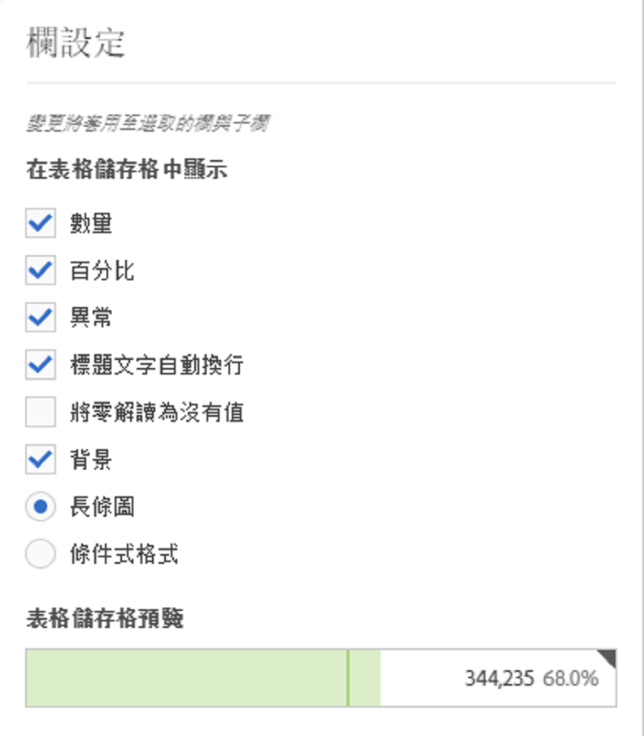
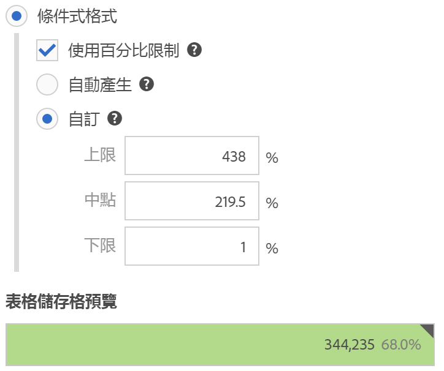

# 欄設定

欄設定可供設定欄的格式，部分可設為條件式。

## 欄設定 {#section_C5A9C13553BF4BFDAD7FACE0139AECA3}

若要存取[!UICONTROL 「欄設定」]，請拖曳自由表格至專案，接著按一下欄標頭中的齒輪圖示。

您可以同時編輯&#x200B;**多欄**&#x200B;的設定。只要選取多個欄，然後在任一欄中按一下設定圖示。您所做的任何變更都會套用在所有欄，以及您在其中選定的儲存格。

| 元素 | 說明 |
|--- |--- |
| 數字 | 決定儲存格是否要顯示/隱藏量度數值。例如，如果量度為「頁面檢視」，則該數值為列項目的頁面檢視數量。 |
| 百分比 | 決定儲存格是否要顯示/隱藏量度百分比值。例如，如果量度為「頁面檢視」，則該百分比數值為欄頁面檢視總數除以列項目的頁面檢視次數。附註：為了比例更精確，我們可以顯示超過 100% 的數值。我們也將上限提高為 1000%，以確保欄位的寬度夠大。 |
| 異常 | 決定是否要在該欄的數值中執行異常偵測。 |
| 繞排標頭文字 | 讓您自由表格中的標頭文字環繞，讓標頭變得更容易閱讀，表格也更便於分享。這項設定對 PDF 的轉譯還有較長名稱的量度來說，非常實用。預設啟用。 |
| 將零解讀為沒有值 | 針對含有 0 值的儲存格，決定顯示 0 或空白儲存格。如果您要查看某月的每日資料，而當月有部分天數尚未發生，這個方法就相當實用。若不想在未來的日期中顯示 0 值，則可選擇顯示空白儲存格。圖表也會採用此設定 (意即選取此設定後，若圖表含有 0 值，則不會顯示折線圖或長條圖)。 |
| 背景 | 決定儲存格是否要顯示/隱藏所有儲存格格式，包括長條圖和條件式格式。 |
| 長條圖 | 顯示橫條圖，當中呈現相對於欄總數的儲存格數值。 |
| 條件式格式 | 請參閱以下小節。 |
| 表格儲存格預覽 | 顯示目前已套用選定格式選項之各儲存格的呈現方式預覽。 |

## 條件式格式 {#section_3DD847151DA14914888A70FC4FD7BDFB}

條件式格式會將格式套用至您可定義的上限、中點和下限。除非選取「自訂」限制，否則系統也會在資料劃分時自動在自由表格中套用顏色等條件式格式。

| 元素 | 說明 |
|--- |--- |
| 條件式格式 | 根據資料值，套用下列顏色至儲存格： <ul><li>綠：高數值</li><li>黃：中間值</li><li>紅：低數值</li></ul> 取代表格中的維度會重設條件式格式限制。取代量度會重新計算該欄的限制 (其中量度位在 X 軸，維度位在 Y 軸)。 |
| 使用百分比限制 | 允許您根據各量度的百分比值使用上限、中點和下限。此設定適用於僅有百分比的量度 (例如反彈率)，以及含有計數和百分比的量度 (例如頁面檢視)。 |
| 自動產生 | 自動產生條件式格式的限制。上限是此欄中的最大值。下限是最小值，而中點是上限和下限的平均。 |
| 自訂 | 您可以手動指派條件式格式的「上限」、「中點」和「下限」欄位。這可提供由您決定欄的值是好、中等或壞的彈性。 |
| 表格儲存格預覽 | 顯示目前已套用選定格式選項之各儲存格的呈現方式預覽。 |

>[!MORELIKETHIS]
>
>* [管理資料來源](/help/analyze/analysis-workspace/visualizations/t-sync-visualization.md)

