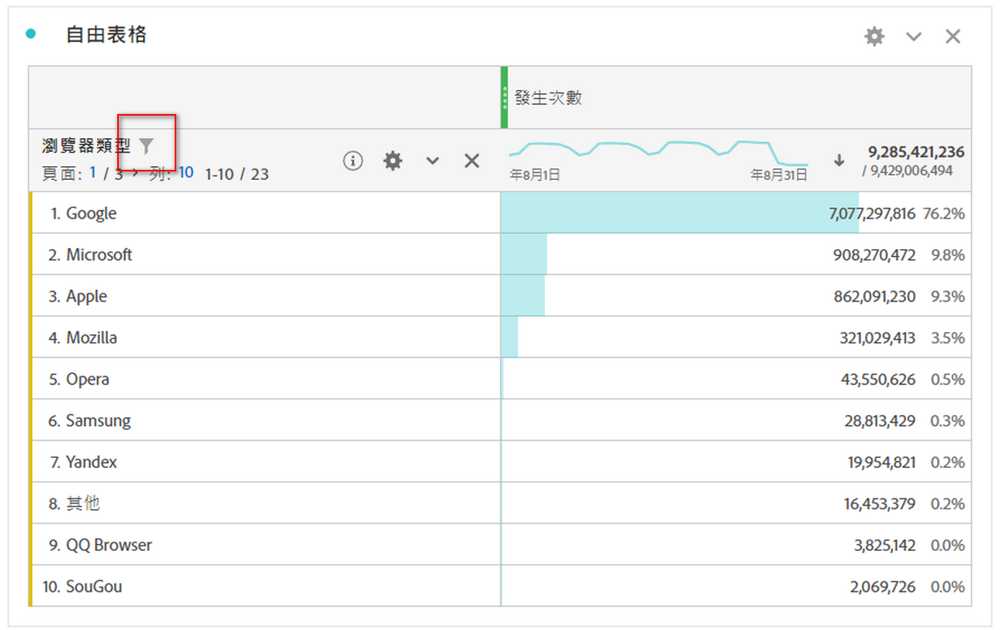
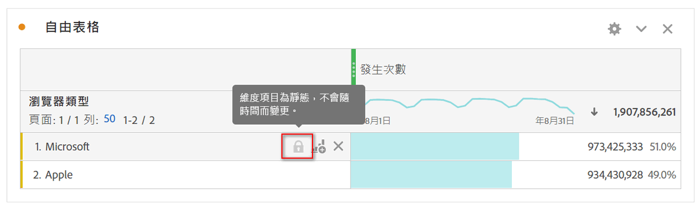
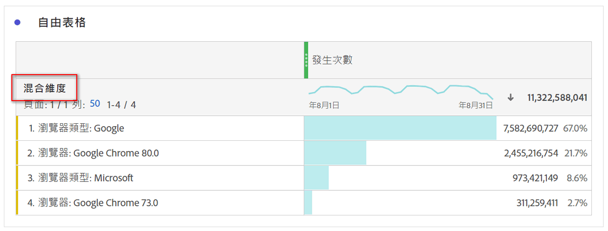

# 自由表格中的動態與靜態維度項目

在自由表格中，行和列可以包含其中的各種元件值。 這些值可以是動態（隨時間變更）或靜態（不隨時間變更），視您要建立的分析而定。

## 動態維度項目

動態維度項目會隨時間而變更，並取決於在自由表格中依據的量度。 當您要分析特定時段的排名最前的項目時，偏好使用動態維度項目。

將維度拖放至自由表格時，會傳回動態列。 它們代表對應至指定量度和時段之維度的排名最前的項目。 您也可以將維度拖放至自由表格欄，而維度會自動展開至前5個維度項目。

例如，當您將「瀏覽器類型」維度拖曳至表格時，頂端的「瀏覽器類型」維度項目（例如Microsoft、Apple、Google等） 動態返回表格列。 如果拖放至欄中，前5個「瀏覽器類型」維度項目會動態傳回。

動態維度項目有列篩選選項，且 **沒有** 鎖定和X圖示。

## 靜態維度項目

靜態維度項目不會隨時間而改變； 它們是固定元件，一律會在自由表格中傳回。 當您想要永遠分析相同項目時，最好使用靜態維度項目，不論該項目是特定促銷活動或一週中的特定天數。

每當您手動選取特定元件值（維度、量度、區段、日期範圍）並放入表格時，結果就會是列或欄的靜態清單。 如果您選擇：

* 從行中，按一下右鍵>只顯 [!UICONTROL 示選定行]
* 從欄中，按一下滑鼠右鍵> [!UICONTROL 將項目設為靜態]

例如，當您拖曳至特定的「瀏覽器類型」項目（例如Microsoft和Apple）時，這2個特定項目一律會拖曳到表格中。

靜態維度項目 **沒有** 「列篩選」選項。 而是每個項目都會顯示鎖定和X圖示。 按一下X表徵圖可從表中刪除該維項。

## 混合維度項目

來自不同維度的維度項目可以新增至相同的表格。 在這些情況下，列標題會顯示「混合維度」。 這些維度項目是靜態的。 例如，從「瀏覽器類型」維度新增特定維度項目，從「瀏覽器」維度新增其他維度項目。

## 自由格式總行數

動態和靜態行在自由格式總計行中的行為不同。 依預設：

* 動態列會在伺服器端加總，並去除重複度量，例如瀏覽或訪客
* 靜態列是在用戶端加總， **不** 會去重複化量度。 要計算總行伺服器端，請將「行」設定更改為「顯 **示總計」**。 [深入了解](https://docs.adobe.com/content/help/zh-Hant/analytics/analyze/analysis-workspace/build-workspace-project/workspace-totals.html)
