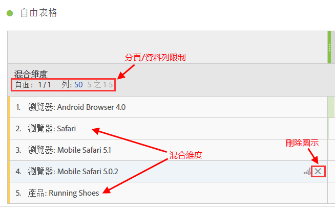
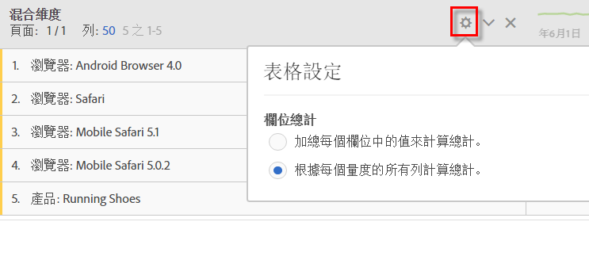

# 靜態與動態列

當您將維度放至表格時，Analysis Workspace 表格會產生「動態」列 - 表示對應至維度 (指定量度) 的所有項目會提取至表格中。

例如，當您將「瀏覽器」維度拖曳至表格內時，其所有維度項目 (例如 Android 瀏覽器、行動裝置 Safari、Firefox 等)會相應提取至表格中。

相反地，您每次手動選取特定的量度、區段、資料範圍或個別維度項目並放至表格時，結果為硬式編碼或「靜態」列或清單。您現在可利用這些方法與靜態列互動：

* 按一下靜態列中的「預覽」圖示，可讓您預覽區段、量度和日期範圍。
* 按一下「x」圖示從表格中刪除該列。
* 限制顯示的列數並啟用分頁。
* 新增「混合維度項目」。例如，從瀏覽器維度新增一個項目，並從產品維度新增另一個項目。

   圖例如下：

   

此外，您必須處在靜態列模式，才可以變更欄位總計的計算方式。只需按一下齒輪圖示並在這 2 個選項之間切換：

| 選項 | 說明 |
|---|---|
| (預設) 總計的計算方式為加總目前在每個欄中的值。 | 這個選項只會計算目前在表格中的列。(用戶端計算) |
| 根據每個量度的所有列來計算總計。 | 這個選項包含此維度的所有維度項目，即使是未列於表格中的項目。(伺服器端計算) |

