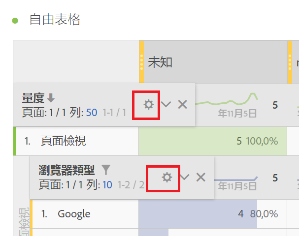
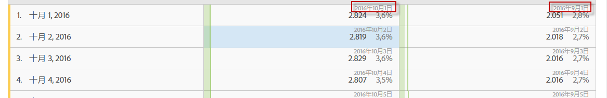

# 列設定

列設定依您拖放至表格中的元件而異。

您也可以使用[表格中的按右鍵動作](/help/analyze/analysis-workspace/visualizations/freeform-table.md)來管理選取的列。

若要存取表格列設定，按一下維度、區段、量度、時段旁的設定圖示，或按以下各項之中的劃分:

<table id="table_7ACE6413DB1F40349ED2860020F92E55"> 
 <thead> 
  <tr> 
   <th colname="col1" class="entry"> 列設定 </th> 
   <th colname="col2" class="entry"> 說明 </th> 
  </tr>
 </thead>
 <tbody> 
  <tr> 
   <td colname="col1"> 
<a href="/help/analyze/analysis-workspace/components/calendar-date-ranges/time-comparison.md"  > 日期比較</a> 
 </td> 
   <td colname="col2"> 
<b>對齊各欄日期，讓所有開始日期在同一列。</b> 
 
當您選擇對齊日期，例如，在 2016 年 10 月和 9 月的月對月比較中，左欄將從 10 月 1 日開始，右欄將從 9 月 1 日開始: 
 
 
 
預設為停用。 
 </td> 
  </tr> 
  <tr> 
   <td colname="col1"> 
百分比 
 </td> 
   <td colname="col2"> 
<b>依列計算百分比</b> 
 
強制自由格式表格跨列計算儲存格百分比，而非整欄計算。此設定在計算趨勢百分比時特別實用。使用「視覺化」圖示時，此功能就會預設為啟用。 
 </td> 
  </tr> 
  <tr> 
   <td colname="col1"> 
欄總計 
 </td> 
   <td colname="col2"> 
這些設定只會在<a href="/help/analyze/analysis-workspace/build-workspace-project/column-row-settings/manual-vs-dynamic-rows.md"  >手動 (靜態) 列</a>顯示 (當您已選取有限數目的項目)，不會在動態列顯示 (當您拖放會顯示所有項目的維度)。 
附註: 若是<i>量度</i>手動列，此設定會停用，因為去加總表格中目前列以外的任何量度不太合理。 
 
 
<b>加總目前在每個欄中的值來計算總計 (預設為啟用):</b> 
 
這個選項只會計算目前在表格中的列。(用戶端計算) 
 
<b>依據每個量度的所有列計算總計 (預設為停用):</b> 
 
這個選項包含此維度的所有維度項目，即使是未列於表格中的項目。(伺服器端計算) 
 </td> 
  </tr> 
  <tr> 
   <td colname="col1"> 
劃分 
 </td> 
   <td colname="col2"> 
<b>依位置劃分:</b> 
 
您可以根據 Freeform 表格中的固定位置執行劃分。例如，您可以指定一律劃分前七列。 
 
(在舊版中，資料劃分中的值清單為「鎖定」。這樣的設定如舉例說名，在您執行依「頁面」劃分「日期」時，會得到所選日期範圍內前 50 個頁面的清單。如果您儲存該報告，然後在一個月後執行，則前 50 頁可能已變更。然而，Analysis Workspace 會使用原始劃分的結果，並傳回相同的頁面，但以當前月份為日期範圍。) 
 
依固定位置執行劃分: 
 
    <ol id="ol_A396A11566AA4F52BC3ABBC373CEF477"> 
     <li id="li_BDAB1E9A48D44944A4F7C31F1182B923">劃分表格中的一些列。 </li> 
     <li id="li_C5610437D3714CCEB9F3C771864B4336">按一下您要固定位置之表格列旁邊的設定 (齒輪) 圖示。 </li> 
     <li id="li_675E429DC3B94201978166F9408D30B1">核選「依位置劃分」旁的核取方塊。 </li> 
     <li id="li_E8A417D0D6D1438CAE825843BA0A7060">變更排序順序或日期範圍，然後注意劃分現在已繫結至該列的位置，而不是程式碼寫定的列。 </li> 
    </ol> 
預設為停用。 
 </td> 
  </tr> 
 </tbody> 
</table>

| 列設定 | 說明 |
|--- |--- |
| 日期比較 | 對齊各欄日期，讓所有開始日期在同一列。當您選擇對齊日期，例如，在 2016 年 10 月和 9 月的月對月比較中，左欄將從 10 月 1 日開始，右欄將從 9 月 1 日開始. 預設為停用。 |
| 百分比 | 依列計算百分比強制自由表格計算行間的儲存格百分比，而非向下計算欄。 此設定在計算趨勢百分比時特別實用。 使用「視覺化」圖示時，預設為啟用。 |
| 欄總計 | 這些設定只會在 [static) rows](https://docs.adobe.com/content/help/en/analytics/analyze/analysis-workspace/build-workspace-project/column-row-settings/manual-vs-dynamic-rows.html) (when you have selected a finite set of items), not with dynamic rows (i.e., when you drop in a dimension that shows all items).<ul><li>**[!UICONTROL 將目前的列數加總顯示為總計]**- 這個選項會顯示表格中的用戶端列數加總，因此總計**&#x200B;不會&#x200B;**刪除「造訪次數」或「訪客人數」等重複量度。</li><li>**[!UICONTROL 顯示總量]**- 這個選項會顯示伺服器端的加總，因此總計會刪除「造訪次數」或「訪客人數」等重複量度。</li></ul> |
| 劃分 | **[!UICONTROL 依職位劃分]**: 您可以根據自由表格中的固定位置執行劃分。 例如，您可以指定一律劃分前七列。 (在舊版中，資料劃分中的值清單為「鎖定」。這樣的設定如舉例說名，在您執行依「頁面」劃分「日期」時，會得到所選日期範圍內前 50 個頁面的清單。如果您儲存該報告，然後在一個月後執行，則前 50 頁可能已變更。然而，Analysis Workspace 會使用原始劃分的結果，並傳回相同的頁面，但以當前月份為日期範圍。) 若要根據固定位置執行劃分：1. 劃分表格中的一些列。2.按一下您要固定位置之表格列旁的「設定（齒輪）」圖示。 3.勾選「依位置劃分」旁的核取方塊。 4.變更排序順序或日期範圍，並注意劃分現在會系結至列位置，而非硬式編碼列。 預設為停用。 |