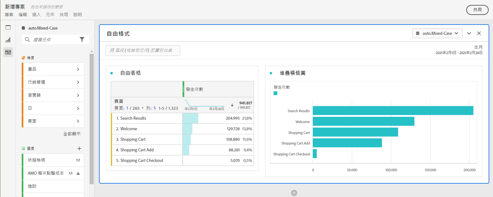

# 專案概觀

Workspace 專案可讓您合併面板、視覺效果和元件，以進行分析並與貴組織的任何人共用。在開始第一個專案之前，請先了解如何存取、瀏覽及管理您的專案。

若要存取Adobe Analytics中的專案，請選取&#x200B;**[!UICONTROL Workspace]**。  **[!UICONTROL 專案]**&#x200B;管理員會列出您擁有的所有專案或與您共用的專案。具有專案清單的專案管理員也是Adobe Analytics的預設登陸頁面，除非您已在「偏好設定」中另行設定。

## 標題區域

在標題區域 ➊ 內，您可以使用其他圖磚來建立專案、建立資料夾、編輯您的偏好設定，以及顯示或隱藏面板。

* 若要顯示或隱藏左側面板以便您在「**[!UICONTROL 專案]**」和「**[!UICONTROL 了解]**」之間選取，您可選取「」。
* 標題會顯示專案，還可選擇新增至您已選取資料夾的路徑。例如，[!UICONTROL 專案] > **[!UICONTROL 公司資料夾]**。您可以選取個別子資料夾部分，以直接前往特定資料夾。
* 若要顯示[**[!UICONTROL 空白專案]**](create-projects.md)、[**[!UICONTROL 空白行動計分卡]**](/help/analyze/mobile-app/create-scorecard.md)、**[!UICONTROL 開啟檔案]**&#x200B;和&#x200B;**[!UICONTROL 開啟發行說明]**，請選取 **[!UICONTROL 顯示更多]**。 若要隱藏有圖磚的區域，請選取  **[!UICONTROL 「顯示較少」]**。
* 根據您的選取來顯示 (使用[顯示選擇器](#show-selector))，您可以編輯偏好設定並對&#x200B;**[!UICONTROL 專案]**&#x200B;中目前可見到的資料夾執行動作：

  | 動作 | 說明 |
  |---|---|
  | **[!UICONTROL 建立專案]** | 選取以[建立新專案](create-projects.md)。 |
  | **[!UICONTROL 建立資料夾]** | 選取以[建立新專案](workspace-folders/create-folders.md)。 |
  |  **[!UICONTROL 編輯偏好設定]** | [編輯偏好設定](/help/analyze/analysis-workspace/user-preferences.md)適用於您所有的專案。當階層連結導致空間有限時，此動作是「」子選單中的一部分。 |
  | **[!UICONTROL 新增專案]** | 選取以[新增專案](workspace-folders/add-projects.md)至目的資料夾。當階層連結導致空間有限時，此動作是「」子選單中的一部分。 |
  | **[!UICONTROL 重新命名資料夾]** | [重新命名](workspace-folders/manage-folders.md#rename-folders)目前資料夾。 |
  | **[!UICONTROL 移動資料夾]** | [移動](workspace-folders/manage-folders.md#move-folders)目前資料夾。 |
  | **[!UICONTROL 刪除資料夾]** | [刪除](workspace-folders/manage-folders.md#delete-folders)目前資料夾。 |

## 專案清單

專案清單 ➋ 會顯示您擁有以及已經與您共用的所有專案。清單有以下欄位：

| 欄 | 說明 |
| --- | --- | 
|  | 當選取一個或多個專案時，專案介面底部會出現一個藍色操作欄。如需詳細資訊，請參閱「[動作](#actions)」。 |
|  | 選取以將專案設為我的最愛  或取消我的最愛 。 |
| **[!UICONTROL 標題和說明]** | 若要編輯專案，請選取標題連結，即會開啟 [Workspace 專案](/help/analyze/analysis-workspace/home.md)。與您共用的專案會以「」來表示。選取  以顯示快顯選單，其中含有專案的更多詳細資訊。選取「」以開啟含有動作的內容選單。如需詳細資訊，請參閱「[動作](#actions)」。 |
| **[!UICONTROL 類型]** | Workspace 專案、 資料夾或[行動計分卡](/help/analyze/mobile-app/home.md)。 |
| **[!UICONTROL 標記]** | 套用至專案的標記。 |
| **[!UICONTROL 已排程]** | 是否為專案排程以透過電子郵件發送給收件者。選項包括  **[!UICONTROL 開啟]**&#x200B;或 **[!UICONTROL 關閉]**。請參閱「[發送專案資料給其他人](/help/analyze/analysis-workspace/curate-share/t-schedule-report.md)」。 |
| **[!UICONTROL 共用連結 (任何人)]** | 無論是否與任何人共用專案，即使是沒有 Analysis Workspace 存取權的人都可以共用。選項包括  **[!UICONTROL 使用中]**&#x200B;或 **[!UICONTROL 非使用中]**。如需更多資訊，請參閱[共用專案](/help/analyze/analysis-workspace/curate-share/share-projects.md)中的「[與任何人共用專案 (無需登入)](/help/analyze/analysis-workspace/curate-share/share-projects.md#share-a-project-with-anyone-no-login-required)」。 |
| **[!UICONTROL 專案角色]** | 您在專案中的角色。選項包括：編輯、複製、檢視。請參閱「[專案角色](/help/analyze/analysis-workspace/curate-share/curate.md)」，了解更多資訊。 |
| **[!UICONTROL 報告套裝]** | 與專案相關聯的報表套裝。 |
| **[!UICONTROL 所有者]** | 建立此專案的人 (您或與您共用專案的人)。 |
| **[!UICONTROL 共用對象]** | 已與其共用該專案的使用者。 |
| **[!UICONTROL 上次修改日期]** | 上次修改專案的日期和時間。 |
| **[!UICONTROL 上次開啟]** | 上次開啟專案的日期和時間。 |
| **[!UICONTROL 元件 ID]** | 元件的ID。 |
| **[!UICONTROL 最大日期範圍]** | 專案中任何面板或視覺效果的最長日期範圍。 |
| **[!UICONTROL 查詢數]** | 專案中使用的查詢總數。 |
| **[!UICONTROL 位置]** | 專案所在的資料夾。 |

將滑鼠停留在任何資料欄標題上，即可顯示  並從內容選單中選取：

* **[!UICONTROL 升序排列]**
* **[!UICONTROL 降序排序]**
* **[!UICONTROL 調整資料欄大小]**&#x200B;會出現一條藍線，可幫助您調整資料欄的大小。

### 動作

您可以使用內容選單  或藍色動作列，對一個或多個專案執行動作。

| 圖示 | 動作 | 說明 |
|:---:| ---|---|
|  | **[!UICONTROL *x *已選取]** | 取消選擇您已選的專案和資料夾，並刪除藍色動作列。 |
|  | **[!UICONTROL 刪除]** | 刪除一個或多個專案或資料夾。系統會提示您進行確認。 |
|  | **[!UICONTROL 共用]** | 共用專案。請參閱「[共用專案](/help/analyze/analysis-workspace/curate-share/share-projects.md)」了解更多。 |
|  | **[!UICONTROL 重新命名]** | 重新命名專案。開啟&#x200B;**[!UICONTROL 重新命名：*專案名稱對話框&#x200B;*]**。輸入新名稱並選取「**[!UICONTROL 儲存&#x200B;]**」。 |
|  | **[!UICONTROL 複製]** | 複製一個或多個專案。專案會獲得相同的名稱和字尾 `(Copy)`。 |
|  | **[!UICONTROL 釘選]**&#x200B;或&#x200B;**[!UICONTROL 取消釘選]** | 釘選或取消釘選一個或多個專案或資料夾。已釘選的專案和資料夾會出現在清單上方，並忽略您指定的排序順序。 |
|  | **[!UICONTROL 向上移動]** | 在專案清單中，將已釘選的專案或資料夾向上移動。 |
|  | **[!UICONTROL 向下移動]** | 在專案清單中，將已釘選的專案或資料夾向下移動。 |
|  | **[!UICONTROL 標記]** | 標記一個或多個專案或資料夾。**[!UICONTROL 標記元件]**&#x200B;對話框會顯示，即可選取一個或多個標記。選取「**[!UICONTROL 儲存]**」，以儲存所選專案或資料夾的標記。 |
|  | **[!UICONTROL 核准]**&#x200B;或&#x200B;**[!UICONTROL 取消核准]** | 核准或不核准專案。只有管&#x200B;&#x200B;理員可以核准專案。 |
|  | **[!UICONTROL 匯出 CSV]** | 將選取的專案匯出為名為 `Project List.csv` 的 CSV 檔案。 |
|  | **[!UICONTROL 新增專案]** | 將一個或多個專案新增至選取的資料夾。在「**[!UICONTROL 新增專案]**」中，您可以選取一個或多個專案。選取「**[!UICONTROL 新增]**」，將專案新增至資料夾。請參閱「[將項目新增至資料夾](workspace-folders/add-projects.md#from-inside-a-folder)」了解更多。 |
|  | **[!UICONTROL 移動至]** | 將一個或多個選取的專案移動至資料夾。在「**[!UICONTROL 選取資料夾]**」中，選取要將選取的專案移往的資料夾，然後選取「**[!UICONTROL 移動]**」。請參閱「[將項目新增至資料夾](workspace-folders/add-projects.md#from-the-project-list)」了解更多。 |

## 顯示選擇器

您可以使用&#x200B;**[!UICONTROL 「顯示」]**&#x200B;選擇器 ➌ 來切換專案介面的外觀。**[!UICONTROL 顯示]**&#x200B;選擇器會定義[標題區域](#title-area)中可用的選項，以及[專案清單](#project-list)中顯示的資料欄。

* 若要變更[標題區域](#title-area)中可用的選項，請選取&#x200B;**[!UICONTROL 顯示]** **[!UICONTROL 所有專案]**&#x200B;或&#x200B;**[!UICONTROL 顯示]** **[!UICONTROL 資料夾和專案]**。

* 若要定義在[專案清單](#project-list)中顯示哪些資料欄，請選取，然後從「**[!UICONTROL 自訂表格]**」對話框選取或取消選取資料欄。選取「**[!UICONTROL 套用]**」以套用自訂。若要了解資料欄的更多資訊，請參閱「[專案清單](#project-list)」。

## 篩選面板

您可以使用篩選器面板 ➍ 來篩選「[專案清單](#project-list)」中的篩選器和資料夾。若要顯示或隱藏篩選器面板，請使用「」。

篩選器面板由以下部分組成。

### 標記

| 標記 | 說明 |
|---|---|
| {width="300"} | 「**[!UICONTROL 標記]**」部分可讓您按標記進行篩選。 <ul><li>您可以使用  *「搜尋標記」*&#x200B;來搜尋您想要用來篩選的標記。</li><li>您可以選取多個標記。適用標記取決於篩在篩選器面板其他部分所做的選擇。</li><li>這些數字是表示：<ul><li>**2︎⃣**：目前篩選器產生的專案適用的標記數量。</li><li>7︎⃣：與特定標記相關聯的專案數量。</li></ul></li></ul> |

### 報表套裝

| 報表套裝 | 說明 |
|---|---|
| {width="300"} | **[!UICONTROL 報表套裝]**&#x200B;區段可讓您篩選報表套裝。 <ul><li>您使用 *搜尋報表套裝*&#x200B;來搜尋您要用來篩選的報表套裝。</li><li>您可以選取多個報表套裝。 可用的報表套裝取決於篩選器面板中其他區段所做的選擇。</li><li>這些數字是表示：<ul><li>**3︎⃣**：目前篩選產生的專案可用的報表套裝數目。</li><li>⃣4︎：與特定報表套裝相關聯的專案數目。</li></ul></li></ul> |

### 所有者

| 所有者 | 說明 |
|---|---|
| {width="300"} | 「**[!UICONTROL 所有者]**」部分可讓您篩選所有者。 <ul><li>您可使用  *「搜尋所有者」*&#x200B;來搜尋您想要用來篩選的所有者。</li><li>您可以選取多個所有者。適用的所有者取決於在篩選器面板其他部分所做的選擇。</li><li>這些數字是表示：<ul><li>**3︎⃣**：目前篩選器產生的專案適用的所有者數量。</li><li>4︎⃣：與特定所有者相關聯的專案數量。</li></ul></li></ul> |

### 類型

| 類型 | 說明 |
|---|---|
| {width="300"} | **[!UICONTROL 類型]**&#x200B;部分可讓您依照專案或資料夾的類型進行篩選。<ul><li>您可以選取下列其中一個或更多選項:<ul><li> **[!UICONTROL 資料夾]**。</li><li>**[!UICONTROL Analysis Workspace 專案]**</li><li>**[!UICONTROL Mobile 計分卡]**</li></ul> <li>您可以選取多個其他篩選器。適用的其他篩選器取決於在篩選器面板其他部分所做的選擇。</li><li>這些數字是表示：<ul><li>**5︎⃣**：目前篩選器產生的專案適用的其他篩選器數量。</li><li>4︎⃣：與特定其他篩選器相關聯的專案數量。</li></ul></li></ul> |

### 其他篩選器

| 其他篩選器 | 說明 |
|---|---|
| {width="300"} |  **[!UICONTROL 其他篩選器]**&#x200B;部分可讓您根據其他預先定義的篩選器進行篩選。<ul><li>您可以選取下列其中一個或更多選項:<ul><li> **[!UICONTROL 全部顯示]**</li><li>**[!UICONTROL 與我共用]**</li><li>**[!UICONTROL 我的]**</li><li>**[!UICONTROL 已核准]**</li><li>**[!UICONTROL 我的最愛]**</li></ul> 您可以選取的內容取決於您的角色和權限。</li><li>您可以選取多個其他篩選器。適用的其他篩選器取決於在篩選器面板其他部分所做的選擇。</li><li>這些數字是表示：<ul><li>**5︎⃣**：目前篩選器產生的專案適用的其他篩選器數量。</li><li>4︎⃣：與特定其他篩選器相關聯的專案數量。</li></ul></li></ul> |

## 搜尋

您可以使用搜尋區域 ➎ 並透過「」欄位搜尋專案和資料夾。開始輸入後，[專案清單](#project-list)會自動篩選您的搜尋輸入。

搜尋區域也會顯示從篩選器面板套用的篩選器。

* 若要移除篩選器，請在篩選器中選取 。
* 若要刪除所有篩選器，請選取「全部清除」。

如果空間受限而無法顯示個別篩選器，您可以看到&#x200B;**[!UICONTROL 按篩選器 *x* 進行劃分]**。

* 若要移除篩選器：

   1. 使用上方的 **[!UICONTROL *x *篩選器]** 來開啟內容選單，列出篩選器類型和個別篩選器。
   1. 使用  來移除篩選器。

<!--

# Projects overview

Workspace projects allow you to combine data components, tables and visualizations to craft your analysis and share with anyone in your organization. Before starting your first project, learn about how to access, navigate and manage your projects. 

Here is a video on how to build a Workspace project:

>[!BEGINSHADEBOX]

See  [Build a Workspace project](https://video.tv.adobe.com/v/334076?quality=12&learn=on){target="_blank"} for a demo video.

>[!ENDSHADEBOX]

## Project list {#project-list}

When you first go to **[!UICONTROL Analytics]** > **[!UICONTROL Workspace]**, the page lists all the projects you own or have been shared to you. This page is also the landing page for Adobe Analytics, unless you have previously set a custom landing page. 

The Projects page contains the following information: 

|  Element  | Description  |
|---|---|
| [Edit preferences](/help/analyze/analysis-workspace/user-preferences.md) | Manage settings for Analysis Workspace and its related components for all new projects or panels that you create.  |
| [Create folder](/help/analyze/analysis-workspace/build-workspace-project/workspace-folders/create-folders.md)  | Add a new folder or subfolder to the list of projects and folders. |
| [Create project](/help/analyze/analysis-workspace/build-workspace-project/create-projects.md)  | Start a new project from scratch or from a report.  |
|  Show more  | This selection reveals options for creating a blank project or mobile scorecard, [viewing training tutorials](https://experienceleague.adobe.com/en/docs/analytics-learn/tutorials/analysis-workspace/analysis-workspace-basics/analysis-workspace-introduction), or [viewing release notes](/help/release-notes/latest.md).  |
|  | To show or hide filters. You can filter on tags, report suite, owners, type (project, folder, mobile scorecard), and other filters. | 
|  | Use the search field to search for folders, Workspace projects or mobile scorecards. |
| Show Folders & Projects| Choose whether to show the folder structure of projects. For more information, see [About Folders in Analytics](/help/analyze/analysis-workspace/build-workspace-project/workspace-folders/about-folders.md). |
|   | This icon allows you to customize the columns you see for each project in the projects list.  |

The list of projects can display the following columns:

|  Column  | Description  |
|---|---|
| [!UICONTROL Name]  | Name of the Workspace project. Select  to show a popup with more details on a project or folder. Select  to show actions available. See [Manage projects](#manage-projects) for more details.  | 
| [!UICONTROL Type] | Indicates whether this entry is a Workspace project, a folder, or a [Mobile scorecard](https://experienceleague.adobe.com/en/docs/analytics/analyze/mobapp/home). |
| [!UICONTROL Tags]  |Tags that were applied to the project.  |
| [!UICONTROL Scheduled] | Indicates whether projects are scheduled to be emailed to recipients. See [Schedule projects](/help/analyze/analysis-workspace/curate-share/t-schedule-report.md). |
| Shared link (anyone) | Projects can be shared with anyone, even with people who don't have access to Analysis Workspace. This column shows whether projects have been shared in this way. See [Share a project with anyone (no login required)](/help/analyze/analysis-workspace/curate-share/share-projects.md#share-public-link) in [Share projects](/help/analyze/analysis-workspace/curate-share/share-projects.md) for more information. |
| [Project Role](https://experienceleague.adobe.com/en/docs/analytics/analyze/analysis-workspace/curate-share/share-projects) | Indicates your role for the project - owners, edit, duplicate, view. |
| [!UICONTROL Report suite] | The report suite that the project is associated with. |
| [!UICONTROL Owner]  | The person who created this project (either you or someone who shared the project with you.)  |
| [!UICONTROL Shared with]  | Users that the project has been shared with.  |
| [!UICONTROL Last Modified]  | Date and time when the project was last modified.  |
| [!UICONTROL Last Opened]  | Date and time when the project was last opened.  |
| [!UICONTROL Last Used] | Date and time when the project was last used. | 
| [!UICONTROL Project ID]  | The ID of the project.  |
| [!UICONTROL Longest Date Range]  | The longest date range of the project.  |
| [!UICONTROL Number of Queries]  | The total number of queries contained in the project.  |
| [!UICONTROL Location]  | The folder where the project resides.  |

### Manage projects

To manage projects, select one or more projects from the project list. 

From the blue action bar, you can select the following actions:

| Action | Description | 
|---|---|
|  Delete | When selected, a confirmation dialog prompts you to confirm the deletion of a Workspace project or Mobile scorecard. Select **[!UICONTROL OK]** to confirm. |
|  Share | This action allows you to share your project. See [Share projects](../curate-share/share-projects.md).|
|  Rename | Opens up a **[!UICONTROL Rename: *name*]** dialog to rename your project. Select **[!UICONTROL Save]** to save the new name for the project. |
|  Copy | Immediately copies the selected project to a new project with name *original name* (Copy).  |
|  Pin | Immediately pins the project to the top of the list. Adds the  indicator. |
|  Tag | Opens up the **[!UICONTROL Tag Project]** dialog. You can select an existing tag or add new tags. Select **[!UICONTROL Save]** to save the tags for the project. |
|  Approve or Unapprove |  Approves or unapproves the project.  |
|  Export CSV | Immediately downloads a file containing a comma-separated value list of the projects. |
|  Move to | This action allows you to move the project to a folder. In the **[!UICONTROL Select Folder]** dialog, select a folder from the **[!UICONTROL Folder]** list, and select **[!UICONTROL Move]**. | 

## Menu bar {#menu-bar}

Within a project, the menu provides options for managing your project, adding components, finding help, and more. You can also access each menu option by keyboard [shortcuts](https://experienceleague.adobe.com/en/docs/analytics/analyze/analysis-workspace/build-workspace-project/fa-shortcut-keys).

|  Menu item  | Description  |
|---|---|
|  Project  | This menu includes common actions for project management, including New, Open, Save, Save as, and [Save as company report](/help/analyze/analysis-workspace/build-workspace-project/starter-projects.md). You can also refresh the entire project to retrieve the most recent data and definitions by clicking Refresh Project. [Download CSV and PDF](https://experienceleague.adobe.com/en/docs/analytics/analyze/analysis-workspace/curate-share/download-send) options enable you to export data from Workspace. [Project Info & Settings](https://experienceleague.adobe.com/en/docs/analytics/analyze/analysis-workspace/build-workspace-project/freeform-overview) offers many options for managing your project.  |
|  Edit  | Undo or redo your last action. Clear All resets your project to a blank starting point. |
|  Insert  | Insert new panels or visualizations from this menu. You can also insert new panels and visualizations from the left rail.  |
|  [Components](https://experienceleague.adobe.com/en/docs/analytics/analyze/analysis-workspace/components/analysis-workspace-components)  | Create new segment, calculated metric, date range, or alert components from your project. You can also create new components from the left rail. If your component definitions have recently changed, Refresh Components retrieves the latest definitions. |
|  [Share](https://experienceleague.adobe.com/en/docs/analytics/analyze/analysis-workspace/curate-share/send-schedule-files)  | Curate, share and schedule PDF/CSV projects to recipients in your organization.  |
|  Help  | Access help documentation, videos, and the Analytics [Experience League community](https://experienceleaguecommunities.adobe.com/t5/adobe-analytics/ct-p/adobe-analytics-community). Manage the visibility of Workspace tips as well as the [debugger](https://developer.adobe.com/analytics-apis/docs/2.0/). Find details about Workspace and factors that impact project [performance](https://experienceleague.adobe.com/en/docs/analytics/analyze/analysis-workspace/workspace-faq/optimizing-performance).  |
|  Share button or Owner  | If you are in an Own or Edit for the project, the Share button in the top-right gives you one-click access to manage your project recipients. If you are in a Duplicate or View role for the project, you see the project owner's name. |

### Project Info & Settings {#info-settings}

>[!CONTEXTUALHELP]
>id="workspace_project_countrepeatinstances"
>title="Count repeat instances"
>abstract="Specifies whether repeat instances are counted in reports.  Note: this setting does not apply to Flow or Fallout visualizations."

>[!CONTEXTUALHELP]
>id="workspace_project_repeatinstances"
>title="Count repeat instances"
>abstract="Specifies whether repeat instances are counted in reports. Note: this setting does not apply to Flow or Fallout visualizations."

>[!CONTEXTUALHELP]
>id="workspace_project_commenting"
>title="Allow commenting"
>abstract="When enabled, a comments area is available in the right rail of the project in Analysis Workspace."

**[!UICONTROL Workspace]** > **[!UICONTROL Project]** > **[!UICONTROL Project Info & settings]** provides project-level information on the currently active project.

Settings include:

|  Setting  | Description  |
|---|---|
|  Project Name  | The name given to the project. You can double-click the name to edit it.  |
|  Owner  | Project owner name  |
|  Last Modified  | Date of last modification to the project.  |
|  Tags  |Lists any tags applied to a project for easier categorization.  |
|  Description  | A description is useful for clarifying the purpose of a project. You can double-click the description to edit it.  |
|  Count repeat instances  | Specifies whether repeat instances are counted in reports. For example, this setting (when activated) treats multiple consecutive pages views to the same page as multiple page views. With it off, they count as a single page view (this setting only affects certain metrics, such as Single Page Visits). **Note**: This setting does not apply to Flow or Fallout visualizations.  |
| [Show annotations](/help/analyze/analysis-workspace/components/annotations/overview.md) | Specify whether to show annotations in the project or not. |
|  [Project color palette](https://experienceleague.adobe.com/en/docs/analytics/analyze/analysis-workspace/build-workspace-project/color-palettes)  | You can change the categorical color palette used in Workspace, by choosing from out-of-the-box palettes that have been optimized for color blindness, or by specifying your custom palette. This feature affects many things in Workspace, including most visualizations.  |
| [View Density](https://experienceleague.adobe.com/en/docs/analytics/analyze/analysis-workspace/build-workspace-project/view-density) | Lets you see more data on the screen by reducing the vertical padding of the left rail, freeform tables and cohort tables. |

## Left rail {#left-rail}

Within a project, various icons are available in the left rail, and each represents important tools to build your project:

| Icon | Functionality |
|---|---|
|  | [Panels](/help/analyze/analysis-workspace/c-panels/panels.md) |
|  |[Visualizations](/help/analyze/analysis-workspace/visualizations/freeform-analysis-visualizations.md) |
|  | [Components](/help/analyze/analysis-workspace/components/analysis-workspace-components.md) |
|  | [Data dictionary](/help/analyze/analysis-workspace/components/data-dictionary/data-dictionary-overview.md) |
|  | [Table of contents](/help/analyze/analysis-workspace/build-workspace-project/project-table-of-contents.md) |

Components (dimensions, metrics, segments, date ranges) in the left rail relate to the active panel data view. A blue border identifies the active panel, and the active report suite is listed at the top of the component rail.

## Right-click menu

Here is a video on using the right-click menu in Analysis Workspace:

>[!BEGINSHADEBOX]

See  [Using the context menu](https://video.tv.adobe.com/v/23981?quality=12&learn=on){target="_blank"} for a demo video.

>[!ENDSHADEBOX]

## Project canvas {#canvas}

The project canvas is where you bring together panels, tables, visualizations, and components to build your analysis. A project can contain many panels, and each panel can contain many tables and visualizations.

Panels are helpful when you want to organize your projects according to time periods, report suites, or analysis use case. The active panel has a colored border around it, and determines what components are available in the left rail.

Depending on the starting point you chose for your projects, you either have a [freeform table](https://experienceleague.adobe.com/en/docs/analytics/analyze/analysis-workspace/visualizations/freeform-table/freeform-table) or a [blank panel](https://experienceleague.adobe.com/en/docs/analytics/analyze/analysis-workspace/panels/blank-panel) in the canvas to begin with. The quickest way to start analyzing is to select one or many components and simply drag & drop them into the project canvas. A table of data is rendered automatically for you. [Learn more](https://experienceleague.adobe.com/en/docs/analytics/analyze/analysis-workspace/visualizations/freeform-table/freeform-table) about the different options for building a table, or leverage the available [training tutorial](https://experienceleague.adobe.com/en/docs/analytics/analyze/analysis-workspace/home) for more guidance on building your first project.

-->