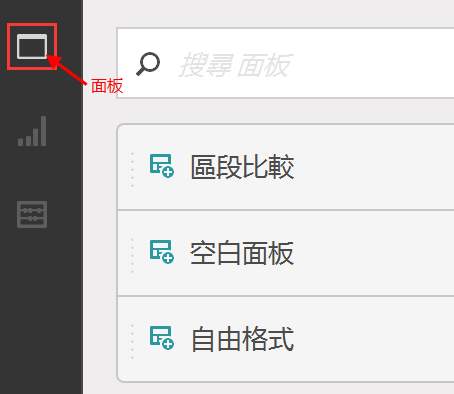
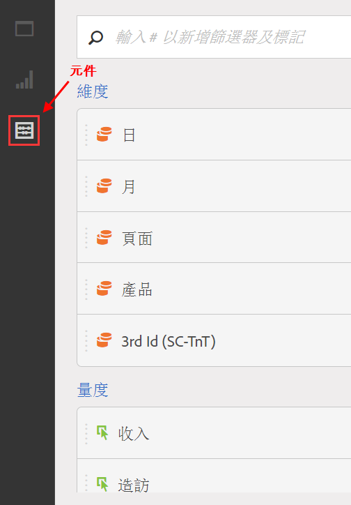

# 建立專案 - 概述

**[!UICONTROL Analytics]** &gt; **[!UICONTROL Workspace]**

您可以根據任何視覺效果、報表元件以及資料表格的組合，建立強大的 Analytics 專案。它將「Ad Hoc Analysis」的許多表格產生器功能引進 Analytics。

在 Analysis Workspace 中，您可用原先無法做到的方式來比較和剖析資料。例如可以設定排名報表並對資料查詢進行立即的反覆變更，接著在報告層級存取和操作值。

查詢會直接前往報告引擎，您可進行內嵌變更，無須使用其他報表即可建立您的分析。結果可立即傳回，無須重新整理瀏覽器。

## 工作區專案清單頁面 {#section_39AA007D7C384F4E869F842F1C7B11F8}

如果您先前往「**[!UICONTROL Analytics]** &gt; **[!UICONTROL Workspace」]**，此頁面會列出所有您擁有或有權存取的專案。您可以按一下&#x200B;**[!UICONTROL 「設為登陸頁面」]**，將此頁面設定為您的 Adobe Analytics 登陸頁面。(如果您看不到如下方螢幕擷取畫面所示的選項，即表示該頁面已為您的著陸頁面。)

「工作區」專案清單頁面內含下列資訊:

| 元素 | 說明 |
|---|---|
| 專案[範本](/help/analyze/analysis-workspace/build-workspace-project/starter-projects.md) | 您可照原樣使用這些預先填入的專案範本，或是依照您的需求進行調整 (例如，透過新增或更換量度或視覺效果)，然後以新名稱儲存這些範本。 |
| [建立新專案](/help/analyze/analysis-workspace/build-workspace-project/t-freeform-project.md) | 按一下此連結即可從頭開始建立新的專案。 |
| 管理專案 | 按一下此連結，您就會前往「專案元件管理員」(**[!UICONTROL 「分析]** &gt; **[!UICONTROL 元件]** &gt; **[!UICONTROL 專案」]**)，這裡會列出您的所有專案，且可供您標記、共用、刪除、重新命名、核准、複製，以及匯出為 CSV。 |
| 觀看教學課程 | 將您導向 [Analysis Workspace YouTube 影片](https://www.youtube.com/playlist?list=PL2tCx83mn7GuNnQdYGOtlyCu0V5mEZ8sS)。 |
| 名稱 | 「工作區」專案名稱。 |
| 建立者 | 建立此專案的人 (您或與您共用專案的人)。 |
| 標記 | 套用至專案的標記，位於「專案元件管理員」或&#x200B;**[!UICONTROL 「Workspace]** &gt; **[!UICONTROL 專案]** &gt; **[!UICONTROL 專案資訊和設定」]**&#x200B;中。 |
| 上次修改 | 上次修改專案的日期和時間。 |

## 專案資訊和設定 {#section_63773D0B9E4543E88068ECECB9EEB4C6}

**[!UICONTROL Workspace]** &gt; **[!UICONTROL 專案]** &gt; **[!UICONTROL 專案資訊和設定]**

**[!UICONTROL 「專案資訊和設定]**」可提供目前作用中專案的專案層級資訊。

| 設定 | 說明 |
|---|---|
| 專案名稱 | 提供給專案的名稱。按兩下名稱即可進行編輯。 |
| 建立者 | 專案擁有者名稱 |
| 上次修改 | 上次修改專案的日期。 |
| 標記 | 列出為了方便分類而套用至專案的所有標記。您也可以在儲存專案時標記專案。在[!UICONTROL 「標記」]欄的「工作區著陸頁面」檢視專案標記。 |
| 說明 | 說明可用於釐清專案的用途。按兩下說明即可進行編輯。 |
| 計算專案中的重複例項 | 指定是否要將重複例項計入報表。如果相同變數具有多個循序值，則可以將其計為該變數的一個或多個執行個體。 |
| 視覺效果色彩配置 | 您可以從其他的調色盤中選擇，或者自訂調色盤，來變更用於 Workspace 的色彩配置。此功能會影響 Workspace 許多項目，包括大部分的視覺效果。 |
| 檢視密度 | 可減少左側欄、自由表格和同類群組表格的垂直邊框間距，讓您在畫面上查看更多資料。 |

## 專案功能表 {#section_850CDFCB86A64EB0A0AD5B9E0FCB7013}

頂端的「專案」功能表看起來類似這樣:

次功能表包含下列選項。

> [!NOTE]以星號 (*) 標示的選項只會顯示在&#x200B;**已儲存**&#x200B;的專案。

| 專案 | 編輯 | 插入 | 元件 | 共用 | 說明 |
|---|---|---|---|---|---|
| 新增 | 還原 | 新增面板 | 新增區段 | 共用專案 | 視訊 |
| 開啟 | 清除 | 新增自由格式面板 | 新增量度 | 取得專案連結* | 快速鍵 |
| 儲存 | 全部清除 | 新增區段比較面板 | 新增日期範圍 | 立即傳送檔案* | 說明論壇 |
| 另存新檔* |  | 新增自由表格 | 新增警報 | 依排程傳送檔案* |  |
| 設定為著陸頁面* |  | 新行 | 重新整理元件 | 組織專案資料 |  |
| 重新整理專案 |  | 新增長條圖 |  |  |  |
| 下載 CSV |  |  |  |  |  |
| 下載 PDF* |  |  |  |  |  |
| 專案資訊和設定 |  |  |  |  |  |

## 左側欄 {#section_271295C26EC840ABB2A8E7EC0498B60E}

左側欄有 3 個圖示，您只需按一下即可存取「面板」、[「視覺效果」](/help/analyze/analysis-workspace/visualizations/freeform-analysis-visualizations.md)和[「元件」](/help/analyze/analysis-workspace/components/analysis-workspace-components.md)(維度、量度、區段、資料範圍):

  

會新增「**[!UICONTROL 空白面板]**」至可從左側欄存取的面板清單。若要建立「**新同類群組面板**」，拖曳至「空白面板」並拖曳至「同類群組表格」視覺效果。
