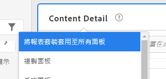
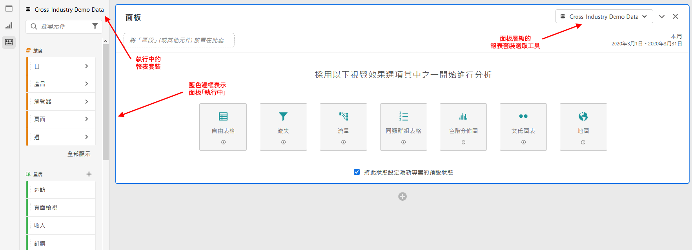
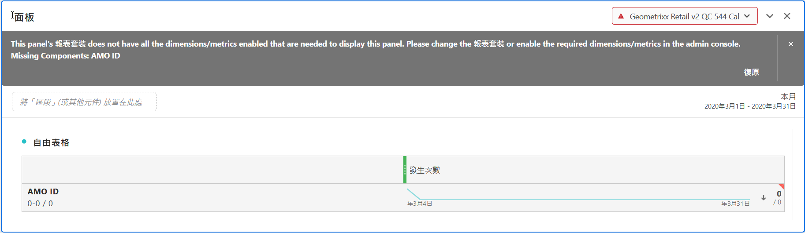

# 多報告套裝

您可以在Analysis Workspace中建立含有來自多個報表套裝之資料的專案。 報表套裝是在面板層級選擇，因此您可以為同一個Workspace專案內的每個面板選擇不同的報表套裝。

此功能相當實用。舉例來說，如果您想

* 比較兩個不同地區的資料，而這些資料位於兩個不同的報表套裝時，您可以建立表格和視覺效果，以便並排比較資料。

* 建立量度和視覺效果的控制面板，以便向其他組織提交報告。您可以將不同報表套裝的資料提取到相同專案中。

以下是有關該主題的影片：

>[!VIDEO](https://video.tv.adobe.com/v/32843/?quality=12)

## 將報表套裝套用至所有面板

您可以對任何面板標題按滑鼠右鍵並選取&#x200B;**[!UICONTROL 「將報表套裝套用至所有面板」]**，一次將一個報表套裝套用至所有面板。

## 使用中面板

我們將透過此功能，介紹「使用中面板」與「非使用中面板」的概念。您可以藉由淺藍色邊框來識別使用中面板。只要按一下面板內部，該面板便會成為使用中面板。

>[!TIP]
>您可以拖放至與使用中面板位於相同報表套裝中的任何面板。若拖曳至相同報表套裝的非使用中面板，該面板就會變成使用中。

| 任務 | 使用中面板 | 非使用中面板 |
| --- | --- | --- |
| 變更報表套裝 | 有 | 否 |
| 拖放元件 | 有 | 可以，適用於與使用中面板位於相同報表套裝中的任何面板。 |
| 拖放視覺效果 | 有 | 可以，適用於與使用中面板位於相同報表套裝中的任何面板。 |

## 使用多個報表套裝

1. 在 Workspace 中建立具有 2 個或更多面板的新專案。

1. 將元件 (量度、維度、區段、日期範圍) 拖放至面板中。確認面板擁有專屬於其報表套裝的資料和視覺效果。

   >[!NOTE]
   >有時候，系統載入專案 (或切換到報表套裝) 時會顯示橫幅訊息，這是因為並非所有元件都包含在報表套裝中。畫面會列出缺少的元件。請依照[這些指示](/help/admin/admin-console/permissions/product-profile.md)，將權限設為所需的量度/維度。

   

   因應這種不相容的狀況有 3 種方法：
   * 啟用必要的維度/量度
   * 變更報表套裝。
   * 在缺少部分元件的情況下繼續操作。這會導致這些元件沒有任何資料，和/或視覺效果空白。

1. 將面板變更為其他報表套裝，並注意元件標籤 (目前使用中的報表套裝) 和列出的元件會如何根據新的報表套裝來更新。

1. 使用鍵盤快速鍵 (拖曳時按住 `shift`)，將非使用中面板轉換為使用中面板。

1. (選用) 您也可以前往其他 Analytics 元件產生器，並確定其是否顯示報表套裝標籤，指出

   * 建立區段的位置：[區段產生器](https://experienceleague.adobe.com/docs/analytics/components/segmentation/segmentation-workflow/seg-build.html?lang=zh-Hant)。
   * 建立計算量度的位置：[計算量度產生器](https://experienceleague.adobe.com/docs/analytics/components/calculated-metrics/calcmetric-workflow/cm-build-metrics.html?lang=zh-Hant)。
   * 建立警報的位置：[警報產生器](https://experienceleague.adobe.com/docs/analytics/components/alerts/alert-builder.html?lang=zh-Hant)。
