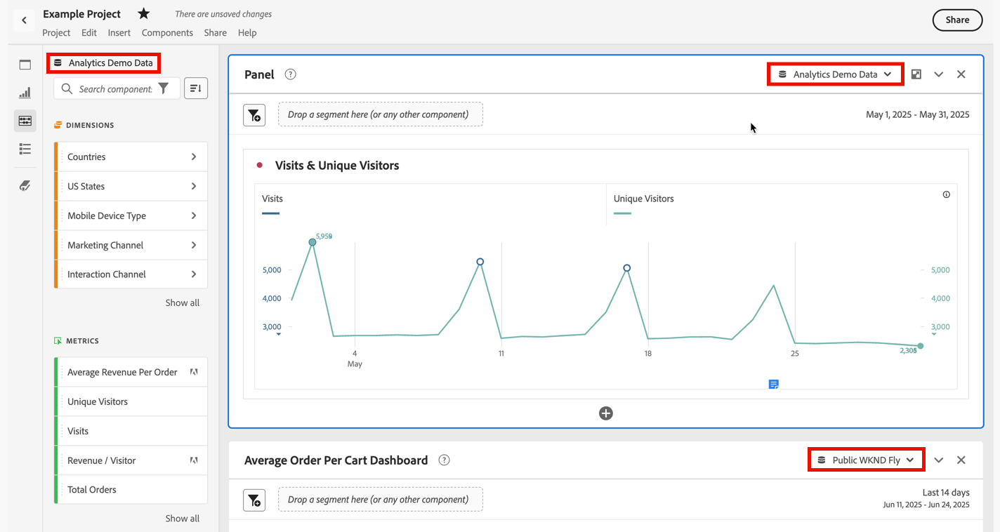

# 工作區中的多個報表套裝

>[!IMPORTANT]
>「工作區」中的多個報表套裝目前為有限版本。 從2020年2月20日開始，此功能將在數週內推出給所有客戶。

您現在可以在分析工作區中建立包含來自多個報表套裝資料的專案。 報表套裝現在可在面板層級選擇，因此您可以針對相同工作區專案中的每個面板選擇不同的報表套裝。

如果您想要(例如，

* 比較來自兩個不同地區的資料，而資料位於兩個不同的報表套裝中。 您可以建立表格和視覺化來並排比較資料。

* 建立度量和視覺化控制面板，以向其他組織報告。 您現在可以從不同的報表套裝將資料提取到同一個專案中。

## 作用中面板

我們將透過此功能，介紹「作用中面板」與「非作用中面板」的概念。 活動面板可由其周圍的淺藍色邊框識別。 只要按一下面板內部，該面板就會成為作用中面板。

>[!IMPORTANT]
>您只能將元件拖放 **至作用中面板**，即使其他面板具有相同的報表套裝。 如果您想在拖放時變更面板，則可使用短切：拖曳 `shift` 時按鍵，將非作用中面板變更為作用中面板。

| 任務 | 作用中面板 | 非作用中面板 |
|---|---|---|
| 變更報表套裝 | 是 | 無 |
| 拖放元件 | 是 | 無 |
| 拖放視覺化 | 是 | 無 |

## 使用多個報表套裝

1. 在工作區中使用2個或多個面板建立新專案。

1. 將元件（量度、維度、區段、日期範圍）拖放至面板。 確保面板擁有特定於其報表套裝的資料和視覺化。

   >[!NOTE]
   >有時，在載入專案（或切換至報表套裝）時，「不相容的報表套裝」訊息會顯示，其中並非專案中包含的所有元件都包含在報表套裝中。 將列出缺少的元件。 請依 [照下列指示](https://helpx.adobe.com/enterprise/using/manage-products-and-profiles.html#createproductprofiles) ，將權限設定為所需的量度／維度。

   

   您有3個選項可處理此不相容性：
   * 繼續處理某些遺失的元件。 這將不會產生這些元件的資料和／或空白的視覺化。
   * 還原.
   * 變更報表套裝.

1. 將面板變更為不同的報表套裝，並注意元件標籤（目前使用中的報表套裝）和列出的元件如何根據新的報表套裝進行更新。

1. 使用鍵盤快速鍵(`shift` 拖曳時)將非作用中面板轉換為作用中面板。

1. （可選）您也可以前往其他Analytics元件建立工具，並確定它們現在會顯示報表套裝標籤，指出

   * 建立區段的位置：區 [段產生器](https://docs.adobe.com/content/help/en/analytics/components/segmentation/segmentation-workflow/seg-build.html)。
   * 建立計算量度的位置：計算 [量度產生器](https://docs.adobe.com/content/help/en/analytics/components/calculated-metrics/calcmetric-workflow/cm-build-metrics.html)。
   * 建立警報的位置：警 [報產生器](https://docs.adobe.com/content/help/en/analytics/components/alerts/alert-builder.html)。