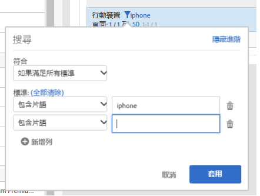

# 表格分頁、篩選及分類

如需概覽，請在 YouTube 上觀賞此影片:

[Analysis Workspace 的表格分頁、篩選及分類功能](https://www.youtube.com/watch?v=2zxpRPCGspg)

## 進階篩選選項 {#section_36E92E31442B4EBCB052073590C1F025}

按一下篩選條件圖示，然後按一下自由表格資料表中維度旁的「顯示進階選項」，即可讓您使用下列標準進行篩選:

* 包含
* 不包含
* 包含所有字詞
* 包含任何字詞
* 包含片語
* 不包含任何字詞
* 不包含此片語
* 等於
* 不等於
* 開始於
* 終止於

