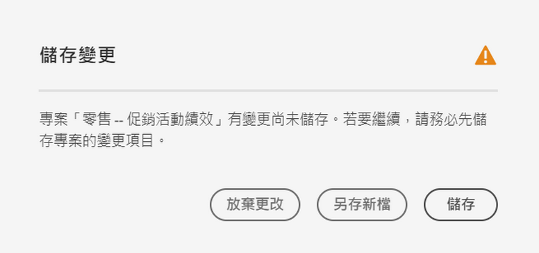
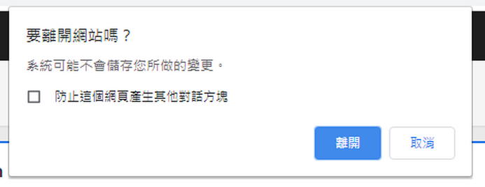
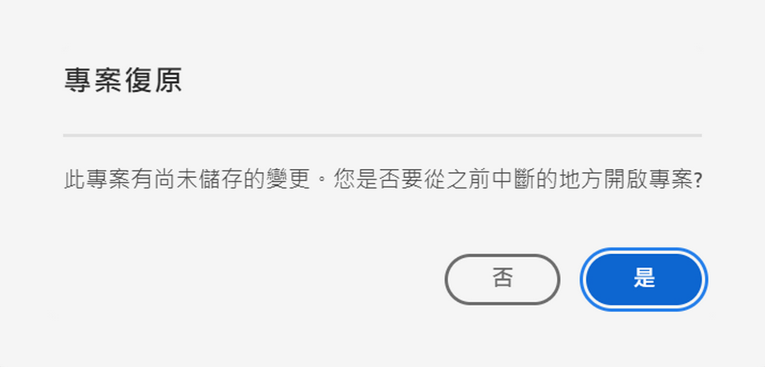
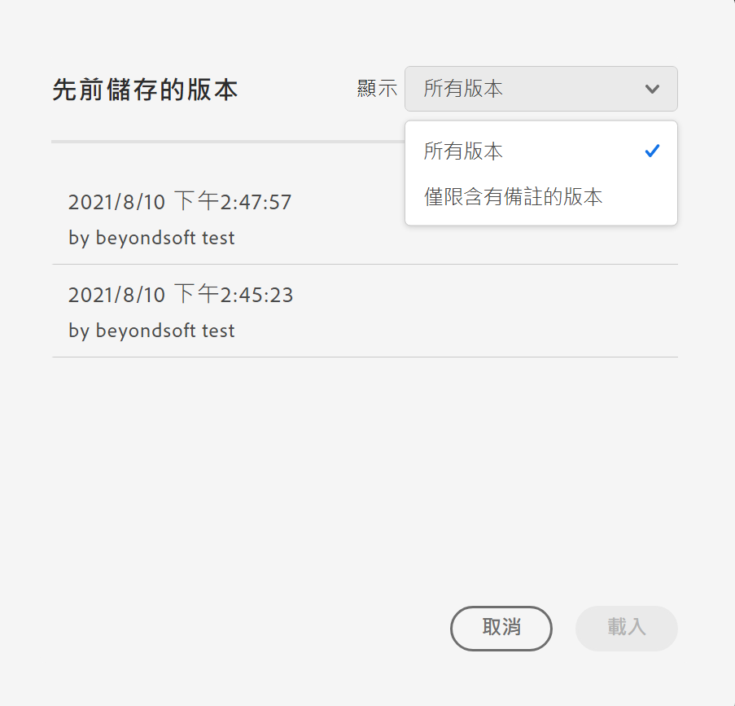

# 儲存專案

Analysis Workspace 中的專案均每 2 分鐘自動儲存一次。

您也可以手動儲存專案。手動儲存專案時，您可使用新增標記或附註等其他選項。

## 手動儲存專案 {#Save}

在 Analysis Workspace 中手動儲存專案時，有各種選項可供使用。

若要手動儲存專案：

1. 在 Analysis Workspace 中開啟專案後，選取&#x200B;**[!UICONTROL 「專案」]**，然後從下列選項中選擇：

   | 動作 | 說明 |
   |---|---| 
   | **[!UICONTROL 儲存]** | 儲存專案的變更項目。如果已共用專案，專案的收件者也會看到變更項目。當您第一次儲存專案時，系統會提示您提供專案名稱、(選用) 說明和新增 (選用) 標籤。  |
   | **[!UICONTROL 一併儲存註釋]** | 在專案儲存之前，請新增關於專案變動的註釋。註釋會和專案版本儲存在「[!UICONTROL 專案] > [!UICONTROL 開啟先前版本]」下，可供編輯人員使用。 |
   | **[!UICONTROL 另存新檔]** | 建立專案的複本。原始專案不受影響。 |
   | **[!UICONTROL 另存為公司報告]** | 將專案儲存為[公司報告](/help/analyze/analysis-workspace/reports/create-company-reports.md)，您的組織可在&#x200B;**[!UICONTROL 「專案 > 新增」]**&#x200B;下使用 |

## 自動儲存 {#Autosave}

Analysis Workspace 中的所有專案均每 2 分鐘自動儲存至本機電腦。這包括尚未手動儲存的新建立專案。

* **新專案：**&#x200B;即使新專案已自動儲存，您仍須在首次手動儲存每個新專案。Analysis Workspace 會在切換至其他專案、關閉瀏覽器索引標籤等動作時，提示您手動儲存新專案。

  如果因任何原因，您在手動儲存新建立專案前意外失去存取權，則您專案的復原版本會儲存在 Analysis Workspace 登陸頁面的資料夾中，名為 `Recovered Projects (Last 7 Days)`。您必須還原已恢復的專案，並手動將其儲存到所需位置。

  若要還原已恢復的專案，請執行以下操作：

   1. 前往 Analysis Workspace 登陸頁面上的&#x200B;[!UICONTROL **「已恢復的專案」**]&#x200B;資料夾。

      

   1. 開啟您的專案並儲存至所需位置。

* **現有專案：**&#x200B;如果因任何原因，當您離開專案時，變更尚未自動儲存，Analysis Workspace 會提示您儲存變更或提供警告訊息。

  以下是一些常見案例：

### 開啟另一個專案

如果您在處理包含尚未自動儲存之變更的專案時開啟其他專案，Analysis Workspace 會在您離開前提示您儲存目前的專案。

提供下列選項：

* **儲存：**&#x200B;以您最新的變更取代最新的自動儲存本機專案副本。
* **另存新檔：**&#x200B;將您的最新變更儲存為新專案。原始專案只會以最新的自動儲存變更儲存。
* **捨棄變更：**&#x200B;捨棄您的最新變更。專案會保留最新的自動儲存變更。

### 離開或關閉索引標籤

如果您在檢視含有尚未自動儲存之變更的專案時離開頁面或關閉瀏覽器標籤，瀏覽器會警告您將遺失未儲存的變更。您可以選擇離開或取消。

### 瀏覽器當機或工作階段逾時

如果您的瀏覽器當機或工作階段逾時，則下次您存取 Analysis Workspace 時，系統會提示您復原專案中尚未自動儲存的任何變更。

以下是「專案復原」對話方塊，顯示當機或逾時後，您首次存取 Analysis Workspace 時的畫面。

選取&#x200B;**「是」**，從最新的自動儲存副本還原專案。

選取&#x200B;**「否」**，刪除自動儲存的副本，並開啟上次使用者儲存的專案版本。

若為從未儲存的&#x200B;**新**&#x200B;專案，未儲存的變更無法復原。

## 開啟先前版本  {#previous-version}

若要開啟專案的先前版本：

1. 前往「**[!UICONTROL 專案]** > **[!UICONTROL 開啟先前版本]**」

   

1. 檢視現有的先前版本清單。
   除了顯示[!UICONTROL 註釋]外，也會顯示[!UICONTROL 時間戳記]和 [!UICONTROL 編輯者] (如果[!UICONTROL 編輯者]儲存時都加入這些內容)。未附註釋的版本會儲存達 90 天；附註釋的版本會儲存達 1 年。
1. 選取先前版本並按一下「**[!UICONTROL 載入]**」。先前版本然後載入通知。在按一下「**[!UICONTROL 儲存]**」以前，先前版本不會成為專案的目前儲存版本。如果您導覽時離開載入的版本，當您回來時，您將看到專案最後儲存的版本。
