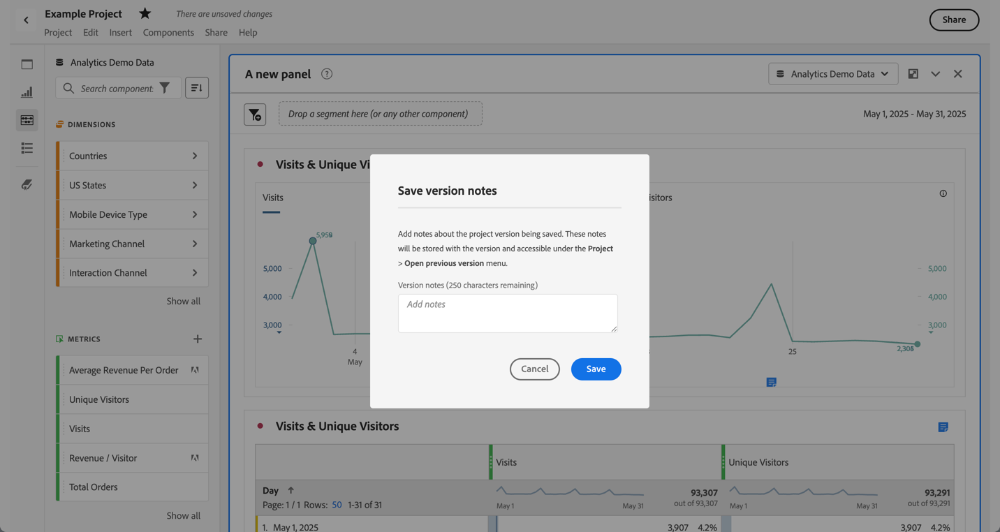

# 儲存專案 {#save-projects}

<!-- markdownlint-disable MD034 -->

>[!CONTEXTUALHELP]
>id="workspace_project_addnotes"
>title="新增註釋"
>abstract="新增有關正在儲存之專案目版本的註釋。這些註釋將與版本一起儲存，並可在「**[!UICONTROL 專案]** > **[!UICONTROL 開啟先前版本]**」選單下存取。"

<!-- markdownlint-enable MD034 -->

Analysis Workspace 中的專案均每 2 分鐘自動儲存一次。您也可以自行儲存專案、將專案儲存為副本或儲存專案及版本說明。

## 儲存

若要以手動方式儲存專案，在 Analysis Workspace 中開啟專案後，選取&#x200B;**[!UICONTROL 「專案」]**，然後從下列選項中選擇：

* **[!UICONTROL 儲存]**

  儲存專案的變更項目。如果已共用專案，專案的收件者也會看到變更項目。

  首次儲存專案時，會顯示「**[!UICONTROL 儲存]**」對話框。

  

   1. 指定以下：

      * **[!UICONTROL 名稱]** (必填)。您的專案名稱。
      * **[!UICONTROL 說明]**。您的專案說明。
      * **[!UICONTROL 標記]**。在「[!UICONTROL *搜尋標記*]」欄位中搜尋標記，或使用 **[!UICONTROL ENTER]** 新增標記。
      * **[!UICONTROL 資料夾]**。從&#x200B;[!UICONTROL *選取資料夾*]&#x200B;下拉式功能表中選取資料夾。 如果您未指定資料夾，則專案會儲存在您建立新專案的目前資料夾中。
      * **[!UICONTROL 版本說明]**。在「*新增註釋*」文字區域中新增版本說明。

   1. 選取「**[!UICONTROL 儲存]**」，即可儲存您的專案。

  儲存您的專案事實上是儲存保留 90 天的專案版本。

  如果您儲存已共用的專案，則會出現「**[!UICONTROL 將變更儲存至共用專案]**」警告對話框提示您確認。

  

   * 選取「**[!UICONTROL 儲存]**」以儲存專案。
   * 選取「**[!UICONTROL 另存新檔]**」，將專案以新名稱儲存為專案副本。

* **[!UICONTROL 一併儲存註釋]**

  

  當您儲存專案時，請新增關於專案變動的註釋。在「儲存版本說明」對話框中：

   1. 在「**[!UICONTROL 新增註釋]**」文字區域中，輸入您的「**[!UICONTROL 版本說明]**」。
   1. 選取「**[!UICONTROL 儲存]**」。

  註釋會和專案版本一起儲存，且會在[開啟專案先前版本](open-projects.md#open-previous-version)時供使用。連同註釋儲存的版本會自動保存一年。

* **[!UICONTROL 另存新檔]**

  

  使用新名稱建立專案副本。「另存新檔」對話框會顯示。

   1. 指定以下：

      * **[!UICONTROL 名稱]** (必填)。您的專案名稱。
      * **[!UICONTROL 說明]**。您的專案說明。
      * **[!UICONTROL 標記]**。在「[!UICONTROL *搜尋標記*]」欄位中搜尋標記，或使用 **[!UICONTROL ENTER]** 新增標記。
      * **[!UICONTROL 資料夾]**。從&#x200B;[!UICONTROL *選取資料夾*]&#x200B;下拉式功能表中選取資料夾。 如果您未指定資料夾，則專案會儲存在您建立新專案的目前資料夾中。
      * **[!UICONTROL 版本說明]**。在「*新增註釋*」文字區域中新增版本說明。

   1. 選取「**[!UICONTROL 儲存]**」，即可儲存您的專案。

  您可以將專案儲存到不同的資料夾。原始專案不受影響。

<!-- Cannot find this option in CJA 
| **[!UICONTROL Save as template]** | Save your project as a [custom template](https://experienceleague.adobe.com/docs/analytics/analyze/analysis-workspace/build-workspace-project/starter-projects.html) that becomes available to your organization under **[!UICONTROL Project > New]** | 
-->

## 自動儲存

>[!IMPORTANT]
>
>即使新專案已自動儲存，您仍須在&#x200B;**首次**&#x200B;手動儲存每個新專案。
>

Analysis Workspace 中的所有專案均每 2 分鐘自動儲存至本機電腦。此自動儲存包括尚未手動儲存的新建立專案。

### 新增專案

Analysis Workspace 會在切換至其他專案、關閉瀏覽器索引標籤等動作時，提示您手動儲存新專案。

如果因任何原因，您在手動儲存新建立專案前意外失去存取權，則您專案的復原版本會儲存在 Analysis Workspace 登陸頁面的資料夾中，名為「**[!UICONTROL 已恢復的專案 (前 7 天)]**」。還原已恢復的專案，並手動將其儲存到所需位置。

若要還原已恢復的專案，請執行以下操作：

1. 前往 Analysis Workspace 登陸頁面上的&#x200B;**[!UICONTROL 「已恢復的專案 (前 7 天)」]**&#x200B;資料夾。

<!-- 
     
  -->

1. 開啟您的專案並儲存至所需位置。

### 現有專案

如果因任何原因，當您離開專案時，變更尚未自動儲存，Analysis Workspace 會提示您儲存變更或提供警告訊息。

一些常見的情況：

#### 開啟另一個專案

如果您在處理包含尚未自動儲存之變更的專案時開啟其他專案，Analysis Workspace 會提示您儲存目前的專案。

提供下列選項：

* **[!UICONTROL 儲存]**：以您最新的變更取代最新的自動儲存本機專案副本。
* **[!UICONTROL 捨棄變更]**：捨棄您的最新變更。專案會保留最新的自動儲存本機副本。
* **[!UICONTROL 取消]**：取消開啟另一個專案的操作，並維持現有專案的開啟狀態。

<!--  -->

#### 離開或關閉索引標籤

如果您在檢視含有尚未自動儲存之變更的專案時離開頁面或關閉瀏覽器標籤，瀏覽器會警告您會遺失未儲存的變更。您可以選擇離開或取消。瀏覽器警告方式取決於您使用的瀏覽器。

### 瀏覽器當機或工作階段逾時

如果您的瀏覽器當機或工作階段逾時，則下次您存取 Analysis Workspace 時，系統會提示您復原專案中尚未自動儲存的任何變更。

* 選取&#x200B;**[!UICONTROL 「是」]**，從最新的自動儲存副本還原專案。

* 選取&#x200B;**[!UICONTROL 「否」]**，刪除自動儲存的副本，並開啟上次使用者儲存的專案版本。

<!---->

若為從未儲存的&#x200B;**新**&#x200B;專案，未儲存的變更無法復原。

<!-- Shouldn't this belong to another page?  Moved it to a new open projects page

## Open previously saved version

To open a previously saved version of a project:

1. Select **[!UICONTROL Open previous version]** from the **[!UICONTROL Project]** menu.

   

1. Review the list of previous versions available. You can switch between **[!UICONTROL All versions]** and **[!UICONTROL Only versions with notes]**.

   For each version, the list shows a timestamp
   [!UICONTROL Timestamp] and [!UICONTROL Editor] are shown, in addition to [!UICONTROL Notes] if they were added when the [!UICONTROL Editor] saved. Versions without notes are stored for 90 days; versions with notes are stored for 1 year.
1. Select a previous version and click **[!UICONTROL Load]**.
   The previous version then loads with a notification. The previous version does not become the current saved version of your project until you click **[!UICONTROL Save]**. If you navigate away from the loaded version, when you return, you will see the last saved version of the project.

-->

<!--
# Save projects {#save-projects}

>[!CONTEXTUALHELP]
>id="workspace_project_addnotes"
>title="Add notes"
>abstract="Add notes about the project version being saved. These notes will be stored with the version and accessible under the **[!UICONTROL Project]** > **[!UICONTROL Open previous version]** menu."

Projects in Analysis Workspace are automatically saved every 2 minutes. 

You can also manually save projects. Additional options such as adding tags or notes are available when you manually save a project.

## Save projects manually {#Save} 

Various options are available when manually saving a project in Analysis Workspace.

To manually save a project:

1. With your project open in Analysis Workspace, select **[!UICONTROL Project]**, then choose from the following options: 

   | Action | Description | 
   |---|---| 
   | **[!UICONTROL Save]** | Save changes to your project. If the project is shared, recipients of the project will also see the changes. When you first save your project, you are prompted to give the project a name, (optional) description and add (optional) tags. | 
   | **[!UICONTROL Save with notes]** | Before your project saves, add notes about what changed in the project. Notes are stored with the project version and are available to all editors under [!UICONTROL Project] > [!UICONTROL Open previous version]. | 
   | **[!UICONTROL Save as]** | Create a duplicate of your project. The original project will not be affected. | 
   | **[!UICONTROL Save as template]** | Save your project as a [template](/help/analyze/analysis-workspace/templates/create-templates.md) that becomes available to your organization under **[!UICONTROL Project > New]** | 

## Auto-save {#Autosave} 

All projects in Analysis Workspace are automatically saved every 2 minutes to your local machine. This includes newly created projects that are not yet saved manually. 

* **New projects:** Even though new projects are auto-saved, you must save each new project manually the first time. Analysis Workspace prompts you to save new projects manually when switching to another project, closing the browser tab, and so forth. 

  If for any reason you unexpectedly lose access to a newly created project before manually saving it, a recovery version of your project is saved on the Analysis Workspace landing page in a folder called `Recovered Projects (Last 7 Days)`. You must restore the recovered project and manually save it to a desired location. 

  To restore a recovered project:
  
  1. Go to the [!UICONTROL **Recovered Projects**] folder on the Analysis Workspace landing page.

     

  1. Open your project and save it to a desired location. 

* **Existing projects:** If for any reason you leave a project with changes that are not yet auto-saved, Analysis Workspace either prompts you to save your changes or provides a warning message. 

  Following are some common scenarios:

### Open another project 

If you open an additional project while working on a project that contains changes that are not yet auto-saved, Analysis Workspace prompts you to save the current project before leaving.

The following options are available:

* **Save:** Replaces the most recent auto-saved local copy of your project with your latest changes.
* **Save As:** Saves your latest changes as a new project. The original project is saved only with the most recent auto-saved changes.
* **Discard Changes:** Discards your latest changes. The project retains the most recent auto-saved changes.

### Navigate away or close a tab 

If you navigate away from the page or close the browser tab while viewing a project with changes that are not yet auto-saved, the browser warns that your unsaved changes will be lost. You can choose to leave or cancel. 

### Browser crashes or session times out 

If your browser crashes or if your session times out, then the next time you access Analysis Workspace you're prompted to recover any changes to your project that are not yet auto-saved.

Following is the Project Recovery dialog box that displays the first time you access Analysis Workspace after a crash or a timeout.

Select **Yes** to restore the project from the most recent auto-saved copy.

Select **No** to delete the auto-saved copy and open the last user-saved version of the project.

For **new** projects that have never been saved, unsaved changes are not recoverable.

## Open a previous version {#previous-version}

To open a previous version of a project:

1. Go to **[!UICONTROL Project]** > **[!UICONTROL Open previous version]**

   
   
1. Review the list of prior versions available. 
   [!UICONTROL Timestamp] and [!UICONTROL Editor] are shown, in addition to [!UICONTROL Notes] if they were added when the [!UICONTROL Editor] saved. Versions without notes are stored for 90 days; versions with notes are stored for 1 year.
1. Select a previous version and click **[!UICONTROL Load]**.
   The previous version then loads with a notification. The previous version does not become the current saved version of your project until you click **[!UICONTROL Save]**. If you navigate away from the loaded version, when you return, you will see the last saved version of the project. 

-->