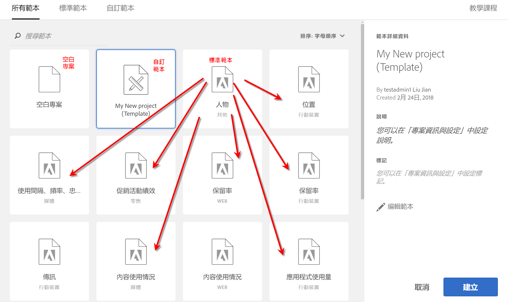
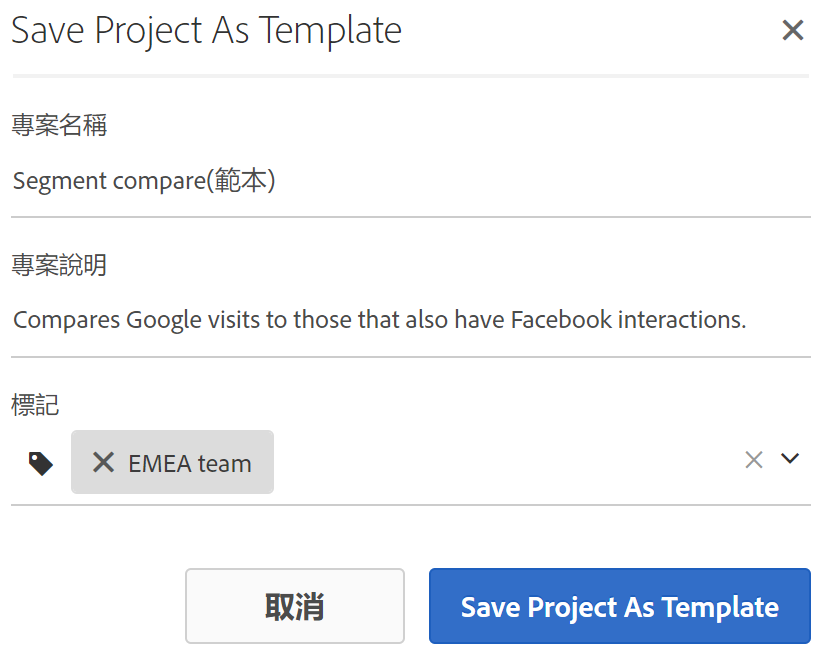
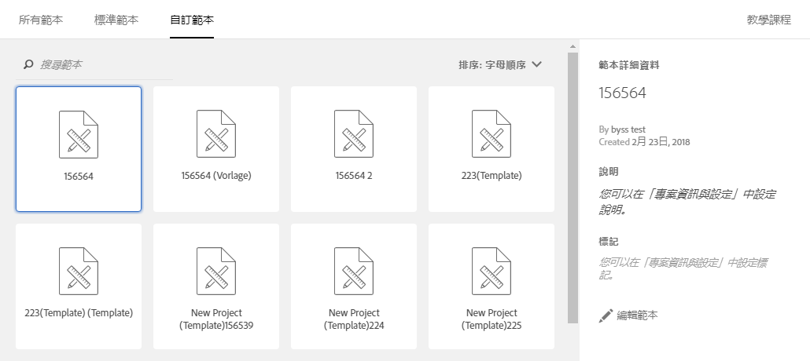

# 範本

## 範本 {#topic_40932F09E18A467983AFBB29908E1CB8}

您可以選擇從以下來源建立專案:

* **空白專案（預設）**:如需指示，請參 [閱建立分析工作區專案](/help/analyze/analysis-workspace/build-workspace-project/t-freeform-project.md)。
* **標準範本**:這些範本是由Adobe建立並隨附於產品中。
* **自訂範本**:這些範本可由具有管理權限的使用者或非管理員建立、共用或刪除，但前提是這些範本已獲得「管 [!UICONTROL Analysis Workspace: Save as Template] 理控制台」的權限。 [更多詳情...](https://docs.adobe.com/content/help/en/analytics/admin/admin-console/permissions/product-profile.html)

## 建立自訂範本 {#create-custom-template}

擁有管理員權限的使用者可以將其建立的任何專案轉換為自訂範本。方法如下:

1. 開啟專案。
1. Go to **[!UICONTROL Project]** > **[!UICONTROL Save As Template]**.

   

   專案將以目前的專案名稱儲存，並於後方以括號加上「(範本)」一詞。管理員可以透過編輯範本來變更名稱。

   >[!NOTE]
   >
   >預設狀況下，您組織中的所有人都可以檢視專案範本。您可以透過套用標記的方式組織範本。(前往 **[!UICONTROL Project]** > **[!UICONTROL Project Info & Settings]** 以編輯標籤和說明。)

### 您可以在自訂範本執行的動作

| 動作 | 說明 |
|--- |--- |
| 編輯範本 | 可讓管理員透過變更資料來源、修改元件、視覺效果和日期範圍等方式編輯範本。若要編輯自訂範本，您可以<ul><li>開啟 Analysis Workspace 中的自訂範本清單、選取一個範本，然後按一下「編輯範本」，或</li><li>在 Analytics 中，導覽至「元件 > 專案」，然後篩選「範本」。按一下您想要編輯的範本名稱。</li></ul>**附註:** 視情況而定，您在編輯範本後有兩個選項:「儲存」、「另存新檔」。兩者的不同之處為:<ul><li>**** 儲存：更新所有使用者的自訂範本。 其他人從這個自訂範本建立專案時，就會看到您變更的內容。</li><li>**** 另存新檔：使用您所做的變更建立自訂範本的復本。 (「共用 > 共用專案」的功能表項目停用時，您就可以得知目前處於編輯模式。)</li></ul> |
| 搜尋範本 | 在「自訂範本」對話方塊中，按一下「搜尋範本」。 |
| 將範本排序 | 您可以依字母順序、關聯性以及建立日期等將範本排序。在「自訂範本」對話方塊中，按一下「排序:」。 |
| 套用標記至範本 | 開啟範本，然後前往「專案 > 專案資訊和設定」。按一下「新增標記」。 |
| 修改範本說明 | 開啟範本，然後前往「專案 > 專案資訊和設定」。連按兩下說明並進行編輯。 |

## 標準範本{#concept_4FE900FEEC894E849CB6C6A0E0ADA524}

第一次開啟 Workspace 時，範本位於左側欄中。Analysis Workspace 範本涵蓋常見的使用案例。這些專案依據其所屬垂直產業而分組，並根據您選取的報表套裝，填入不同的維度、區段、量度和視覺效果。

您可照原樣使用這些預先填入的範本，或是依照您的需求據以調整 (例如透過新增或更換量度或視覺效果)，然後以新名稱儲存這些範本。

[在 YouTube 觀看「Analysis Workspace 標準範本」](https://www.youtube.com/watch?v=aRgYwPneVXg&list=PL2tCx83mn7GuNnQdYGOtlyCu0V5mEZ8sS&index=6)(2:46)

以下為可用的範本，以及可透過個別範本找到答案的問題:

### 廣告

>[!IMPORTANT]
>
>您必須在 Advertising Cloud 啟用報表套裝，才可使用廣告範本。

* **搜尋引擎**: 此範本可劃分廣告趨勢、廣告平台、關鍵字、帳戶、促銷活動等。

### 商務

* **Magento: 行銷與商務**: 此範本依行銷管道歸因來劃分電子商務轉換，並依搜尋關鍵字、登陸頁面、地理位置等資料提供深入分析。如需影片概述，請參閱 > [!VIDEO](https://www.youtube.com/watch?v=AQOViVLEMHw)

### 媒體

* **音訊使用量**: 使用者最常使用且受到哪些內容吸引?
* **使用間隔 - 頻率 - 忠誠度:** 誰是我的忠實讀者?

### 行動

>[!IMPORTANT]
>
>您的報表套裝必須為行動裝置啟用，才能使用行動範本。

* **傳送訊息:** 著重於應用程式內及推播訊息的效能。
* **位置:** 當中的地圖可呈現位置資料。
* **關鍵量度:** 掌握您應用程式的關鍵量度。
* **應用程式使用情形:** 應用程式擁有多少使用者和首次啟動次數，而平均工作階段時間長度又如何?
* **贏取:** 瞭解行動裝置客戶贏取連結的成效。
* **成效:** 應用程式的成效如何，以及使用者在哪些階段遭遇問題?
* **保留率:** 我的忠實使用者是哪些人，以及他們都進行什麼活動?
* **歷程:** 我應用程式中的顯著使用模式為何?

### 零售

* **促銷活動成效:** 什麼促銷活動帶來的收入最高?
* **產品:** 哪些產品成效最佳?

### Web

* **贏取:** 為我的網站帶來最多流量的因素是什麼?
* **內容消耗:** 使用者最常前往我網站的哪些位置?
* **保留率:** 什麼類型的使用者可能成為我網站的忠實使用者?
* **技術:** 使用者使用哪些技術來存取我的網站?

### 人物

> [!NOTE]「人物」範本與相關的「人物」量度只能當作 [Adobe Experience Cloud Device Co-op](https://marketing.adobe.com/resources/help/en_US/mcdc/mcdc-people.html) 的一部分使用。

此範本是根據「人物」量度建立，該量度是「獨特訪客」量度去除重複後的版本。「人物」量度提供的是客戶利用多部裝置與品牌互動的頻率。此範本可讓您

* 針對美國/加拿大與其他國家/地區的比較分割資料區段。Device Co-op 目前僅供北美地區使用。
* 並排比較「人物」和「獨特訪客」量度。
* 查看「壓縮率」，此計算量度可計算「人物」量度相對於「獨特訪客」的壓縮百分比。
* 比較客戶所使用的裝置類型總數
* 了解每人當中所使用的平均裝置數量。
* 了解如何搭配「人物」量度使用區段堆疊。
* 了解如何透過環境中的 Experience Cloud ID 增強「人物」量度的效益。

### 歷程IQ:跨裝置分析範本

<!-->This content is mirrored in the CDA doc.<-->

此範本可讓您查看重要的跨裝置效能資料。 它僅適用於可存取跨裝置 [分析](https://docs.adobe.com/content/help/en/analytics/components/cda/cda-home.html) (CDA)的客戶。

* **Co-op Graph成員的特殊注意事項**:顯示支援合作圖的地區和不支援的地區中，報表套裝的哪些部分包含訪客。
* **使用者識別**:顯示使用基於跨裝置分析的方法識別網站訪客的頻率。
* **測量受眾規模**:顯示「獨特裝置」與「人物」的比較。 這兩個數字的比例稱為「跨裝置壓縮」，此面板中可見的計算量度。 此壓縮度量取決於廣泛的因素：
   * **使用合作圖或私人圖**:一般而言，使用裝置合作社的組織看到的壓縮率，會比使用私人圖表的組織好。
   * **登入率**:登入您網站的使用者越多，Adobe越能識別並將訪客連結到各種裝置上。 登入率低的網站壓縮率也會很低。
   * **Experience Cloud ID涵蓋範圍**:只有具有ECID的訪客才能被銜接。 使用 ECID 造訪您網站的訪客比例較低，與壓縮率較低有關。
   * **多種裝置使用**:若您網站的訪客不使用多種裝置，則可看到較低的壓縮率。
   * **報告詳細程度**:按日壓縮通常比按月或年壓縮小。 依個人在一天內使用多部裝置的機率，會比整個月的機率小。分段、篩選或使用劃分維度也可以顯示較低的壓縮率。
* **以人為本的細分**:包含區段下拉式清單，可讓您檢視裝置特定的資料。 此面板鼓勵您嘗試區段，以瞭解包含或排除裝置類型對報表有何影響。
* **分析跨裝置歷程**:根據裝置類型提供流量和流失報表。
* **跨裝置歸因**:將Journey IQ和Attribution IQ的功能結合在一起。
* **其他秘訣與訣竅**:CDA相關的實用主題可讓您進一步運用它。