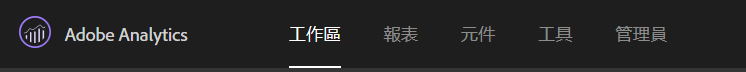
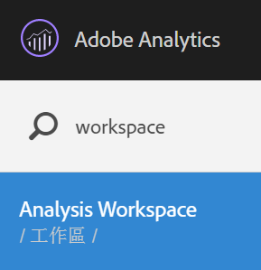
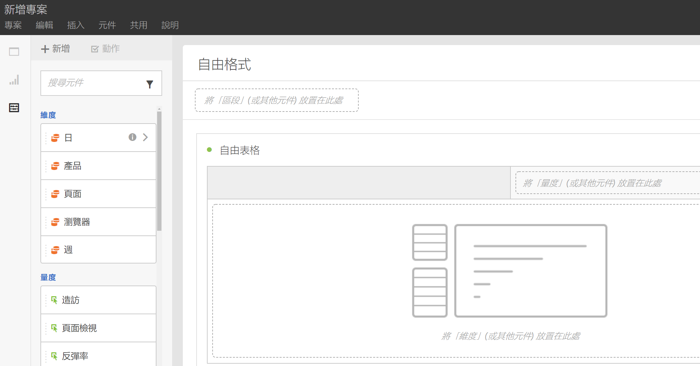
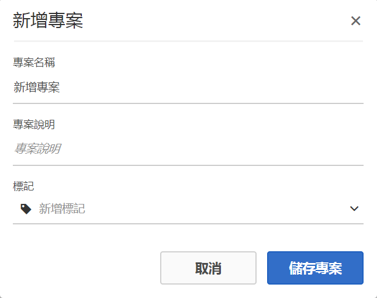
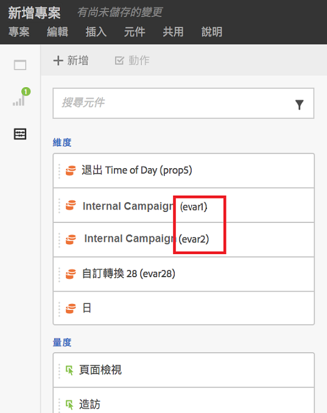
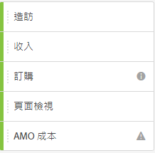
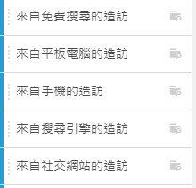
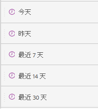
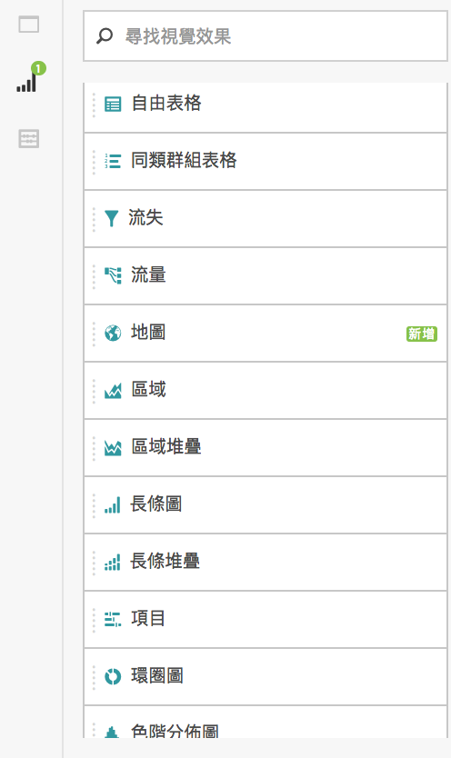
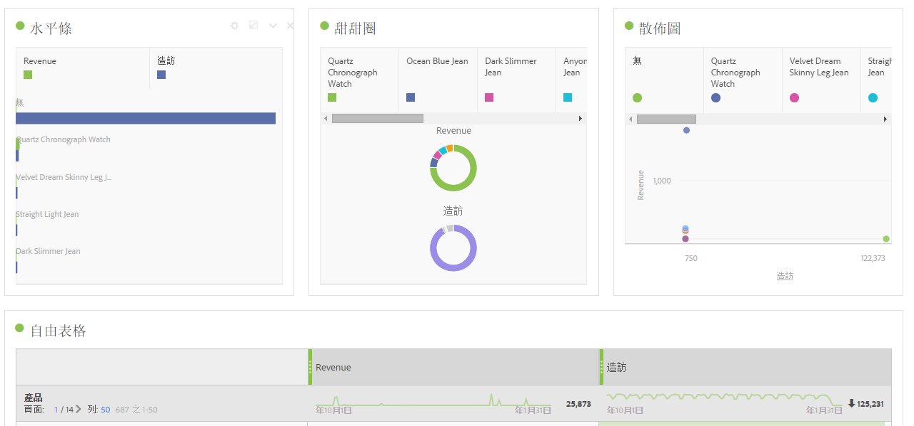

# 建立 Workspace 專案

建立專案並新增元件 (維度、量度、區段和日期範圍) 至自由面板。

本文將帶您了解「Analysis Workspace」介面元素，並說明如何建立專案。如需具體用案例，請參閱 [Analysis Workspace 的使用案例](/help/analyze/analysis-workspace/freeform-analysis-examples-use-cases.md)。

## 建立 專案

1. 指定建立和組織專案的使用者權限。

   在建立或組織 Analysis Workspace 專案前，管理員必須先將您新增至已啟用「**[!UICONTROL 在 Analysis Workspace 中建立 / 組織專案]**」權限的群組，或新增至「**[!UICONTROL 完全報表存取]**」使用者群組。(**[!UICONTROL 管理員]** > **[!UICONTROL 使用者管理]** > [群組](https://marketing.adobe.com/resources/help/zh_TW/reference/groups.html))。

1. 在「[!DNL Experience Cloud]」中，按一下&#x200B;**[!UICONTROL 「Analytics]** > **[!UICONTROL Workspace」]**。

   

   或者，輸入斜線 (/) 開啟報表搜尋列，然後輸入「*`workspace`*」。

   

1. 按一下&#x200B;**[!UICONTROL 「建立新專案」]**。

   您可以選擇從以下來源建立專案

* 空白專案 (預設)。如需指示，請參閱以下內容。
* 標準範本。這些範本皆由 Adobe 建立且出廠即提供。如需指示，請參閱[範本](/help/analyze/analysis-workspace/build-workspace-project/starter-projects.md)
* 自訂範本。這些範本是由擁有管理員權限的使用者所建立。如需指示，請參閱[範本](/help/analyze/analysis-workspace/build-workspace-project/starter-projects.md)

   

1. 若要從空白專案建立專案，請按一下&#x200B;**[!UICONTROL 「空白專案」]**。

   * 接著，按一下&#x200B;**[!UICONTROL 「建立」]**，或
   * 只需按一下 **[!UICONTROL Enter]** 即可。
   接著會出現空白專案，其中顯示自由面板和資料表格視覺效果。

   

   >[!NOTE]
   >
   >有時，系統在載入專案 (或切換到報表套裝) 時會顯示「不相容的報表套裝」訊息，這是因為並非所有元件 (量度/維度) 都包含在報表套裝中。您可以看到不相容的元件清單，得知收到這類訊息的原因。

<table id="table_3989E45D9D4241CBB2E58B29DA257B2F"> 
 <thead> 
  <tr> 
   <th colname="col1" class="entry"> 元素 </th> 
   <th colname="col2" class="entry"> 說明 </th> 
  </tr> 
 </thead>
 <tbody> 
  <tr> 
   <td colname="col1"><a href="/help/analyze/analysis-workspace/components/analysis-workspace-components.md"  > 元件</a> </td> 
   <td colname="col2"> 
您可以拖曳至專案的維度、量度、區段和日期範圍。 
 </td> 
  </tr> 
  <tr> 
   <td colname="col1"><a href="/help/analyze/analysis-workspace/visualizations/freeform-analysis-visualizations.md"  > 視覺效果</a> </td> 
   <td colname="col2"> 
您可拖曳至介面的面板或專案區域的項目。 
 </td> 
  </tr> 
  <tr> 
   <td colname="col1"><a href="/help/analyze/analysis-workspace/visualizations/freeform-table.md"  > 自由面板 </a> </td> 
   <td colname="col2"> 
您與「Analysis Workspace」互動的畫布或工作區。 
 </td> 
  </tr> 
 </tbody> 
</table>

1. 儲存您的專案。為專案命名，輸入說明 (選填，但此項目很實用) 並標記專案 (選用)，然後按一下&#x200B;**[!UICONTROL 「儲存」]**。

   

1. 您現在可按一下滑鼠右鍵複製視覺效果或面板，然後再將複製的元素貼到 (「插入」) 專案內的其他位置或其他專案中。

   您可使用這項功能建立「建置組塊」 (預先定義的視覺效果/面板) 並將這些組塊複製到其他專案中，然後藉由您業務專用的資料，更快地展開作業。

   >[!NOTE]
   >
   >在您複製/另存新檔後，內部連結與其所在專案為相對關係，已非原本複製的原始專案。

## 新增元件與視覺效果 {#task_CDAC9B3007BE4A3790AFAD3746D669B1}

1. 將 *`components`* 和 *`visualizations`* 拖曳到專案中，藉此建立您的專案。

   **元件**

   元件工具列會顯示您最常使用的可搜尋維度、量度、區段和日期範圍。

<table id="table_4626163E26DE46CB86391868BBA3AD32"> 
 <thead> 
  <tr> 
   <th colname="col1" class="entry"> 元件 </th> 
   <th colname="col2" class="entry"> 說明 </th> 
  </tr> 
 </thead>
 <tbody> 
  <tr> 
   <td colname="col1"> 維度 (橘色) </td> 
   <td colname="col2"> 
在專案層級套用 
 
 
 
維度名稱後面附加了 Prop#、eVar# 和 event#，您可以依據這些編號來搜尋。範例：「內部促銷活動」會在左側欄中顯示為「內部促銷活動 (evar2)」。 
 
 請注意，prop、eVar 和事件編號不會顯示在表格中 (以保持標題簡潔)。 
 
在被拖曳至自由表格中、或是顯示在左側欄時，部分現有的維度會有預設的排序順序。例如，當「小時」被拖放到表格中，或顯示在左側欄時，會以從上午 12 點至下午 11 點的順序排序。您仍可以選擇依照任何量度欄來排序。 
 </td> 
  </tr> 
  <tr> 
   <td colname="col1"> 量度 (綠色) </td> 
   <td colname="col2"> 
在專案層級套用。 
 
 
 
 「發生次數」是資料表的預設量度。 
 </td> 
  </tr> 
  <tr> 
   <td colname="col1"> 區段 (藍色) </td> 
   <td colname="col2"> 
僅可在面板層級拖曳，但您可在資料表格中建立內嵌區段。 
 
 
 
如需詳細資訊，請參閱 <a href="/help/analyze/analysis-workspace/freeform-analysis-examples-use-cases.md"  >Analysis Workspace 的使用案例</a>。 
 </td> 
  </tr> 
  <tr> 
   <td colname="col1"> 日期範圍和粒度 (紫色) </td> 
   <td colname="col2"> 
僅可在面板層級拖曳。您可從日曆設定日期範圍以建立專案。 
 
 
 </td> 
  </tr> 
 </tbody> 
</table>

**[視覺效果](/help/analyze/analysis-workspace/visualizations/freeform-analysis-visualizations.md)**

「[!UICONTROL 視覺效果]」面板提供標準的 Analytics 圖形、圖表、環圈圖、資料表格、[同類群組](/help/analyze/analysis-workspace/visualizations/cohort-table/cohort-analysis.md)表格、Venn 圖表等等。您可以拖放多個視覺效果至專案。

1. 步驟

## 使用滑鼠右鍵功能表可自訂您的資料 {#concept_8117C300F21843B99F4E1B9AB7B11B6F}

滑鼠右鍵功能表可讓您執行下列動作，視您在表格中按下滑鼠右鍵的儲存格而定。

<table id="table_0F84CC5B604D4D41BD0C9668DF525929"> 
 <thead> 
  <tr> 
   <th colname="col1" class="entry"> 動作 </th> 
   <th colname="col2" class="entry"> 說明 </th> 
  </tr>
 </thead>
 <tbody> 
  <tr> 
   <td colname="col1"><a href="/help/analyze/analysis-workspace/components/calendar-date-ranges/time-comparison.md"  > 新增時段欄</a> </td> 
   <td colname="col2"> </td> 
  </tr> 
  <tr> 
   <td colname="col1"><a href="/help/analyze/analysis-workspace/components/calendar-date-ranges/time-comparison.md"  > 比較時段</a> </td> 
   <td colname="col2"> </td> 
  </tr> 
  <tr> 
   <td colname="col1"> 
複製至剪貼簿 
 </td> 
   <td colname="col2"> </td> 
  </tr> 
  <tr> 
   <td colname="col1"> 
刪除選取 
 </td> 
   <td colname="col2"> </td> 
  </tr> 
  <tr> 
   <td colname="col1"><a href="/help/components/c-alerts/intellligent-alerts.md"  > 從選取範圍建立警報</a> </td> 
   <td colname="col2"> </td> 
  </tr> 
  <tr> 
   <td colname="col1"><a href="/help/analyze/analysis-workspace/components/dimensions/t-breakdown-fa.md"  > 劃分</a> 
    <ul id="ul_18C83B8514AD4C1C86C071AA8402CB5C"> 
     <li id="li_6CA84ED293EA4940A7495DA9D9121264">維度 </li> 
     <li id="li_EA16EE017B2E4A6998918706938A21BF">量度 </li> 
     <li id="li_0405D339CD01405DB508A7D8D1A976B4">區段 </li> 
     <li id="li_819CE81C552F49BB9C1B83ED3B42C5F7">時間 </li> 
    </ul> </td> 
   <td colname="col2"> </td> 
  </tr> 
  <tr> 
   <td colname="col1"><a href="/help/analyze/analysis-workspace/visualizations/freeform-analysis-visualizations.md"  > 視覺化</a> </td> 
   <td colname="col2"> </td> 
  </tr> 
  <tr> 
   <td colname="col1"><a href="/help/analyze/analysis-workspace/curate-share/download-send.md"  > 下載為 CSV</a> </td> 
   <td colname="col2"> </td> 
  </tr> 
  <tr> 
   <td colname="col1"><a href="/help/analyze/analysis-workspace/analysis-workspace-features.md"  > 趨勢選取範圍</a> </td> 
   <td colname="col2"> </td> 
  </tr> 
  <tr> 
   <td colname="col1"><a href="/help/analyze/analysis-workspace/components/t-freeform-project-segment.md"  > 從選取項目建立區段</a> </td> 
   <td colname="col2"> </td> 
  </tr> 
  <tr> 
   <td colname="col1"><a href="/help/analyze/analysis-workspace/c-panels/c-segment-comparison/segment-comparison.md"  > 在區段比較中執行</a> </td> 
   <td colname="col2"> </td> 
  </tr> 
  <tr> 
   <td colname="col1"> 僅顯示選取的列 </td> 
   <td colname="col2"> </td> 
  </tr> 
  <tr> 
   <td colname="col1"> 顯示所有列 </td> 
   <td colname="col2"> </td> 
  </tr> 
 </tbody> 
</table>

請參閱 [Analysis Workspace 可用的鍵盤和滑鼠互動](/help/analyze/analysis-workspace/build-workspace-project/fa-shortcut-keys.md)，以獲得複製和選取行的相關資訊。
