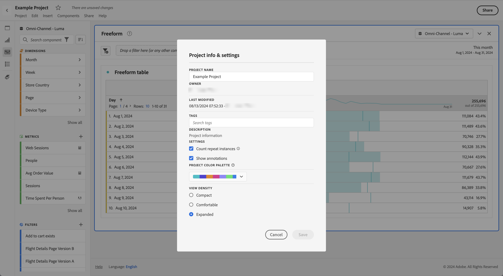

# 檢視密度

調整檢視密度可減少左側面板、自由格式表格和同類群組表格的垂直邊框間距，好讓您在畫面上看到更多資料。 提供三個選項：

>[!BEGINTABS]

>[!TAB 精簡]

此版本為最密集的畫面。

>[!TAB 舒適]

這是為您熟悉的 Workspace 畫面。

>[!TAB 展開]

此版本具有最廣的檢視畫面。

>[!ENDTABS]

若要設定檢視密度：

1. 在 Workspace 中，導覽至&#x200B;**[!UICONTROL 「專案]** > **[!UICONTROL 專案資訊與設定」]**。

1. 選取「**[!UICONTROL 檢視密度]**」選項，然後選取「**[!UICONTROL 儲存]**」。

<!--
# [!UICONTROL View Density]

Adjusting the [!UICONTROL view density] lets you see more data on the screen by reducing the vertical padding of the left rail, freeform tables and cohort tables. You have 3 options when toggling the view density via radio buttons:

- **[!UICONTROL Compact]**: This is the version with the most condensed view.
- **[!UICONTROL Comfortable]**: This leaves a little more padding than the Compact version.
- **[!UICONTROL Expanded]** (default): This is the view you are used to in Workspace.

To set the view density:

1. In Workspace, navigate to **[!UICONTROL Projects]** > **[!UICONTROL Project Info and Settings]**.

1. Select among the 3 options outlined above and click **[!UICONTROL Save]**.

>[!BEGINSHADEBOX]

See  [View density](https://video.tv.adobe.com/v/25963?quality=12&learn=on){target="_blank"} for a demo video.

>[!ENDSHADEBOX]

-->
