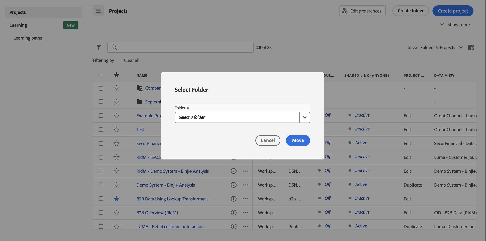

# 將專案新增或移動至資料夾

您可以從[專案清單](/help/analyze/analysis-workspace/build-workspace-project/freeform-overview.md#project-list)直接將專案新增或移動至資料夾。

## 將專案移動至資料夾

>[!NOTE]
>
>當管理員將專案移動至公司資料夾時，即使現有的共用權限被禁止，該資料夾也可以與所有人共用。當管理員將專案移出公司資料夾時，將重新套用現有的共用權限。
>

如要將專案從[專案清單](/help/analyze/analysis-workspace/build-workspace-project/freeform-overview.md#project-list)移動至資料夾：

1. 選取一個或多個要移動至資料夾的專案。

1. 選取**移動至**，從可執行的[動作](/help/analyze/analysis-workspace/build-workspace-project/freeform-overview.md#actions)清單選取。顯示&#x200B;**[!UICONTROL 選取資料夾]**&#x200B;對話框。

1. 從&#x200B;**[!UICONTROL 資料夾]**&#x200B;下拉式選單中選取資料夾名稱。下拉式功能表可讓您周游資料夾階層，以選取任何層級的子資料夾。

   

1. 選取「**[!UICONTROL 移動]**」。

   選取的專案就會新增到資料夾中。

## 將專案新增至資料夾

如要將專案從[專案清單](/help/analyze/analysis-workspace/build-workspace-project/freeform-overview.md#project-list)新增至資料夾：

1. 選取您要新增專案的資料夾。

1. 選取**新增專案**，從可執行的[動作](/help/analyze/analysis-workspace/build-workspace-project/freeform-overview.md#actions)清單中選取。顯示&#x200B;**[!UICONTROL 選取資料夾]**&#x200B;對話框。

1. 從&#x200B;[!UICONTROL *選取要新增至資料夾的專案*]&#x200B;中選取一個或多個專案。

   

1. 選取&#x200B;**[!UICONTROL 新增]**。

>[!NOTE]
>
>只有管理員可以將專案新增到公司資料夾，或是建立新專案並儲存到公司資料夾

<!--
# Add Projects to Folders

You can add projects to a folder in the table view or from within a folder.

>[!NOTE]
>
>Only Analytics administrators can add projects to the Company Folder or create a new project and save it to the Company Folder

## From the table view {#table-view}

Add projects to a folder from the table view on the home page.

1.  Select one or more projects that you want to add to a folder.

    

1.  Select **Move to**. 

    The Select Folder dialogue is displayed.

1.  In the drop-down menu, select the folder where you want to move the selected projects.

    

1.  Select **Move**.

    

    The selected projects are added to the folder.

    

    The Workspace landing page now shows the folder contains (3) projects.

    

## From inside a folder {#inside-folder}

You can also add projects from inside a folder using the ellipses link.

1.  Select and open a folder from the table view.

    

1.  Select the **...** ellipsis icon in the upper-right.
   
    

1.  Select **Add projects** and select the project that you want to add from the drop-down list.

    

    
1.  (Optional) Select additional projects from the drop-down list to add multiple projects.

    

1.  Select **Add** to add the projects to the folder.

    

-->