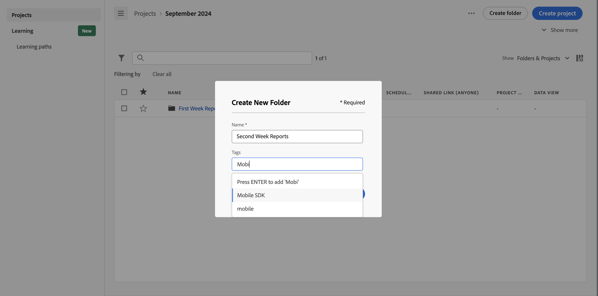

# 建立資料夾

您可以在 Workspace 登陸頁面上，將新的資料夾或子資料夾新增至專案和資料夾清單。

## 建立新資料夾

若要建立新資料夾，

1. 確保您已選取[顯示資料夾和專案](/help/analyze/analysis-workspace/build-workspace-project/freeform-overview.md#show-selector)。

1. 確保[標題區域](/help/analyze/analysis-workspace/build-workspace-project/freeform-overview.md#title-area)和[專案清單](/help/analyze/analysis-workspace/build-workspace-project/freeform-overview.md#project-list)顯示您要在其中建立新資料夾的資料夾。

1. 按一下&#x200B;**建立資料夾**。

1. 在&#x200B;**[!UICONTROL 建立新資料夾]**&#x200B;對話框中，輸入新資料夾的名稱。例如：`Second Week Reports`。

1. 從&#x200B;**[!UICONTROL 標籤]**&#x200B;下拉式功能表中選取標籤或輸入新標籤。

   

1. 按一下&#x200B;**建立**。新資料夾會新增至目前資料夾中。

<!--
# Create folders

You can add a new folder or a subfolder to the list of projects and folders on your Workspace landing page.

## Create a new folder {#create-new-folder}

To create a new folder,

1.  Click **Create new**.

1.  Enter a Name for the new folder.

1.  Select tags from the drop-down menu or add net-new tags.

    

1.  Click **Create**.

    

    The new folder is added in the main list of projects and folders.

    

## Create a subfolder {#create-subfolder}

Subfolders allow you to provide additional levels of project management and organization.

To create a subfolder when you have an existing folder open,

1.  Click **Create a new folder**.

    

1.  Enter a subfolder name and add any necessary tags.

    

1.  Click **Create**.

    The new subfolder is added to the list of projects and subfolders.

    

    >[!NOTE]
    >
    >You can create up to 10-levels of subfolders in a single folder.

    

-->