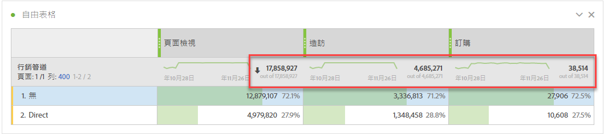
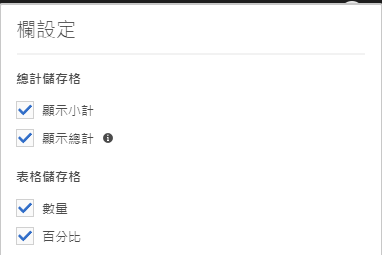
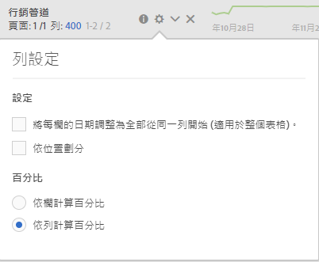

# 工作區總計

在自由表格中，每個劃分層級會顯示總列，並可顯示兩個總計：

* **[!UICONTROL 總計]** （灰色的「of」數字）-此總計代表所有已收集的點擊，有時稱為「報表套裝總計」。 在面板層級或自由表格內套用區段時，總計會調整以反映符合區段標準的所有點擊。
* **[!UICONTROL 表總計]** （黑色數字）-此總計通常等於或是總計的 [!UICONTROL 子集]。 它反映自由表格內套用的任何表格篩選，包括「包 [!UICONTROL 含無] 」選項。

## 顯示總設定

在「 **[!UICONTROL 欄設定]**」下方，有「顯 **[!UICONTROL 示總計]** 」和「 **[!UICONTROL 顯示總計」選項]**。 如果取消選中這些設定，則總計將從表中刪除。 當總計不合理時（例如，在某些計算量度藍本中），可能會 [想要此點](https://docs.adobe.com/content/help/en/analytics/components/calculated-metrics/calcmetrics-reference/cm-totals.html)。

## 靜態列總計設定

[靜態列總計](https://docs.adobe.com/content/help/en/analytics/analyze/analysis-workspace/build-workspace-project/column-row-settings/manual-vs-dynamic-rows.html) ，其行為方式不同，並在「列設定」 **[!UICONTROL 下控制]**。

* **[!UICONTROL 將目前列的總和顯示為總計]** -這會顯示表格中行的用戶端總和，表示總計不會去除 **** 造訪或訪客等度量重複資料。
* **[!UICONTROL 顯示總計]** -這會顯示伺服器端總和，這表示總計會去除重複度量，例如瀏覽或訪客。

## 匯出總計

當從自由表格複製並貼上資料或透過CSV下載資料時，總列將僅反映 [!UICONTROL 表格總計] 。

## 常見問題集

| 問題 | 回答 |
|---|---|
| 灰色欄百分比以哪些'total'為基礎？ | 這取決於「列設 **[!UICONTROL 定]** 」下方的「百分 **[!UICONTROL 比」設定選擇]**:<ul><li>按列計算百分比——這是預設設定。 百分比將以表格總計為基礎。</li><li>按行計算百分比——百分比將基於總計。</li></ul> |
| 「包含未指 **[!UICONTROL 定（無）」設定如何]** ? | 如果未選 **[!UICONTROL 取「包含未指定（無）]**[」設定，則「無／未指定」列將從表格、表格總計中移除，並將執行任何使用「總計」量度類型的計算量度](https://docs.adobe.com/content/help/en/analytics/components/calculated-metrics/calcmetric-workflow/m-metric-type-alloc.html) |
| 當自訂表格篩選器套用至自由表格時，我的所有計算量度和條件式格式設定帳戶是否都適用於篩選？ | 目前不是。 **[!UICONTROL 包含未指定（無）]** ，但自訂表格篩選器不會影響下列項目：<ul><li>條件式格式使用的欄最大／分鐘範圍會在所有資料中查看。</li><li>利用總計量度 **[!UICONTROL 類型的計算量度]** 。</li><li>具有函式的計算量度，可跨自由表格中的列計算——例如欄總計、欄最大、欄最小值、計數、平均值、中位、百分位數、四分位數、列計數、標準差、方差、累積、累積平均、回歸變數、T-Score、Z-Score、Z-Test。</li></ul> |
| 在計算量度中，總計量度 **[!UICONTROL 類型反映]** 什麼？ | **[!UICONTROL 總計]** (Grand Total)繼續指 **[!UICONTROL 代總計(Grand Total]**)，並不反映套用至表格或表格總計( **[!UICONTROL Table Total)的篩選]**。 |

