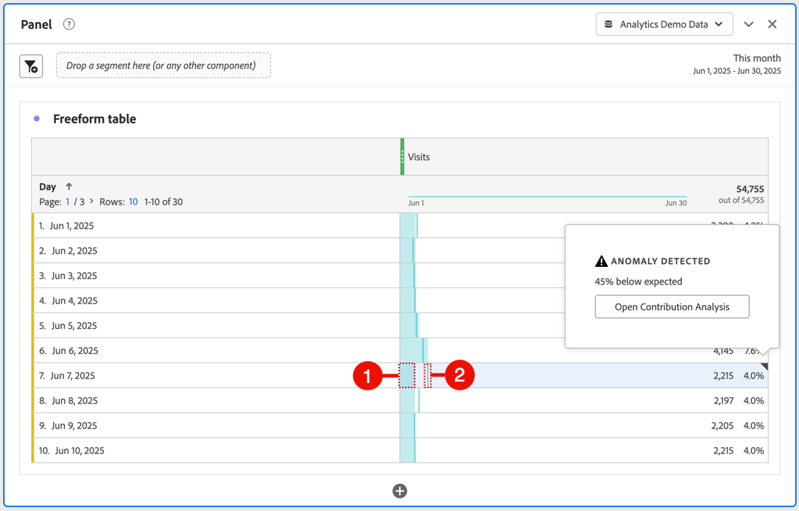

# 檢視異常

您可以在Analysis Workspace的表格或折線圖中檢視異常。

## 在表格中檢視異常 {#section_869A87B92B574A38B017A980ED8A29C5}

您可以在時間序列自由格式表格中檢視異常。

1. 在欄標題中選取，然後確定已在選項清單中選取&#x200B;**[!UICONTROL Anomalies]**&#x200B;選項。 如需詳細資訊，請參閱[欄設定](/help/analyze/analysis-workspace/visualizations/freeform-table/column-row-settings/column-settings.md)。

1. 異常情況在表格中顯示如下：

   

   偵測到資料異常的每一列右上角都會顯示◥。

   每一列➋中的&#x200B;**彩色垂直線**&#x200B;表示預期的值。 每一列➊中的&#x200B;**彩色陰影區域**&#x200B;表示實際值。 線條 (預期值) 與陰影區域 (實際值) 的比較方式會決定是否有異常。 （根據[異常偵測所使用的統計技術](/help/analyze/analysis-workspace/c-anomaly-detection/statistics-anomaly-detection.md)中所述的進階統計技術，將觀察視為異常。）

1. 選取資料列右上角的◥以檢視有關異常的詳細資訊。 這會顯示實際值高於或低於預期值的偏離程度 (以百分比表示)。
1. 選取[開啟貢獻分析](run-contribution-analysis.md)以開始貢獻分析。

## 在線性圖中檢視異常

折線圖是唯一可讓您檢視異常的視覺效果。

若要在折線圖中檢視異常：

1. 在視覺效果標題中選取，然後確定已在選項清單中選取&#x200B;[!UICONTROL **顯示異常**]&#x200B;選項。 如需詳細資訊，請參閱[折線圖](/help/analyze/analysis-workspace/visualizations/line.md)。

1. （選擇性）若要允許信賴區間縮放圖表，請選取視覺效果標題中的，然後選取&#x200B;**[!UICONTROL 允許異常縮放Y軸]**&#x200B;選項。

   預設為不選取此選項，因為有時會讓圖表較不清晰。

   異常情況在折線圖中顯示如下：

   

   **白點**&#x200B;會顯示在偵測到資料異常的位置。 （根據[異常偵測所使用的統計技術](/help/analyze/analysis-workspace/c-anomaly-detection/statistics-anomaly-detection.md)中所述的進階統計技術，將觀察視為異常。）

   此&#x200B;**淺色陰影區域**&#x200B;是信賴範圍或預期範圍，值應發生的位置。 任何超出此預期範圍的值都是異常。

   如果折線圖中有多個量度，系統只會顯示異常值，您必須將滑鼠移到每個異常值上方，才能查看該量度的信賴帶。

   此&#x200B;**虛線**&#x200B;是確切的預期值。

1. 選取異常（白點）以檢視下列資訊：

   * 異常發生的日期。

   * 異常的原始值。

   * 百分比值高於或低於預期值，以實心綠色線表示。

   * **[!UICONTROL 分析]**&#x200B;連結以開始貢獻分析

