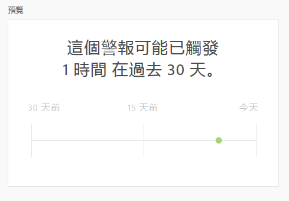

# 建立警報

>[!NOTE]
>
>智慧型警報僅供 Adobe Analytics Prime 與 Adobe Analytics Ultimate 的客戶使用。

Adobe Analytics中的智慧型警報（或只是「警報」）可讓您在資料中發生異常事件時立即收到通知。 (伺服器呼叫使用量警報是僅供Analytics管理員使用的不同類別警報。 這些警報會通知您伺服器呼叫耗用量和承諾使用量資料中發生超額的風險或發生次數。 如需詳細資訊，請參閱 [伺服器呼叫使用量警報](/help/admin/admin/c-server-call-usage/scu-alerts.md).)

如需智慧型警報的詳細概觀資訊，請參閱 [智慧型警報概觀](/help/analyze/analysis-workspace/c-intelligent-alerts/intellligent-alerts.md).

若要建立智慧型警報：

1. 存取警報產生器以開始建立警報。 您可以透過下列任何方式存取警報產生器：

   * 在Analysis Workspace中開啟專案，然後選取 **[!UICONTROL 元件]** > **[!UICONTROL 建立警報]**.
   * 在Analysis Workspace中開啟專案，然後使用下列捷徑：

     `ctrl (or cmd) + shift + a`
   * 在Analysis Workspace中開啟專案，在自由格式表格中選取一或多個條列專案，然後按一下滑鼠右鍵並選取「 」 **[!UICONTROL 從選取範圍建立警報]**.

     如此會立即預先填入警報產生器，使用正確的量度和篩選器建立警報。
   * 建立警報 [從警報管理器](/help/analyze/analysis-workspace/c-intelligent-alerts/alert-manager.md#create-alerts).

   警報產生器隨即顯示。 此介面與在Analytics中建立區段或計算量度類似：

   

1. 指定下列選項來設定警示：

   | 選項 | 說明 |
   |---------|----------|
   | [!UICONTROL **標題**] | 指定警報的名稱。警報名稱中可以包含報表的名稱或量度臨界值。 |
   | [!UICONTROL **說明（選擇性）**] | 指定警示的說明。 |
   | [!UICONTROL **時間粒度**] | 選取您希望檢查量度的頻率：每日、每週或每月。
<b>注意：</b>對於使用自訂日曆的資料檢視，警報產生器不支援每月粒度。<!--true?-->
 |
   | [!UICONTROL **收件者**] | 指定可傳送警報的位置。警報可以傳送給 Analytics 用戶、Analytics 群組、原始電子郵件地址或電話號碼。
<b>重要：</b>電話號碼前面必須加上「+」和 [國家/地區代碼](https://countrycode.org/).

一旦觸發警報，用戶收到的電子郵件顯示如下：

 |
   | [!UICONTROL **到期日**] | 設定您想要警報到期的日期和時間。 |
   | [!UICONTROL **傳送警報的時機**] | [!UICONTROL **這些量度觸發器的任一項**]：將量度（包括計算量度）拖放到這裡，以建立警報的觸發器。
一個 **「不相容的元件」** 如果警報中並非所有量度、維度或區段都與目前所選資料檢視相容，則會顯示訊息。

確定觸發警報前必須超過的量度臨界值。您可以將此值設為臨界值以及下列其中一個條件：
<ul><li>存在異常</li><li>異常超出預期</li><li>異常低於預期</li><li>高於或等於</li><li>低於或等於</li><li>變更者</li><li>您可以設定 90%、95%、99%、99.75% 或 99.9% 的臨界值。</li></ul>
[!UICONTROL **包含所有這些篩選器**]：拖放區段或維度以新增篩選器。 例如，新增「僅限行動裝置」區段表示規則僅會針對行動裝置觸發。 您可以使用AND陳述式來新增其他篩選器。 您可按一下齒輪圖示，新增 AND 或 OR 規則。

另請參閱 [智慧型警報 — 使用案例](/help/analyze/analysis-workspace/c-intelligent-alerts/alerts-use-cases.md) 例如使用案例。
 |
   | [!UICONTROL **預覽**] | 互動式警報預覽會根據過去經驗，顯示觸發警報的大約頻率。
例如，如果您將時間詳細程度設為每日，則預覽可告訴您在過去 30 或 31 天裡，針對某個量度觸發了 x 次警報。

如果您覺得觸發的警報次數過多，可在「[警報管理員](/help/analyze/analysis-workspace/c-intelligent-alerts/alert-manager.md)」中調整臨界值。

 |

1. 選取「[!UICONTROL **儲存**]」。
