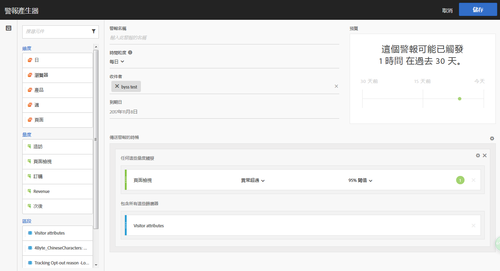

# 警報產生器

>[!IMPORTANT]
>
>智慧提醒僅適用於Adobe Analytics Prime和Adobe Analytics Ultimate客戶。

## 存取警報產生器

存取警報產生器有四種方法:

* 在 Analysis Workspace 中使用下列快速鍵:

   `ctrl (or cmd) + shift + a`
* By going to **[!UICONTROL Workspace]** &gt; **[!UICONTROL Components]** &gt; **[!UICONTROL New Alert]**.
* By selecting one or more freeform table line items, right-clicking and selecting **[!UICONTROL Create Alert from Selection]**.
* From within a Reports &amp; Analytics report, by going to **[!UICONTROL More]** &gt; **[!UICONTROL Add Alert]**.

## 建立警報

警報產生器的介面與在 Analytics 中建立區段或計算量度類似:

<!--Meike, I edited this table for validation -->

**警報名稱**

指定警報的名稱。警報名稱中可以包含報告的名稱或量度臨界值。

**時間粒度**

指定您希望檢查量度的時間: 每小時、每日、每週或每月。

>[!NOTE]
>
>對於具有自訂日曆的報表套裝，我們不支援警報產生器中的每月粒度。

**收件者**

指定可傳送警報的位置。警報可以傳送給 Analytics 使用者、Analytics 群組、原始電子郵件地址或電話號碼。

>[!IMPORTANT]
>
>The phone number must be preceded by a "+" and a [country code](https://countrycode.org/).

使用者在警報觸發後會收到的電子郵件類似於：

**到期日**

設定警報的到期日。

**傳送警報的時機...**

*... 任何這些量度觸發*

* 拖放量度到畫布以新增觸發。

   An **"incompatible components”** message will appear if not all the components (metrics/dimensions/segments) in the alert are compatible with the currently selected report suite.
* 確定觸發警報前必須超過的量度臨界值。您可以將此值設為臨界值以及下列其中一個條件:

   * 存在異常
   * 異常超出預期
   * 異常低於預期
   * 高於或等於
   * 低於或等於
   * 變更者
   * 您可以設定 90%、95%、99%、99.75% 或 99.9% 的臨界值。
   請注意您也可以使用計算量度。

*... 包含這些篩選*

* 拖放區段或維度以新增篩選條件。例如，新增「僅限行動裝置」區段可以代表規則僅會針對行動裝置而觸發。
* 可使用 AND 陳述式新增其他篩選器條件。

**新增規則**

您可按一下齒輪圖示，新增 AND 或 OR 規則。

## Preview Alerts {#section_10D75BA7B77E4C5FAF58A719C082E070}

互動式警報預覽會根據過去經驗，顯示觸發警報的大約頻率。

例如，如果您將時間粒度設為每日，則預覽可告訴您在過去 30 或 31 天裡，針對某個量度觸發了 x 次警報。

如果您覺得觸發的警報次數過多，可在「[警報管理器](/help/components/c-alerts/alert-manager.md)」中調整臨界值。

