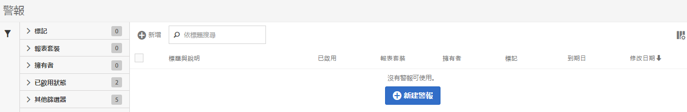

# 管理警報

您可以在「警報管理員」中管理現有警報。 您可以對警示執行各種管理工作，例如標籤、重新命名、刪除等等。

警示管理員的結構相當類似於[區段管理員](https://experienceleague.adobe.com/docs/analytics/components/segmentation/segmentation-workflow/seg-manage.html?lang=zh-Hant)和[計算量度管理員](https://experienceleague.adobe.com/docs/analytics/components/calculated-metrics/calcmetric-workflow/cm-manager.html?lang=zh-Hant)。

## 建立警報

若要從「警示管理員」建立警示，請執行下列動作：

1. 選取&#x200B;**[!UICONTROL 元件]** > **[!UICONTROL 警報]**&#x200B;以存取Adobe Analytics中的警報管理器。

   

1. 選取「[!UICONTROL **新增**]」（或如果您沒有任何現有的警示，則選取「[!UICONTROL **建立新警示**]」）。

1. 選取對應至您要建立之警示的警示型別：

   * [!UICONTROL **Analytics資料警示**]：當您的資料中發生異常事件時通知您的警示。

     如果您選取此選項，請繼續[建立警示](/help/analyze/analysis-workspace/c-intelligent-alerts/alert-builder.md)，以取得有關建立警示的詳細資訊。

   * [!UICONTROL **伺服器呼叫使用量警報**]：通知您伺服器呼叫使用量和承諾使用量資料有超額風險或發生超額的警報。

     如果您選取此選項，請繼續[伺服器呼叫使用量警報](/help/admin/admin/c-server-call-usage/scu-alerts.md)。

     >[!NOTE]
     >
     >您必須是Analytics管理員或具有伺服器呼叫使用量許可權的使用者，才能存取伺服器呼叫使用量。

## 管理現有警報

若要在「警報管理員」中管理現有警報：

1. 選取&#x200B;**[!UICONTROL 元件]** > **[!UICONTROL 警報]**&#x200B;以存取Adobe Analytics中的警報管理器。

   

1. 選取一或多個您要管理的警示。

   

1. 在動作列中，選取下列任一選項：

   | 動作 | 函數 |
   |---------|----------|
   | [!UICONTROL **標記**] | 將標籤套用至警報。 這可協助您組織警報以方便使用。 |
   | [!UICONTROL **刪除**] | 刪除警示。 |
   | [!UICONTROL **重新命名**] | 重新命名警報。 |
   | [!UICONTROL **核准**] | 將警報標示為「已核准」。 |
   | [!UICONTROL **副本**] | 建立警示的復本（重複）。 |
   | [!UICONTROL **停用**] | 停用目前啟用的警示。 |
   | [!UICONTROL **啟用**] | 啟用目前停用的警示。 |
   | [!UICONTROL **續約**] | 更新警示到期日。 如此一來，到期日將從您選取此選項之日算起延長1年，無論原始到期日為何。 |
   | [!UICONTROL **匯出至 CSV**] | 將警報匯出至.CSV檔案。 |
