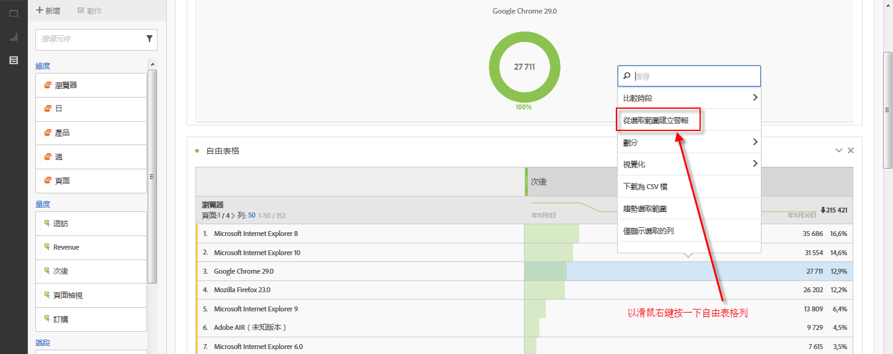
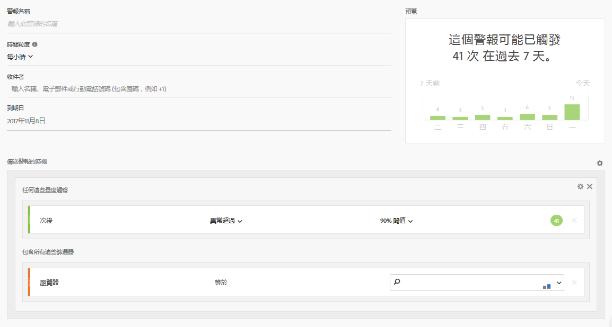

# 智慧提醒-使用個案

## 建立依兩個區段篩選的簡單警報 {#section_2E96FFFA93D44F7D8DBCEC97203204AA}

<!-- 

Update screenshots for better readability.

 -->

## 從表格選取範圍建立警報 {#section_AE6D42E1255D498D908A2FA60370A419}

In Freeform Tables, you can now create in-context alerts by right-clicking a table row and selecting **[!UICONTROL Create Alert from Selection]**.

如此會立即預先填入警報產生器，使用正確的量度和篩選器建立警報:

## Consolidate (stack) alerts instead of creating multiple alerts {#section_B27B0856BA104B9FB6D0BBB317633F18}

堆疊警報可確保結合警報，以免您收到大量的單獨警報。

