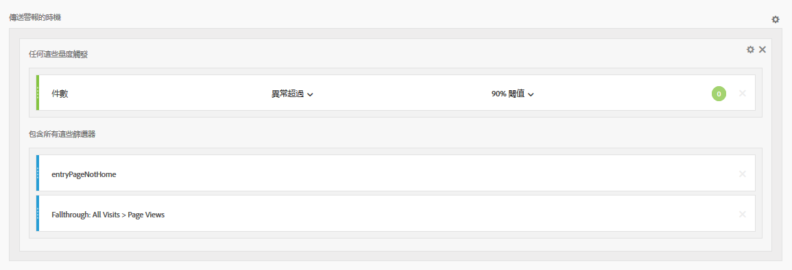
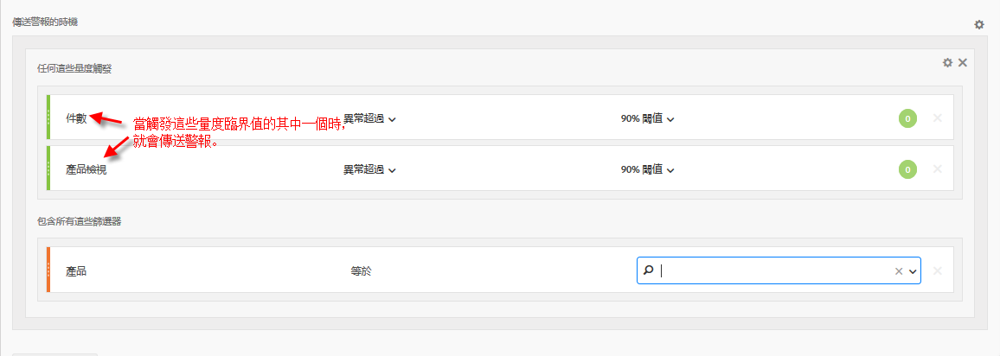

# 智慧型警報 - 使用案例

您可以建立智慧型警報，如中所述 [建立警報](/help/analyze/analysis-workspace/c-intelligent-alerts/alert-builder.md).

以下幾節將說明建立警報時要考慮的範例使用案例。

## 建立依兩個區段篩選的簡單警報 {#section_2E96FFFA93D44F7D8DBCEC97203204AA}

<!-- 

Update screenshots for better readability.

 -->

## 合併 (堆疊) 警報，而非建立多個警報 {#section_B27B0856BA104B9FB6D0BBB317633F18}

堆疊警報可確保結合警報，以免您收到大量的單獨警報。

