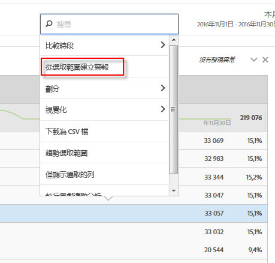
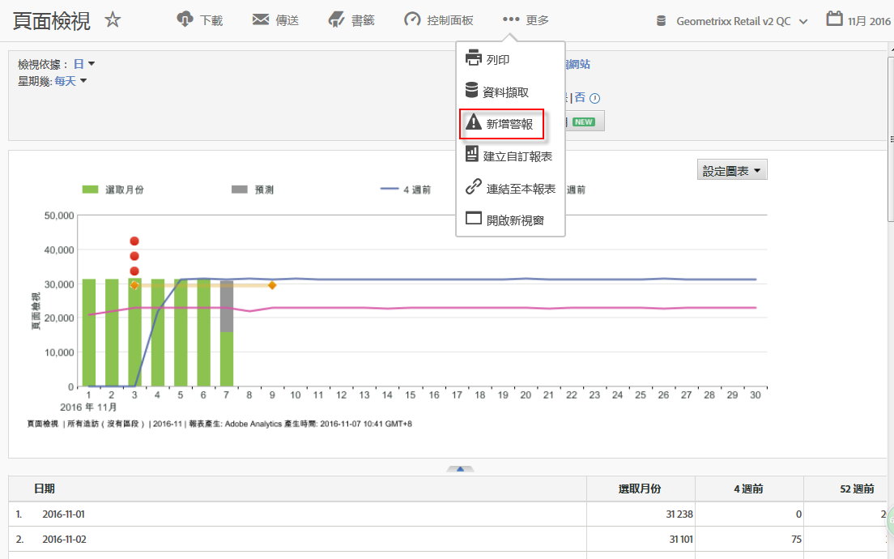

# 智慧型警報概述

智慧型警報可提供更細緻的警報控制能力，並整合警報系統與異常偵測功能。

[在 YouTube 觀看「智慧型警報 」](https://www.youtube.com/watch?v=UVH9xr_2REA)(5:34)

## 概述

Analysis Workspace 中的新「警報產生器」和「警報管理器」取代了「Reports &amp; Analytics」中的現有警報功能。智慧型警報可讓您:

* 根據異常 (90％、95％、99%、99.75% 或 99.9% 臨界值；% 變化；以上/以下) 建立警報
* 預覽警報觸發的頻率
* 透過電子郵件或簡訊傳送警報，當中附有可自動產生 Analysis Workspace 專案的連結
* 建立在單一警報中擷取多個量度的「堆疊」警報

取得「警報產生器」有四種方式:

* 直接前往警報產生器:**[!UICONTROL 「元件]** &gt; **[!UICONTROL 警報」]**
* 使用 Workspace 中的鍵盤快速鍵: `Ctrl + Shift + A` (Windows) 或 `Cmd + Shift + A` (Mac)
* 選取一或多個自由表格條列項目，按一下滑鼠右鍵並選取&#x200B;**[!UICONTROL 「從選取項目建立警報」]**。這個動作會開啟警報產生器，並預先填入表格中套用的合適量度量和篩選器。您可以視需要編輯警報。

   

* 在 Reports &amp; Analytics 報表中，前往&#x200B;**[!UICONTROL 「更多]** &gt; **[!UICONTROL 新增警報」]**。這個動作會開啟警報產生器，並預先填入報表中套用的合適量度量和篩選器。您可以視需要編輯警報。

   

百分比臨界值代表標準差。例如，95% = 2 標準差與 99% = 3 標準差。依您選擇的時間粒度而定，[不同模式](../virtual-analyst/c-anomaly-detection/statistics-anomaly-detection.md)會用於計算各資料點距離基準有多遠 (多少標準差)。若您設定較低的臨界值 (例如 90%)，您收到異常警報的次數就會比設定較高臨界值 (99.75%) 時多。

> [!IMPORTANT]使用時間戳記資料建立警報，可能導致錯誤觸發警報。Adobe 建議您為智慧型警報使用非時間戳記資料。

## 警報的異常回顧

如果警報使用異常偵測，訓練期會依您為警報選擇的粒度而有所不同。

* 每月粒度: 15 個月 + 去年的相同範圍
* 每週粒度: 15 週 + 去年的相同範圍
* 每日粒度: 35 天 + 去年的相同範圍
* 每小時粒度: 336小時

請參閱[異常偵測所使用的統計技術](../virtual-analyst/c-anomaly-detection/statistics-anomaly-detection.md)深入瞭解相關資訊。
