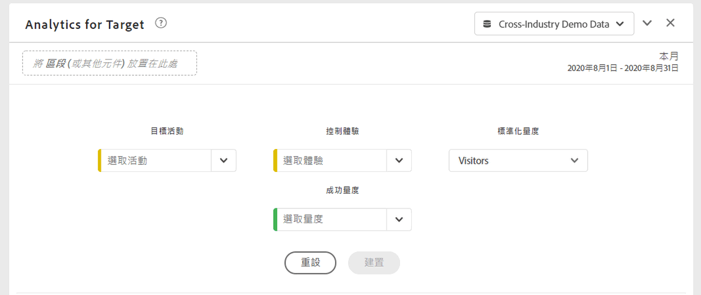
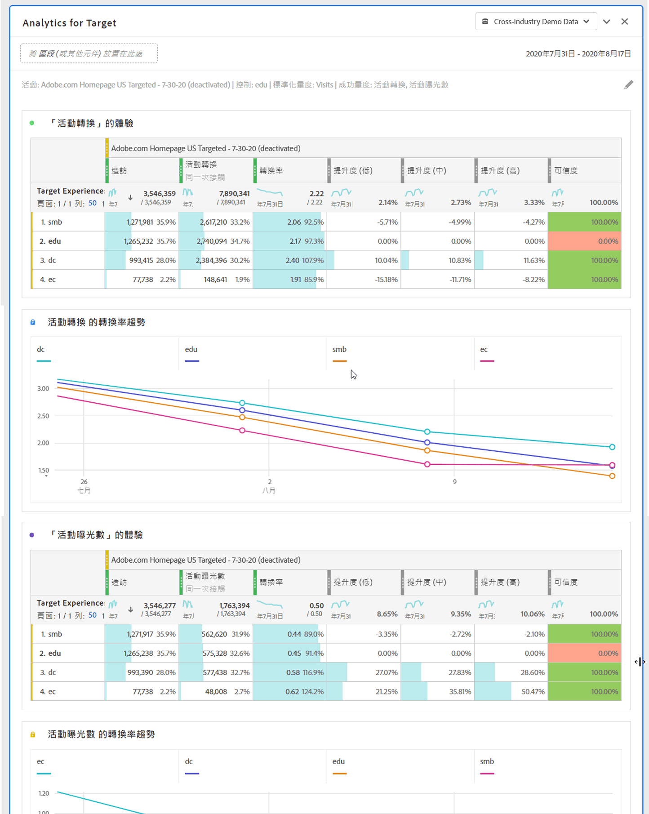

# Analytics for Target面板 {#analyze-for-target-panel}

<!-- markdownlint-disable MD034 -->

>[!CONTEXTUALHELP]
>id="workspace_a4t_button"
>title="目標分析"
>abstract="在 Analysis Workspace 中分析 Target 的活動和體驗。"

<!-- markdownlint-enable MD034 -->

<!-- markdownlint-disable MD034 -->

>[!CONTEXTUALHELP]
>id="workspace_a4t_panel"
>title="Analytics for Target面板"
>abstract="在 Analysis Workspace 中分析 Target 的活動和體驗。  **引數&#x200B;** **目標活動**：將分析的Target活動。 **控制體驗**：所選Target活動的控制體驗。 **標準化量度**：訪客、造訪次數或曝光數。 此量度 (也稱為計數方法) 會成為提升度計算的分母。也會影響在套用可信度計算前彙總資料的方式。 **成功量度**：最多3個可分析Target活動的標準（非計算）成功量度。"

<!-- markdownlint-enable MD034 -->

>[!BEGINSHADEBOX]

_本文會在_  _**Adobe Analytics**&#x200B;中記錄Analytics for Target面板。_ _如需如何比較_  _**Customer Journey Analytics**._中不同使用者體驗、行銷或訊息變數的詳細資訊，請參閱[實驗面板](https://experienceleague.adobe.com/en/docs/analytics/analyze/analysis-workspace/panels/a4t-panel)

>[!ENDSHADEBOX]

「Analytics for Target」面板可讓您在Analysis Workspace中分析Adobe Target活動和體驗。 面板最多可讓您檢視3個成功量度的提升度和可信度。 若要存取Analytics for Target面板，可瀏覽至啟用Analytics for Target元件的報表套裝。 然後，選取最左側的面板圖示，並將Analytics for Target面板拖曳到您的Analysis Workspace專案中。

+++以下是Analytics for Target面板的短片概觀：

>[!VIDEO](https://video.tv.adobe.com/v/37247/?quality=12)

+++

## 使用

若要使用&#x200B;**[!UICONTROL Analytics for Target]**&#x200B;面板：

1. 建立&#x200B;**[!UICONTROL Analytics for Target]**&#x200B;面板。 有關如何建立面板的資訊，請參閱[建立面板](panels.md#create-a-panel)。

1. 指定面板的[輸入](#panel-input)。

1. 觀察面板的[輸出](#panel-output)。

### 面板輸入 {#panel-nput}

您可以使用以下輸入設定來設定Analytics for Target面板：

| 設定 | 說明 |
|---|---|
| **[!UICONTROL 目標活動]** | 從「Target 活動」清單中選取活動，或從左側邊欄拖放活動。注意：清單會填入近 6 個月內至少點擊過 1 次的活動。如果您在清單中未看到某個活動，表示其存留期可能已超過 6 個月。您仍可從左側邊欄新增該活動，其回顧期間最長為 18 個月。 |
| **[!UICONTROL 控制體驗]** | 選取您的控制體驗。如有需要，您可以在下拉式清單中加以變更。 |
| **[!UICONTROL 標準化量度]** | 從「不重複訪客」、「造訪」或「活動曝光數」中選擇。在大多數的分析使用案例中，均建議使用不重複訪客。此量度 (也稱為計數方法) 會成為提升度計算的分母。也會影響在套用可信度計算前彙總資料的方式。 |
| **[!UICONTROL 成功量度]** | 從下拉式清單中選取最多 3 個標準 (非計算) 成功事件，或從左側邊欄中拖放量度。每個量度在呈現的面板中都會有專屬的表格和視覺效果。 |
| C**[!UICONTROL 行事曆日期範圍]** | 此項目會根據 Adobe Target 的活動日期範圍自動填入。如有需要，您可加以變更。 |

### 面板輸出 {#panel-output}

Analytics for Target 面板會傳回一組豐富的資料和視覺效果，協助您更清楚了解 Adobe Target 活動和體驗的執行方式。面板頂端會提供一個摘要行，為您提示您所選取的面板設定。您可以隨時按一下右上方的編輯鉛筆來編輯面板。

對於您所選取的每個成功量度，都會顯示一個自由表格和一個轉換率趨勢：

每個自由表格都會顯示下列量度欄：

| 量度 | 說明 |
|---|---|
| **[!UICONTROL 標準化量度]** | 不重複訪客、造訪，或活動曝光數。 |
| **[!UICONTROL 成功量度]** | 在產生器中選取的量度 |
| **[!UICONTROL 轉換率]** | 成功量度/標準化量度 |
| **[!UICONTROL 提升度]** | 對照控制體驗來比較每一個體驗的轉換率。注意：提升度是 Target 體驗的「鎖定量度」；您無法加以劃分，也無法與其他維度搭配使用。 |
| **[!UICONTROL 提升度（下限）]** | 表示 95％ 信賴區間中，變異數體驗對控制的最壞提升度。 如需詳細資訊，請參閱[統計計算](https://experienceleague.adobe.com/docs/target/using/reports/statistical-methodology/statistical-calculations.html)和[完整可信度電腦](https://experienceleague.adobe.com/docs/target/assets/complete_confidence_calculator.xlsx) Excel檔案。 |
| **[!UICONTROL 提升度(Mid)]** | 代表 95% 信賴區間中，變異數體驗對控制的中點提升度。 如需詳細資訊，請參閱[統計計算](https://experienceleague.adobe.com/docs/target/using/reports/statistical-methodology/statistical-calculations.html)和[完整可信度電腦](https://experienceleague.adobe.com/docs/target/assets/complete_confidence_calculator.xlsx) Excel檔案。 |
| **[!UICONTROL 提升度（上限]**） | 表示 95％ 信賴區間中，變異數體驗對控制的最佳提升度。 如需詳細資訊，請參閱[統計計算](https://experienceleague.adobe.com/docs/target/using/reports/statistical-methodology/statistical-calculations.html)和[完整可信度電腦](https://experienceleague.adobe.com/docs/target/assets/complete_confidence_calculator.xlsx) Excel檔案。 |
| **[!UICONTROL 信賴度]** | Student t 檢定會計算可信度等級，指出結果在重新執行該檢定時重複的可能性。量度已套用 75%/85%/95% 的固定條件式格式範圍。如有需要，可在「欄」設定下自訂此格式。注意：可信度是 Target 體驗的「鎖定量度」；您無法加以劃分，或與其他維度搭配使用。 如需詳細資訊，請參閱[統計計算](https://experienceleague.adobe.com/docs/target/using/reports/statistical-methodology/statistical-calculations.html)和[完整可信度電腦](https://experienceleague.adobe.com/docs/target/assets/complete_confidence_calculator.xlsx) Excel檔案。 |

和 Analysis Workspace 中的任何面板一樣，您可以新增其他有助於您分析 Adobe Target 活動的表格和[視覺效果](https://experienceleague.adobe.com/docs/analytics/analyze/analysis-workspace/visualizations/freeform-analysis-visualizations.html)，以繼續進行分析。您也可以在面板級別或自由格式表中套用區段。請注意，如果將其新增到自由格式表中，則必須將其覆蓋在整個表中，以保留提升度和可信度計算。目前不支援欄級區段。

## 常見問答 {#FAQ}

| 問題 | 回答 |
|---|---|
| Analytics for Target支援哪些活動型別？ | [深入了解](https://experienceleague.adobe.com/docs/target/using/integrate/a4t/a4t-faq/a4t-faq-activity-setup.html)受支援的活動類型。 |
| 提升度和可信度計算是否支援計算量度？ | 否。 [深入了解](https://experienceleague.adobe.com/docs/target/using/integrate/a4t/a4t-faq/a4t-faq-lift-and-confidence.html)提升度和可信度不支援計算量度的原因。不過，計算量度可用於這些量度以外的Analytics for Target報表。 |
| 為何 Target 與 Analytics 的不重複訪客會有差異？ | [深入了解](https://experienceleague.adobe.com/docs/target/using/integrate/a4t/a4t-faq/a4t-faq-viewing-reports.html)產品之間的不重複訪客差異。 |
| 當我在分析中為特定 Target 活動套用點擊區段時，為何會看到有不相關的體驗傳回？ | Analytics for Target維度是清單變數，這表示它可以同時包含許多活動（和體驗）。 [了解更多](https://experienceleague.adobe.com/docs/target/using/integrate/a4t/a4t-faq/a4t-faq-viewing-reports.html) |
| 可信度量度是否可計算極端順序，或對多個產品建議套用 Bonferroni 校正？ | 否。 [深入了解](https://experienceleague.adobe.com/docs/target/using/integrate/a4t/a4t-faq/a4t-faq-lift-and-confidence.html) Analytics 計算可信度的方式。 |
| 提升度和可信度量度是否可搭配其他維度或劃分使用？ | 提升度和可信度是「目標體驗」維度的「鎖定量度」，因為它們需有控制項和變數才能計算。因此，無法劃分或搭配其他維度使用。 |
| 何時會重新計算提升度和可信度？ | 每當執行 (或重新運行) 面板、面板日期範圍變更或將區段套用至面板或表格時，就會重新計算提升度和可信度。將區段過濾器套用至自由格式表時，必須將其套用於所有欄或提升度，否則可信度將無法正確更新。目前不支援欄級區段。 |

如需有關Analytics for Target報告的詳細資訊，請造訪[Analytics for Target報告](https://experienceleague.adobe.com/docs/target/using/integrate/a4t/reporting.html)
