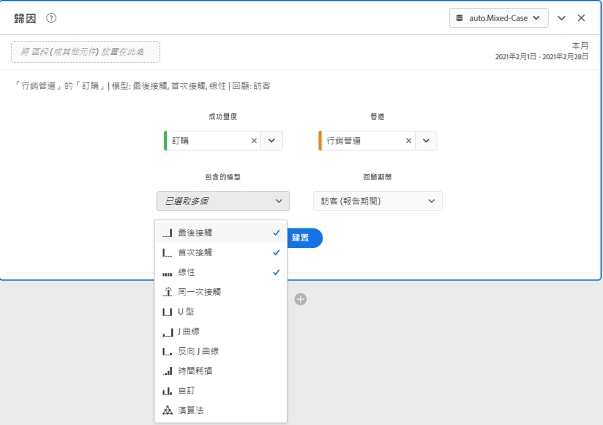
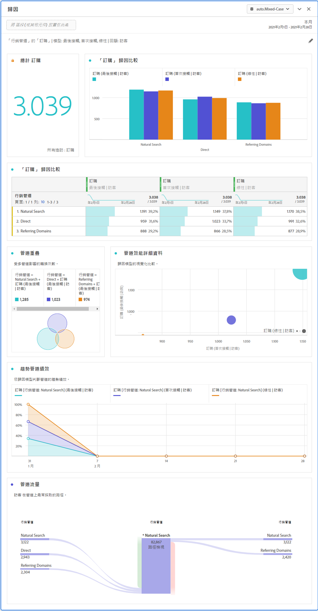

# 歸因面板

The [!UICONTROL Attribution] panel is an easy way to build an analysis comparing various attribution models. 這是[歸因 IQ](../attribution/overview.md) 中的一項功能，可讓您在專屬的工作區中使用和比較歸因模型。

## 建立歸因面板

1. 按一下左側的面板圖示。
1. Drag the [!UICONTROL Attribution] panel into your Analysis Workspace Project.

   

1. 新增要歸因的量度，並新增任何作為歸因依據的維度。其範例包括行銷管道或自訂維度，例如內部促銷。

   

1. 選取要比較的[歸因模型和回顧期間](../attribution/models.md)。

1. 「歸因」面板會傳回一組豐富的資料和視覺效果，用以比較所選維度和量度的歸因。

   

## 歸因視覺效果

* **量度總計**：在報告時間範圍內發生的轉換總數。這些是在您所選取的維度中歸因的轉換。
* **歸因比較列**:以視覺化方式比較所選維度中每個維度項目的歸屬轉換。 每個長條的顏色代表不同的歸因模型。
* **歸因比較表**:顯示與條形圖相同的資料，以表的形式表示。 在此表格中選取不同的欄或列可篩選長條圖，以及面板中的其他數個視覺效果。此表格的作用與 Workspace 中的其他自由表格相仿 - 讓您新增量度、區段或劃分等元件。
* **重疊圖**:「文氏圖」顯示前三維項目，以及它們共同參與轉換的頻率。 舉例來說，重疊的泡泡圖大小代表訪客同時接觸到兩個維度項目時發生轉換的頻率。選取相鄰自由表格中的其他列，可依據您的選取項目更新視覺效果。
* **效能詳細資訊**:可讓您使用散布圖以視覺化方式比較最多3個歸因模型。
* **趨勢效能**:顯示排名最前的維度項目的歸屬轉換趨勢。 選取相鄰自由表格中的其他列，可依據您的選取項目更新視覺效果。
* **流量**:可讓您查看哪些頻道最常互動，以及訪客歷程中的順序。

